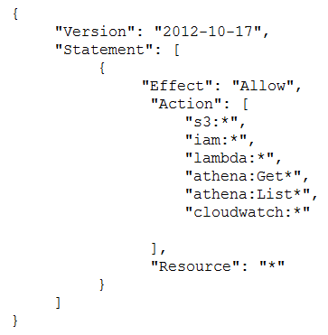

### A business requires a forensic logging solution for hundreds of Docker-based apps running on Amazon EC2. The solution must analyze logs in real time, provide message replay, and persist logs. Which Amazon Web Offerings (IAM) services should be employed to satisfy these requirements? (Select TWO)

- [ ] Amazon Athena.
- [x] Amazon Kinesis.
- [ ] Amazon SQS.
- [x] Amazon Elasticsearch.
- [ ] Amazon EMR.

### A company developed an application by using AWS Lambda, Amazon S3, Amazon Simple Notification Service (Amazon SNS), and Amazon DynamoDB. An external application puts objects into the company's S3 bucket and tags the objects with date and time. A Lambda function periodically pulls data from the company's S3 bucket based on date and time tags and inserts specific values into a DynamoDB table for further processing. The data includes personally identifiable information (Pll). The company must remove data that is older than 30 days from the S3 bucket and the DynamoDB table. Which solution will meet this requirement with the MOST operational efficiency?

- [ ] Update the Lambda function to add a TTL S3 flag to S3 objects. Create an S3 Lifecycle policy to expire objects that are older than 30 days by using the TTL S3 flag.
- [x] Create an S3 Lifecycle policy to expire objects that are older than 30 days. Update the Lambda function to add the TTL attribute in the DynamoDB table. Enable TTL on the DynamoDB table to expire entires that are older than 30 days based on the TTL attribute.
- [ ] Create an S3 Lifecycle policy to expire objects that are older than 30 days and to add all prefixes to the S3 bucket. Update the Lambda function to delete entries that are older than 30 days.
- [ ] Create an S3 Lifecycle policy to expire objects that are older than 30 days by using object tags. Update the Lambda function to delete entries that are older than 30 days.

### A company is hosting a static website on Amazon S3 The company has configured an Amazon CloudFront distribution to serve the website contents. The company has associated an IAM WAF web ACL with the CloudFront distribution. The Web ACL ensures that requests originate from the United States to address compliance restrictions. THE company is worried that the S3 URL might still be accessible directly and that requests can bypass the CloudFront distribution. Which combination of steps should the company take to remove direct access to the S3 URL? (Select TWO)

- [x] Select "Restrict Bucket Access" in the origin settings of the CloudFront distribution
- [x] Create an origin access identity (OAI) for the S3 origin.
- [ ] Update the S3 bucket policy to allow s3 GetObject with a condition that the IAM Referer key matches the secret value Deny all other.
- [ ] Configure the S3 bucket poky so that only the origin access identity (OAI) has read permission for objects in the bucket.
- [ ] Add an origin custom header that has the name Referer to the CloudFront distribution Give the header a secret value.

### A company is testing its incident response plan for compromised credentials. The company runs a database on an Amazon EC2 instance and stores the sensitive data-base credentials as a secret in AWS Secrets Manager. The secret has rotation configured with an AWS Lambda function that uses the generic rotation function template. The EC2 instance and the Lambda function are deployed in the same private subnet. The VPC has a Secrets Manager VPC endpoint. A security engineer discovers that the secret cannot rotate. The security engineer determines that the VPC endpoint is working as intended. The Amazon Cloud-Watch logs contain the following error: `"setSecret: Unable to log into database"`. Which solution will resolve this error?

- [ ] Use the AWS Management Console to edit the JSON structure of the secret in Secrets Manager so that the secret automatically conforms with the structure that the database requires.
- [x] Ensure that the security group that is attached to the Lambda function al-lows outbound connections to the EC2 instance. Ensure that the security group that is attached to the EC2 instance allows inbound connections from the security group that is attached to the Lambda function.
- [ ] Use the Secrets Manager list-secrets command in the AWS CLI to list the secret. Identify the database
credentials. Use the Secrets Manager rotate-secret command in the AWS CLI to force the immediate rotation of the secret.
- [ ] Add an internet gateway to the VPC. Create a NAT gateway in a public sub-net. Update the VPC route tables so that traffic from the Lambda function and traffic from the EC2 instance can reach the Secrets Manager public endpoint.

### A company needs a forensic-logging solution for hundreds of applications running in Docker on Amazon EC2 The solution must perform real-time analytics on the togs must support the replay of messages and must persist the logs. Which IAM services should be used to meet these requirements? (Select TWO)

- [ ] Amazon Athena.
- [x] Amazon Kinesis.
- [ ] Amazon SQS.
- [x] Amazon Elasticsearch.
- [ ] Amazon EMR.

### A company is evaluating the use of AWS Systems Manager Session Manager to gam access to the company's Amazon EC2 instances. However, until the company implements the change, the company must protect the key file for the EC2 instances from read and write operations by any other users. When a security administrator tries to connect to a critical EC2 Linux instance during an emergency, the security administrator receives the following error. `"Error Unprotected private key file – Permissions for' ssh/my_private_key pern' are too open"`. Which command should the security administrator use to modify the private key Me permissions to resolve this error?

- [ ] chmod 0040 ssh/my_private_key pern.
- [x] chmod 0400 ssh/my_private_key pern.
- [ ] chmod 0004 ssh/my_private_key pern.
- [ ] chmod 0777 ssh/my_private_key pern.

### A company deploys a set of standard IAM roles in AWS accounts. The IAM roles are based on job functions within the company. To balance operational efficiency and security, a security engineer implemented AWS Organizations SCPs to restrict access to critical security services in all company accounts. All of the company's accounts and OUs within AWS Organizations have a default FullAWSAccess SCP that is attached. The security engineer needs to ensure that no one can disable Amazon GuardDuty and AWS Security Hub. The security engineer also must not override other permissions that are granted by IAM policies that are defined in the accounts. Which SCP should the security engineer attach to the root of the organization to meet these requirements?

- [x] Option A.

- [ ] Option B.

- [ ] Option C.

- [ ] Option D.

### A company is building a data processing application mat uses AWS Lambda functions. The application's Lambda functions need to communicate with an Amazon RDS OB instance that is deployed within a VPC in the same AWS accountWhich solution meets these requirements in the MOST secure way?

- [ ] Configure the DB instance to allow public access Update the DB instance security group to allow access from the Lambda public address space for the AWS Region.
- [ ] Deploy the Lambda functions inside the VPC Attach a network ACL to the Lambda subnet Provide outbound rule access to the VPC CIDR range only Update the DB instance security group to allow traffic from 0.0.0.0/0.
- [x] Deploy the Lambda functions inside the VPC Attach a security group to the Lambda functions Provide outbound rule access to the VPC CIDR range only Update the DB instance security group to allow traffic from the Lambda security group.
- [ ] Peer the Lambda default VPC with the VPC that hosts the DB instance to allow direct network access without the need for security groups.

### A company has an application that uses an Amazon RDS PostgreSQL database. The company is developing an application feature that will store sensitive information for an individual in the database. During a security review of the environment, the company discovers that the RDS DB instance is not encrypting data at rest. The company needs a solution that will provide encryption at rest for all the existing data and for any new data that is entered for an individual. Which combination of options can the company use to meet these requirements? (Select TWO)

- [x] Create a snapshot of the DB instance. Copy the snapshot to a new snapshot, and enable encryption for the copy process. Use the new snapshot to restore the DB instance.
- [ ] Modify the configuration of the DB instance by enabling encryption. Create a snapshot of the DB instance. Use the snapshot to restore the DB instance.
- [ ] Use IAM Key Management Service (AWS KMS) to create a new default IAM managed awards key. Select this key as the encryption key for operations with Amazon RDS.
- [x] Use IAM Key Management Service (AWS KMS) to create a new CMK. Select this key as the encryption key for operations with Amazon RDS.
- [ ] Create a snapshot of the DB instance. Enable encryption on the snapshoVUse the snapshot to restore the DB instance.

### Which of the following bucket policies will ensure that objects being uploaded to a bucket called 'demo' are encrypted.

- [x] Option A.

- [ ] Option B.

- [ ] Option C.

- [ ] Option D.

### A company uses AWS Organizations to manage a multi-account AWS environment in a single AWS Region. The organization's management account is named management-01. The company has turned on AWS Config in all accounts in the organization. The company has designated an account named security-01 as the delegated administrator for AWS Config. All accounts report the compliance status of each account's rules to the AWS Config delegated administrator account by using an AWS Config aggregator. Each account administrator can configure and manage the account's own AWS Config rules to handle each account's unique compliance requirements. A security engineer needs to implement a solution to automatically deploy a set of 10 AWS Config rules to all existing and future AWS accounts in the organization. The solution must turn on AWS Config automatically during account creation. Which combination of steps will meet these requirements? (Select TWO)

- [ ] Create an AWS CloudFormation template that contains the 1 0 required AVVS Config rules. Deploy the template by using CloudFormation StackSets in the security-01 account.
- [x] Create a conformance pack that contains the 10 required AWS Config rules. Deploy the conformance pack from the security-01 account.
- [ ] Create a conformance pack that contains the 10 required AWS Config rules. Deploy the conformance pack from the management-01 account.
- [ ] Create an AWS CloudFormation template that will activate AWS Config. Deploy the template by using CloudFormation StackSets in the security-01 ac-count.
- [x] Create an AWS CloudFormation template that will activate AWS Config. Deploy the template by using CloudFormation StackSets in the management-01 account.

### A company has two IAM accounts within IAM Organizations. In Account-1. Amazon EC2 Auto Scaling is launched using a service-linked role. In Account-2. Amazon EBS volumes are encrypted with an AWS KMS key. A Security Engineer needs to ensure that the service-linked role can launch instances with these encrypted volumesWhich combination of steps should the Security Engineer take in both accounts? (Select TWO)

- [x] Allow Account-1 to access the KMS key in Account-2 using a key policy
- [ ] Attach an IAM policy to the service-linked role in Account-1 that allows these actions CreateGrant. DescnbeKey, Encrypt, GenerateDataKey, Decrypt, and ReEncrypt
- [x] Create a KMS grant for the service-linked role with these actions CreateGrant, DescnbeKey Encrypt GenerateDataKey Decrypt, and ReEncrypt
- [ ] Attach an IAM policy to the role attached to the EC2 instances with KMS actions and then allow Account-1 in the KMS key policy.
- [ ] Attach an IAM policy to the user who is launching EC2 instances and allow the user to access the KMS key policy of Account-2.

### Which of the following are valid configurations for using SSL certificates with Amazon CloudFront? (Select THREE)

- [ ] Default AWS Certificate Manager certificate.
- [ ] Custom SSL certificate stored in AWS KMS.
- [x] Default CloudFront certificate.
- [x] Custom SSL certificate stored in AWS Certificate Manager.
- [ ] Default SSL certificate stored in AWS Secrets Manager.
- [x] Custom SSL certificate stored in AWS IAM.

### A Security Engineer is troubleshooting an issue with a company's custom logging application. The application logs are written to an Amazon S3 bucket with event notifications enabled to send events to an Amazon SNS topic. All logs are encrypted at rest using an AWS KMS CMK. The SNS topic is subscribed to an encrypted Amazon SQS queue. The logging application polls the queue for new messages that contain metadata about the S3 object. The application then reads the content of the object from the S3 bucket for indexing. The Logging team reported that Amazon CloudWatch metrics for the number of messages sent or received is showing zero. No tags are being received. What should the Security Engineer do to troubleshoot this issue?

- [ ] Option A: Add the following statement to the IAM managed CMKs.

- [ ] Option B: Add the following statement to the CMK key policy.

- [ ] Option C: Add the following statement to the CMK key policy.

- [x] Option D: Add the following statement to the CMK key policy.

### A security engineer needs to implement a write-once-read-many (WORM) model for data that a company will store in Amazon S3 buckets. The company uses the S3 Standard storage class for all of its S3 buckets. The security engineer must ensure that objects cannot be overwritten or deleted by any user, including the AWS account root user. Which solution will meet these requirements?

- [x] Create new S3 buckets with S3 Object Lock enabled in compliance mode. Place objects in the S3 buckets.
- [ ] Use S3 Glacier Vault Lock to attach a Vault Lock policy to new S3 buckets. Wait 24 hours to complete the Vault Lock process. Place objects in the S3 buckets.
- [ ] Create new S3 buckets with S3 Object Lock enabled in governance mode. Place objects in the S3 buckets.
- [ ] Create new S3 buckets with S3 Object Lock enabled in governance mode. Add a legal hold to the S3 buckets. Place objects in the S3 buckets.

### A development team is attempting to encrypt and decode a secure string parameter from the IAM Systems Manager Parameter Store using an IAM Key Management Service (AWS KMS) CMK. However, each attempt results in an error message being sent to the development team. Which CMK-related problems possibly account for the error? (Select TWO)

- [x] The CMK is used in the attempt does not exist.
- [ ] The CMK is used in the attempt needs to be rotated.
- [ ] The CMK is used in the attempt is using the CMKs key ID instead of the CMK ARN.
- [x] The CMK is used in the attempt is not enabled.
- [ ] The CMK is used in the attempt is using an alias.

### A security engineer logs in to the AWS Lambda console with administrator permissions. The security engineer is trying to view logs in Amazon CloudWatch for a Lambda function that is named my Function. When the security engineer chooses the option in the Lambda console to view logs in CloudWatch, an `error loading Log Streams` message appears. The IAM policy for the Lambda function's execution role contains the following. How should the security engineer correct the error?

- [ ] Move the logs:CreateLogGroup action to the second Allow statement.
- [ ] Add the logs:PutDestination action to the second Allow statement.
- [ ] Add the logs:GetLogEvents action to the second Allow statement.
- [x] Add the logs:GetLogEvents action to the second Allow statement.

### A company plans to create individual child accounts within an existing organization in IAM Organizations for each of its DevOps teams. AWS CloudTrail has been enabled and configured on all accounts to write audit logs to an Amazon S3 bucket in a centralized IAM account. A security engineer needs to ensure that DevOps team members are unable to modify or disable this configuration. How can the security engineer meet these requirements?

- [ ] Create an IAM policy that prohibits changes to the specific CloudTrail trail and apply the policy to the IAM account root user.
- [ ] Create an S3 bucket policy in the specified destination account for the CloudTrail trail that prohibits configuration changes from the IAM account root user in the source account.
- [x] Create an SCP that prohibits changes to the specific CloudTrail trail and apply the SCP to the appropriate organizational unit or account in Organizations.
- [ ] Create an IAM policy that prohibits changes to the specific CloudTrail trail and apply the policy to a new IAM group. Have team members use individual IAM accounts that are members of the new IAM group.

### A company uses Amazon RDS for MySQL as a database engine for its applications. A recent security audit revealed an RDS instance that is not compliant with company policy for encrypting data at rest. A security engineer at the company needs to ensure that all existing RDS databases are encrypted using server-side encryption and that any future deviations from the policy are detected. Which combination of steps should the security engineer take to accomplish this? (Select TWO)

- [x] Create an AWS Config rule to detect the creation of encrypted RDS databases. Create an Amazon EventBridge (Amazon CloudWatch Events) rule to trigger on the AWS Config rules compliance state change and use Amazon Simple Notification Service (Amazon SNS) to notify the security operations team.
- [ ] Use AWS System Manager State Manager to detect RDS database encryption configuration drift. Create an Amazon EventBridge (Amazon CloudWatch Events) rule to track state changes and use Amazon Simple Notification Service (Amazon SNS) to notify the security operations team.
- [ ] Create a read replica for the existing unencrypted RDS database and enable replica encryption in the process. Once the replica becomes active, promote it into a standalone database instance and terminate the unencrypted database instance.
- [x] Take a snapshot of the unencrypted RDS database. Copy the snapshot and enable snapshot encryption in the process. Restore the database instance from the newly created encrypted snapshot. Terminate the unencrypted database instance.
- [ ] Enable encryption for the identified unencrypted RDS instance by changing the configurations of the existing database.

### A company has a large fleet of Linux Amazon EC2 instances and Windows EC2 instances that run in private subnets. The company wants all remote administration to be performed as securely as possible in the AWS Cloud. Which solution will meet these requirements?

- [x] Do not use SSH-RSA private keys during the launch of new instances. Implement AWS Systems Manager Session Manager.
- [ ] Generate new SSH-RSA private keys for existing instances. Implement AWS Systems Manager Session Manager.
- [ ] Do not use SSH-RSA private keys during the launch of new instances. Configure EC2 Instance Connect.
- [ ] Generate new SSH-RSA private keys for existing instances. Configure EC2 Instance Connect.

### A company has an AWS Lambda function that creates image thumbnails from larger images. The Lambda function needs read and write access to an Amazon S3 bucket in the same AWS account. Which solutions will provide the Lambda function this access? (Select TWO)

- [ ] Create an IAM user that has only programmatic access. Create a new access key pair. Add environmental variables to the Lambda function with the access key ID and secret access key. Modify the Lambda function to use the environmental variables at run time during communication with Amazon S3.
- [ ] Generate an Amazon EC2 key pair. Store the private key in AWS Secrets Man-ager. Modify the Lambda function to retrieve the private key from Secrets Manager and to use the private key during communication with Amazon S3.
- [x] Create an IAM role for the Lambda function. Attach an IAM policy that al-lows access to the S3 bucket.
- [x] Create an IAM role for the Lambda function. Attach a bucket policy to the S3 bucket to allow access. Specify the function's IAM role as the principal.
- [ ] Create a security group. Attach the security group to the Lambda function. Attach a bucket policy that allows access to the S3 bucket through the security group ID.

### A security engineer is designing an IAM policy for a script that will use the AWS CLI. The script currently assumes an IAM role that is attached to three AWS managed IAM policies: AmazonEC2FullAccess, AmazonDynamoDBFullAccess, and Ama-zonVPCFull Access. The security engineer needs to construct a least privilege IAM policy that will replace the AWS managed IAM policies that are attached to this role. Which solution will meet these requirements in the MOST operationally efficient way?

- [x] In AWS CloudTrail, create a trail for management events. Run the script with the existing AWS managed IAM policies. Use IAM Access Analyzer to generate a new IAM policy that is based on access activity in the trail. Replace the existing AWS managed IAM policies with the generated IAM poli-cy for the role.
- [ ] Remove the existing AWS managed IAM policies from the role. Attach the IAM Access Analyzer Role Policy Generator to the role. Run the script. Return to IAM Access Analyzer and generate a least privilege IAM policy. Attach the new IAM policy to the role.
- [ ] Create an account analyzer in IAM Access Analyzer. Create an archive rule that has a filter that checks whether the Principal Arn value matches the ARN of the role. Run the script. Remove the existing AWS managed IAM policies from the role.
- [ ] In AWS CloudTrail, create a trail for management events. Remove the existing AWS managed IAM policies from the role. Run the script. Find the authorization failure in the trail event that is associated with the script. Create a new IAM policy that includes the action and resource that caused the authorization failure. Repeat the process until the script succeeds. Attach the new IAM policy to the role.

### A company that uses AWS Organizations wants to see AWS Security Hub findings for many AWS accounts and AWS Regions. Some of the accounts are in the company's organization, and some accounts are in organizations that the company manages for customers. Although the company can see findings in the Security Hub administrator account for accounts in the company's organization, there are no findings from accounts in other organizations. Which combination of steps should the company take to see findings from accounts that are outside the organization that includes the Security Hub administrator account? (Select TWO)

- [ ] Use a designated administration account to automatically set up member accounts.
- [ ] Create the AWS Service Role ForSecurrty Hub service-linked rote for Security Hub.
- [x] Send an administration request from the member accounts.
- [ ] Enable Security Hub for all member accounts.
- [x] Send invitations to accounts that are outside the company's organization from the Security Hub administrator account.

### A company uses identity federation to authenticate users into an identity account (987654321987) where the users assume an IAM role named IdentityRole. The users then assume an IAM role named JobFunctionRole in the target IAM account (123456789123) to perform their job functions. A user is unable to assume the IAM role in the target account. The policy attached to the role in the identity account is. What should be done to enable the user to assume the appropriate role in the target account?

- [ ] Option A: Update the IAM policy attached to the role in the identity account to be.

- [x] Option B: Update the trust policy on the role in the target account to be.

- [ ] Option C: Update the trust policy on the role in the identity account to be.

- [ ] Option D: Update the IAM policy attached to the role in the target account to be.

### A company hosts a web application on an Apache Web server. The application runs on Amazon EC2 instances that are in an Auto Scaling group. The company configured the EC2 instances to send the Apache Web server logs to an Amazon CloudWatch Logs group that the company has configured to expire after 1 year. Recently, the company discovered in the Apache Web server logs that a specific IP address is sending suspicious requests to the Web application. A security engineer wants to analyze the past week of Apache Web server logs to determine how many requests that the IP address sent and the corresponding URLs that the IP address requested. What should the security engineer do to meet these requirements with the LEAST effort?

- [ ] Export the CloudWatch Logs group data to Amazon S3. Use Amazon Macie to query the logs for the specific IP address and the requested URLs.
- [ ] Configure a CloudWatch Logs subscription to stream the log group to an Amazon OpenSearch Service cluster. Use OpenSearch Service to analyze the logs for the specific IP address and the requested URLs.
- [x] Use CloudWatch Logs Insights and a custom query syntax to analyze the CloudWatch logs for the specific IP address and the requested URLs.
- [ ] Export the CloudWatch Logs group data to Amazon S3. Use AWS Glue to crawl the S3 bucket for only the log entries that contain the specific IP ad-dress. Use AWS Glue to view the results.

### A company has multiple Amazon S3 buckets encrypted with customer-managed CMKs Due to regulatory requirements the keys must be rotated every year. The company's Security Engineer has enabled automatic key rotation for the CMKs; however the company wants to verity that the rotation has occurred. What should the Security Engineer do to accomplish this?

- [x] Filter AWS CloudTrail logs for KeyRotaton events.
- [ ] Monitor Amazon CloudWatch Events for any AWS KMS CMK rotation events.
- [ ] Using the IAM CLI run the IAM kms gel-key-relation-status operation with the –key-id parameter to check the CMK rotation date.
- [ ] Use Amazon Athena to query AWS CloudTrail logs saved in an S3 bucket to filter Generate New Key events.

### A company has implemented IAM WAF and Amazon CloudFront for an application. The application runs on Amazon EC2 instances that are part of an Auto Scaling group. The Auto Scaling group is behind an Application Load Balancer (ALB). The IAM WAF web ACL uses an IAM Managed Rules rule group and is associated with the CloudFront distribution. CloudFront receives the request from IAM WAF and then uses the ALB as the distribution's origin. During a security review, a security engineer discovers that the infrastructure is susceptible to a large, layer 7 DDoS attack. How can the security engineer improve the security at the edge of the solution to defend against this type of attack?

- [ ] Configure the CloudFront distribution to use the Lambda@Edge feature. Create an IAM Lambda function that imposes a rate limit on CloudFront viewer requests. Block the request if the rate limit is exceeded.
- [ ] Configure the IAM WAF web ACL so that the Web ACL has more capacity units to process all IAM WAF rules faster.
- [x] Configure IAM WAF with a rate-based rule that imposes a rate limit that automatically blocks requests when the rate limit is exceeded.
- [ ] Configure the CloudFront distribution to use IAM WAF as its origin instead of the ALB.

### A company has multiple accounts in the AWS Cloud. Users in the developer account need to have access to specific resources in the production account. What is the MOST secure way to provide this access?

- [ ] Create one IAM user in the production account. Grant the appropriate permissions to the resources that are needed. Share the password only with the users that need access.
- [ ] Create cross account access with an IAM role in the developer account. Grant the appropriate permissions to this role. Allow users in the developer account to assume this role to access the production resources.
- [ ] Create cross-account access with an IAM user account in the production account. Grant the appropriate permissions to this user account. Allow users in the developer account to use this user account to access the production resources.
- [x] Create cross-account access with an IAM role in the production account. Grant the appropriate permissions to this role. Allow users in the developer account to assume this role to access the production resources.

### A System Administrator is unable to start an Amazon EC2 instance in the eu-west-1 Region using an IAM role The same System Administrator is able to start an EC2 instance in the eu-west-2 and eu-west-3 Regions. The IAMSystemAdministrator access policy attached to the System Administrator IAM role allows unconditional access to all IAM services and resources within the account. Which configuration caused this issue?

- [ ] Option A: An SCP is attached to the account with the following permission statement.

- [x] Option B: A permission boundary policy is attached to the System Administrator role with the following permission statement.

- [ ] Option C: A permission boundary is attached to the System Administrator role with the following permission statement.

- [ ] Option D: An SCP is attached to the account with the following statement.

### Amazon GuardDuty has detected communications to a known command and control endpoint from a company's Amazon EC2 instance. The instance was found to be running a vulnerable version of a common web framework. The company's security operations team wants to quickly identity other compute resources with the specific version of that framework installed. Which approach should the team take to accomplish this task?

- [ ] Scan all the EC2 instances for noncompliance with IAM Config. Use Amazon Athena to query AWS CloudTrail logs for the framework installation.
- [ ] Scan all the EC2 instances with the Amazon Inspector Network Reachability rules package to identity instances running a web server with RecognizedPortWithListener findings.
- [x] Scan all the EC2 instances with IAM Systems Manager to identify the vulnerable version of the Web framework.
- [ ] Scan an the EC2 instances with IAM Resource Access Manager to identify the vulnerable version of the Web framework.

### A company stores sensitive documents in Amazon S3 by using server-side encryption with an AWS Key Management Service (AWS KMS) CMK. A new requirement mandates that the CMK that is used for these documents can be used only for S3 actions. Which statement should the company add to the key policy to meet this requirement?

- [ ] Option A.

- [ ] Option B.

- [x] Option C.

- [ ] Option D.

### A company finds that one of its Amazon EC2 instances suddenly has a high CPU usage. The company does not know whether the EC2 instance is compromised or whether the operating system is performing background cleanup. Which combination of steps should a security engineer take before investigating the issue? (Select THREE)

- [ ] Disable termination protection for the EC2 instance if termination protection has not been disabled.
- [x] Enable termination protection for the EC2 instance if termination protection has not been enabled.
- [x] Take snapshots of the Amazon Elastic Block Store (Amazon EBS) data volumes that are attached to the EC2 instance.
- [ ] Remove all snapshots of the Amazon Elastic Block Store (Amazon EBS) data volumes that are attached to the EC2 instance.
- [x] Capture the EC2 instance metadata, and then tag the EC2 instance as under quarantine.
- [ ] Immediately remove any entries in the EC2 instance metadata that contain sensitive information.

### A company hosts an application on Amazon EC2 that is subject to specific rules for regulatory compliance. One rule states that traffic to and from the workload must be inspected for network-level attacks. This involves inspecting the whole packet. To comply with this regulatory rule, a security engineer must install intrusion detection software on a c5n.4xlarge EC2 instance. The engineer must then configure the software to monitor traffic to and from the application instances. What should the security engineer do next?

- [ ] Place the network interface in promiscuous mode to capture the traffic.
- [ ] Configure VPC Flow Logs to send traffic to the monitoring EC2 instance using a Network Load Balancer.
- [x] Configure VPC traffic mirroring to send traffic to the monitoring EC2 instance using a Network Load Balancer.
- [ ] Use Amazon Inspector to detect network-level attacks and trigger an IAM Lambda function to send the suspicious packets to the EC2 instance.

### A company has a relational database workload that runs on Amazon Aurora MySQL. According to new compliance standards the company must rotate all database credentials every 30 days. The company needs a solution that maximizes security and minimizes development effort. Which solution will meet these requirements?

- [x] Store the database credentials in AWS Secrets Manager. Configure automatic credential rotation for every 30 days.
- [ ] Store the database credentials in AWS Systems Manager Parameter Store. Create an AWS Lambda function to rotate the credentials every 30 days.
- [ ] Store the database credentials in an environment file or in a configuration file. Modify the credentials every 30 days.
- [ ] Store the database credentials in an environment file or in a configuration file. Create an AWS Lambda function to rotate the credentials every 30 days.

### A company uses AWS Organizations to manage a small number of AWS accounts. However, the company plans to add 1 000 more accounts soon. The company allows only a centralized security team to create IAM roles for all AWS accounts and teams. Application teams submit requests for IAM roles to the security team. The security team has a backlog of IAM role requests and cannot review and provision the IAM roles quickly. The security team must create a process that will allow application teams to provision their own IAM roles. The process must also limit the scope of IAM roles and prevent privilege escalation. Which solution will meet these requirements with the LEAST operational overhead?

- [ ] Create an IAM group for each application team. Associate policies with each IAM group. Provision IAM users for each application team member. Add the new IAM users to the appropriate IAM group by using role-based access control (RBAC).
- [ ] Delegate application team leads to provision IAM rotes for each team. Conduct a quarterly review of the IAM rotes the team leads have provisioned. Ensure that the application team leads have the appropriate training to review IAM roles.
- [ ] Put each AWS account in its own OU. Add an SCP to each OU to grant access to only the AWS services that the teams plan to use. Include conditions tn the AWS account of each team.
- [x] Create an SCP and a permissions boundary for IAM roles. Add the SCP to the root OU so that only roles that have the permissions boundary attached can create any new IAM roles.

### A company's security engineer is developing an incident response plan to detect suspicious activity in an AWS account for VPC hosted resources. The security engineer needs to provide visibility for as many AWS Regions as possible. Which combination of steps will meet these requirements MOST cost-effectively? (Select TWO)

- [ ] Turn on VPC Flow Logs for all VPCs in the account.
- [x] Activate Amazon GuardDuty across all AWS Regions.
- [ ] Activate Amazon Detective across all AWS Regions.
- [x] Create an Amazon Simple Notification Service (Amazon SNS) topic. Create an Amazon EventBridge rule that responds to findings and publishes the findings to the SNS topic.
- [ ] Create an AWS Lambda function. Create an Amazon EventBridge rule that invokes the Lambda function to publish findings to Amazon Simple Email Ser-vice (Amazon SES).

### A team is using AWS Secrets Manager to store an application database password. Only a limited number of IAM principals within the account can have access to the secret. The principals who require access to the secret change frequently. A security engineer must create a solution that maximizes flexibility and scalability. Which solution will meet these requirements?

- [ ] Use a role-based approach by creating an IAM role with an inline permissions policy that allows access to the secret. Update the IAM principals in the role trust policy as required.
- [ ] Deploy a VPC endpoint for Secrets Manager. Create and attach an endpoint policy that specifies the IAM principals that are allowed to access the secret. Update the list of IAM principals as required.
- [x] Use a tag-based approach by attaching a resource policy to the secret. Apply tags to the secret and the IAM principals. Use the aws:PrincipalTag and aws:ResourceTag IAM condition keys to control access.
- [ ] Use a deny-by-default approach by using IAM policies to deny access to the secret explicitly. Attach the policies to an IAM group. Add all IAM principals to the IAM group. Remove principals from the group when they need access. Add the principals to the group again when access is no longer allowed.

### A company uses AWS Organizations to run workloads in multiple AWS accounts. Currently the individual team members at the company access all Amazon EC2 instances remotely by using SSH or Remote Desktop Protocol (RDP) The company does not have any audit trails and security groups are occasionally open. The company must secure access management and implement a centralized togging solution. Which solution will meet these requirements MOST securely?

- [ ] Configure trusted access for AWS System Manager in Organizations. Configure a bastion host from the management account. Replace SSH and RDP by using Systems Manager Session Manager from the management account Configure Session Manager logging to Amazon CloudWatch Logs.
- [ ] Replace SSH and RDP with AWS Systems Manager Session Manager. Install Systems Manager Agent (SSM Agent) on the instances Attach the.
- [x] AmazonSSMManagedlnstanceCore role to the instances. Configure session data streaming to Amazon CloudWatch Logs. Create a separate logging account that has appropriate cross-account permissions to audit the log data.
- [ ] Install a bastion host in the management account. Reconfigure all SSH and RDP to allow access only from the bastion host Install AWS Systems Manager Agent (SSM Agent) on the bastion host Attach the AmazonSSMManagedlnstanceCore role to the bastion host. Configure session data streaming to Amazon CloudWatch Logs in a separate logging account to audit log data.
- [ ] Replace SSH and RDP with AWS Systems Manager State Manager. Install Systems Manager Agent (SSM Agent) on the instances Attach the AmazonSSMManagedlnstanceCore role to the instances. Configure session data streaming to Amazon CloudTrail. Use CloudTrail Insights to analyze the trail data.

### A company became aware that one of its access keys was exposed on a code sharing website 11 days ago. A Security Engineer must review all use of the exposed access keys to determine the extent of the exposure. The company enabled AWS CloudTrail m an regions when it opened the account. Which of the following will allow (he Security Engineer 10 complete the task?

- [x] Filter the event history on the exposed access key in the CloudTrail console Examine the data from the past 11 days.
- [ ] Use the IAM CLI to generate an IAM credential report Extract all the data from the past 11 days.
- [ ] Use Amazon Athena to query the CloudTrail logs from Amazon S3 Retrieve the rows for the exposed access key for the past 11 days.
- [ ] Use the Access Advisor tab in the IAM console to view all of the access key activity for the past 11 days.

### An application team wants to use IAM Certificate Manager (ACM) to request public certificates to ensure that data is secured in transit. The domains that are being used are not currently hosted on Amazon Route 53 The application team wants to use an IAM managed distribution and caching solution to optimize requests to its systems and provide better points of presence to customers The distribution solution will use a primary domain name that is customized The distribution solution also will use several alternative domain names The certificates must renew automatically over an indefinite period of time. Which combination of steps should the application team take to deploy this architecture? (Select THREE)

- [x] Request a certificate for ACM in the `us-west-2` Region Add the domain names that the certificate will secure.
- [ ] Send an email message to the domain administrators to request vacation of the domains for ACM.
- [x] Request validation of the domains for ACM through DNS Insert CNAME records into each domain's DNS zone.
- [ ] Create an Application Load Balancer for me caching solution Select the newly requested certificate from ACM to be used for secure connections.
- [x] Create an Amazon CloudFront distribution for the caching solution Enter the main CNAME record as the Origin Name Enter the subdomain names or alternate names in the Alternate Domain Names Distribution Settings Select the newly requested certificate from ACM to be used for secure connections.
- [ ] Request a certificate from ACM in the `us-east-1` Region Add the domain names that the certificate. Wil secure.

### A company uses Amazon API Gateway to present REST APIs to users. An API developer wants to analyze API access patterns without the need to parse the log files. Which combination of steps will meet these requirements with the LEAST effort? (Select TWO)

- [x] Configure access logging for the required API stage.
- [ ] Configure an AWS CloudTrail trail destination for API Gateway events. Configure filters on the userldentity, userAgent, and sourcelPAddress fields.
- [ ] Configure an Amazon S3 destination for API Gateway logs. Run Amazon Athena queries to analyze API access information.
- [x] Use Amazon CloudWatch Logs Insights to analyze API access information.
- [ ] Select the Enable Detailed CloudWatch Metrics option on the required API stage.

### There are currently multiple applications hosted in a VPC. During monitoring it has been noticed that multiple port scans are coming in from a specific IP Address block. The internal security team has requested that all offending IP Addresses be denied for the next 24 hours. Which of the following is the best method to quickly and temporarily deny access from the specified IP Address's.

- [ ] Create an AD policy to modify the. Windows Firewall settings on all hosts in the VPC to deny access from the IP Address block.
- [x] Modify the Network ACLs associated with all public subnets in the VPC to deny access from the IP Address block.
- [ ] Add a rule to all of the VPC Security Groups to deny access from the IP Address block.
- [ ] Modify the. Windows Firewall settings on all AMI'S that your organization uses in that VPC to deny access from the IP address block.

### A company needs to store multiple years of financial records. The company wants to use Amazon S3 to store copies of these documents. The company must implement a solution to prevent the documents from being edited, replaced, or deleted for 7 years after the documents are stored in Amazon S3. The solution must also encrypt the documents at rest. A security engineer creates a new S3 bucket to store the documents. What should the security engineer do next to meet these requirements?

- [ ] Configure S3 server-side encryption. Create an S3 bucket policy that has an explicit deny rule for all users for s3:DeleteObject and s3:PutObject API calls. Configure S3 Object Lock to use governance mode with a retention period of 7 years.
- [x] Configure S3 server-side encryption. Configure S3 Versioning on the S3 bucket. Configure S3 Object Lock to use compliance mode with a retention period of 7 years.
- [ ] Configure S3 Versioning. Configure S3 Intelligent-Tiering on the S3 bucket to move the documents to S3 Glacier Deep Archive storage. Use S3 server-side encryption immediately. Expire the objects after 7 years.
- [ ] Set up S3 Event Notifications and use S3 server-side encryption. Configure S3 Event Notifications to target an AWS Lambda function that will review any S3 API call to the S3 bucket and deny the s3:DeleteObject and s3:PutObject API calls. Remove the S3 event notification after 7 years.

### There is a requirement for a company to transfer large amounts of data between IAM and an on-premise location. There is an additional requirement for low latency and high consistency traffic to IAM. Given these requirements how would you design a hybrid architecture?

- [x] Provision a Direct Connect connection to an IAM region using a Direct Connect partner.
- [ ] Create a VPN tunnel for private connectivity, which increases network consistency and reduces latency.
- [ ] Create an IPsec tunnel for private connectivity, which increases network consistency and reduces latency.
- [ ] Create a VPC peering connection between IAM and the Customer gateway.

### A company uses a third-party identity provider and SAML-based SSO for its AWS accounts. After the third-party identity provider renewed an expired signing certificate, users saw the following message. When trying to log in: Error: `Response Signature Invalid (Service: AWSSecurityTokenService; Status Code: 400; Error Code:InvalidldentityToken)`. A security engineer needs to provide a solution that corrects the error and minimizes operational overhead. Which solution meets these requirements?

- [ ] Upload the third-party signing certificate's new private key to the AWS identity provider entity defined in AWS Identity and Access Management (IAM) by using the AWS Management Console.
- [ ] Sign the identity provider's metadata file with the new public key. Upload the signature to the AWS identity provider entity defined in AWS Identity and Access Management (IAM) by using the AWS CU.
- [x] Download the updated SAML metadata file from the identity service provider. Update the file in the AWS identity provider entity defined in AWS Identity and Access Management (IAM) by using the AWS CLI.
- [ ] Configure the AWS identity provider entity defined in AWS Identity and Access Management (IAM) to synchronously fetch the new public key by using the AWS Management Console.

### An AWS account that is used for development projects has a VPC that contains two subnets. The first subnet is named public-subnet-1 and has the CIDR block 192.168.1.0/24 assigned. The other subnet is named private-subnet-2 and has the CIDR block 192.168.2.0/24 assigned. Each subnet contains Amazon EC2 instances. Each subnet is currently using the VPC's default network ACL. The security groups that the EC2 instances in these subnets use have rules that allow traffic between each instance. Where required. Currently, all network traffic flow is working as expected between the EC2 instances that are using these subnets. A security engineer creates a new network ACL that is named subnet-2-NACL with default entries. The security engineer immediately configures private-subnet-2 to use the new network ACL and makes no other changes to the infrastructure. The security engineer starts to receive reports that the EC2 instances in public-subnet-1 and public-subnet-2 cannot communicate with each other. Which combination of steps should the security engineer take to allow the EC2 instances that are running in these two subnets to communicate again? (Select TWO)

- [ ] Add an outbound allow rule for 192.168.2.0/24 in the VPC's default network ACL.
- [ ] Add an inbound allow rule for 192.168.2.0/24 in the VPC's default network ACL.
- [ ] Add an outbound allow rule for 192.168.2.0/24 in subnet-2-NACL.
- [x] Add an inbound allow rule for 192.168.1.0/24 in subnet-2-NACL.
- [x] Add an outbound allow rule for 192.168.1.0/24 in subnet-2-NACL.

### Within a VPC, a corporation runs an Amazon RDS Multi-AZ DB instance. The database instance is connected to the internet through a NAT gateway via two subnets. Additionally, the organization has application servers that are hosted on Amazon EC2 instances and use the RDS database. These EC2 instances have been deployed onto two more private subnets inside the same VPC. These EC2 instances connect to the internet through a default route via the same NAT gateway. Each VPC subnet has its own route table. The organization implemented a new security requirement after a recent security examination. Never allow the database instance to connect to the internet. A security engineer must perform this update promptly without interfering with the network traffic of the application servers. How will the security engineer be able to comply with these requirements?

- [ ] Remove the existing NAT gateway. Create a new NAT gateway that only the application server subnets can use.
- [ ] Configure the DB instances inbound network ACL to deny traffic from the security group ID of the NAT gateway.
- [x] Modify the route tables of the DB instance subnets to remove the default route to the NAT gateway.
- [ ] Configure the route table of the NAT gateway to deny connections to the DB instance subnets.

### An audit determined that a company's Amazon EC2 instance security group violated company policy by allowing unrestricted incoming SSH traffic. A security engineer must implement a near-real-time monitoring and alerting solution that will notify administrators of such violations. Which solution meets these requirements with the MOST operational efficiency?

- [ ] Create a recurring Amazon Inspector assessment run that runs every day and uses the Network Reachability package. Create an Amazon CloudWatch rule that invokes an IAM Lambda function when an assessment run starts. Configure the Lambda function to retrieve and evaluate the assessment run report when it completes. Configure the Lambda function also to publish an Amazon Simple Notification Service (Amazon SNS) notification if there are any violations for unrestricted incoming SSH traffic.
- [x] Use the restricted-ssh IAM Config managed rule that is invoked by security group configuration changes that are not compliant. Use the IAM Config remediation feature to publish a message to an Amazon Simple Notification Service (Amazon SNS) topic.
- [ ] Configure VPC Flow Logs for the VPC. and specify an Amazon CloudWatch Logs group. Subscribe the CloudWatch Logs group to an IAM Lambda function that parses new log entries, detects successful connections on port 22, and publishes a notification through Amazon Simple Notification Service (Amazon SNS).
- [ ] Create a recurring Amazon Inspector assessment run that runs every day and uses the Security Best Practices package. Create an Amazon CloudWatch rule that invokes an IAM Lambda function when an assessment run starts. Configure the Lambda function to retrieve and evaluate the assessment run report when it completes. Configure the Lambda function also to publish an Amazon Simple Notification Service (Amazon SNS) notification if there are any violations for unrestricted incoming SSH traffic.

### A company is using Amazon Elastic Container Service (Amazon ECS) to deploy an application that deals with sensitive data During a recent security audit, the company identified a security issue in which Amazon RDS credentials were stored with the application code In the company's source code repository. A security engineer needs to develop a solution to ensure that database credentials are stored securely and rotated periodically. The credentials should be accessible to the application only. The engineer also needs to prevent database administrators from sharing database credentials as plaintext with other teammates. The solution must also minimize administrate overhead. Which solution meets these requirements?

- [ ] Use the IAM Systems Manager Parameter Store to generate database credentials. Use an IAM profile for ECS tasks to restrict access to database credentials to specific containers only.
- [ ] Use IAM Secrets Manager to store database credentials. Use an IAM inline policy for ECS tasks to restrict access to database credentials to specific containers only.
- [ ] Use the IAM Systems Manager Parameter Store to store database credentials. Use IAM roles for ECS tasks to restrict access to database credentials to specific containers only
- [x] Use IAM Secrets Manager to store database credentials. Use IAM roles for ECS tasks to restrict access to database credentials to specific containers only.

### A company discovers a billing anomaly in its AWS account. A security consultant investigates the anomaly and discovers that an employee. Who left the company 30 days ago still has access to the account. The company has not monitored account activity in the past. The security consultant needs to determine. Which resources have been deployed or reconfigured by the employee as quickly as possible. Which solution will meet these requirements?

- [ ] In AWS Cost Explorer, filter chart data to display results from the past 30 days. Export the results to a data table. Group the data table by re-source.
- [ ] Use AWS Cost Anomaly Detection to create a cost monitor. Access the detection history. Set the time frame to Last 30 days. In the search area, choose the service category.
- [x] In AWS CloudTrail, filter the event history to display results from the past 30 days. Create an Amazon Athena table that contains the data. Partition the table by event source.
- [ ] Use AWS Audit Manager to create an assessment for the past 30 days. Apply a usage-based framework to the assessment. Configure the assessment to assess by resource.

### A company wants to monitor the deletion of AWS Key Management Service (AWS KMS) customer managed keys. A security engineer needs to create an alarm that will notify the company before a KMS key is deleted. The security engineer has configured the integration of AWS CloudTrail with Amazon CloudWatch. What should the security engineer do next to meet these requirements?

- [ ] Specify the deletion time of the key material during KMS key creation. Create a custom AWS Config rule to assess the key's scheduled deletion. Configure the rule to trigger upon a configuration change. Send a message to an Amazon Simple Notification Service (Amazon SNS) topic if the key is scheduled for deletion.
- [ ] Create an Amazon EventBridge rule to detect KMS API calls of DeleteAlias. Create an AWS Lambda function to send an Amazon Simple Notification Service (Amazon SNS) message to the company. Add the Lambda function as the target of the EventBridge rule.
- [x] Create an Amazon EventBridge rule to detect KMS API calls of DisableKey and ScheduleKeyDeletion. Create an AWS Lambda function to send an Amazon Simple Notification Service (Amazon SNS) message to the company. Add the Lambda function as the target of the EventBridge rule.
- [ ] Create an Amazon Simple Notification Service (Amazon SNS) policy to detect KMS API calls of RevokeGrant and ScheduleKeyDeletion. Create an AWS Lambda function to generate the alarm and send the notification to the company. Add the Lambda function as the target of the SNS policy.

### A company accidentally deleted the private key for an Amazon Elastic Block Store (Amazon EBS)-backed Amazon EC2 instance. A security engineer needs to regain access to the instance. Which combination of steps will meet this requirement? (Choose TWO)

- [x] Stop the instance. Detach the root volume. Generate a new key pair.
- [ ] Keep the instance running. Detach the root volume. Generate a new key pair.
- [x] When the volume is detached from the original instance, attach the volume to another instance as a data volume. Modify the authorized_keys file with a new public key. Move the volume back to the original instance. Start the instance.
- [ ] When the volume is detached from the original instance, attach the volume to another instance as a data volume. Modify the authorized_keys file with a new private key. Move the volume back to the original instance. Start the instance.
- [ ] When the volume is detached from the original instance, attach the volume to another instance as a data volume. Modify the authorized_keys file with a new public key. Move the volume back to the original instance that is running.

### A company deployed Amazon GuardDuty in the `us-east-1` Region. The company wants all DNS logs that relate to the company's Amazon EC2 instances to be inspected. What should a security engineer do to ensure that the EC2 instances are logged?

- [ ] Use IPv6 addresses that are configured for hostnames.
- [ ] Configure external DNS resolvers as internal resolvers that are visible only to IAM.
- [x] Use IAM DNS resolvers for all EC2 instances.
- [ ] Configure a third-party DNS resolver with logging for all EC2 instances.

### An ecommerce website was down for 1 hour following a DDoS attack Users were unable to connect to the website during the attack period. The ecommerce company's security team is worried about future potential attacks and wants to prepare for such events The company needs to minimize downtime in its response to similar attacks in the future. Which steps would help achieve this9 (Select TWO)

- [ ] Enable Amazon GuardDuty to automatically monitor for malicious activity and block unauthorized access.
- [x] Subscribe to AWS Shield Advanced and reach out to IAM Support in the event of an attack.
- [ ] Use VPC Flow Logs to monitor network: traffic and an IAM Lambda function to automatically block an attacker's IP using security groups.
- [ ] Set up an Amazon CloudWatch Events rule to monitor the AWS CloudTrail events in real time use IAM Config rules to audit the configuration, and use IAM Systems Manager for remediation.
- [x] Use IAM WAF to create rules to respond to such attacks.

### A security engineer receives an IAM abuse email message. According to the message, an Amazon EC2 instance that is running in the security engineer's IAM account is sending phishing email messages.  The EC2 instance is part of an application that is deployed in production. The application runs on many EC2 instances behind an Application Load Balancer. The instances run in an Amazon EC2 Auto Scaling group across multiple subnets and multiple Availability Zones. The instances normally communicate only over the HTTP. HTTPS, and MySQL protocols. Upon investigation, the security engineer discovers that email messages are being sent over port 587. All other traffic is normal. The security engineer must create a solution that contains the compromised EC2 instance, preserves forensic evidence for analysis, and minimizes application downtime. Which combination of steps must the security engineer take to meet these requirements? (Select THREE)

- [x] Add an outbound rule to the security group that is attached to the compromised EC2 instance to deny traffic to 0.0.0.0/0 and port 587.
- [ ] Add an outbound rule to the network ACL for the subnet that contains the compromised EC2 instance to deny traffic to 0.0.0.0/0 and port 587.
- [x] Gather volatile memory from the compromised EC2 instance. Suspend the compromised EC2 instance from the Auto Scaling group. Then take a snapshot of the compromised EC2 instance.
- [ ] Take a snapshot of the compromised EC2 instance. Suspend the compromised EC2 instance from the Auto Scaling group. Then gather volatile memory from the compromised EC2 instance.
- [x] Move the compromised EC2 instance to an isolated subnet that has a network ACL that has no inbound rules or outbound rules.
- [ ] Replace the existing security group that is attached to the compromised EC2 instance with a new security group that has no inbound rules or outbound rules.

### You need to create a policy and apply it for just an individual user. How could you accomplish this in the right way?

- [ ] Add an IAM managed policy for the user.
- [ ] Add a service policy for the user.
- [ ] Add an IAM role for the user.
- [x] Add an inline policy for the user.

### Company A has an AWS account that is named Account A. Company A recently acquired Company B, which has an AWS account that is named Account B. Company B stores its files in an Amazon S3 bucket. The administrators need to give a user from Account A full access to the S3 bucket in Account B. After the administrators adjust the IAM permissions for the user in Account A to access the S3 bucket in Account B, the user still cannot access any files in the S3 bucket. Which solution will resolve this issue?

- [ ] In Account B, create a bucket ACL to allow the user from Account A to access the S3 bucket in Account B.
- [ ] In Account B, create an object ACL to allow the user from Account A to access all the objects in the S3 bucket in Account B.
- [x] In Account B, create a bucket policy to allow the user from Account A to access the S3 bucket in Account B.
- [ ] In Account B, create a user policy to allow the user from Account A to access the S3 bucket in Account B.

### A company has a web-based application using Amazon CloudFront and running on Amazon Elastic Container Service (Amazon ECS) behind an Application Load Balancer (ALB). The ALB is terminating TLS and balancing load across ECS service tasks A security engineer needs to design a solution to ensure that application content is accessible only through CloudFront and that I is never accessible directly. How should the security engineer build the MOST secure solution?

- [ ] Add an origin custom header. Set the viewer protocol policy to HTTP and HTTPS. Set the origin protocol pokey to HTTPS only. Update the application to validate the CloudFront custom header.
- [x] Add an origin custom header. Set the viewer protocol policy to HTTPS only. Set the origin protocol policy to match viewer. Update the application to validate the CloudFront custom header.
- [ ] Add an origin custom header. Set the viewer protocol policy to redirect HTTP to HTTPS. Set the origin protocol policy to HTTP only. Update the application to validate the CloudFront custom header.
- [ ] Add an origin custom header. Set the viewer protocol policy to redirect HTTP to HTTPS. Set the origin protocol policy to HTTPS only. Update the application to validate the CloudFront custom header.

### A company is using IAM Secrets Manager to store secrets for its production Amazon RDS database. The Security Officer has asked that secrets be rotated every 3 months. Which solution would allow the company to securely rotate the secrets? (Select TWO)

- [ ] Place the RDS instance in a public subnet and an IAM Lambda function outside the VPC. Schedule the Lambda function to run every 3 months to rotate the secrets.
- [x] Place the RDS instance in a private subnet and an IAM Lambda function inside the VPC in the private subnet. Configure the private subnet to use a NAT gateway. Schedule the Lambda function to run every 3 months to rotate the secrets.
- [ ] Place the RDS instance in a private subnet and an IAM Lambda function outside the VPC. Configure the private subnet to use an internet gateway. Schedule the Lambda function to run every 3 months to rotate the secrets.
- [ ] Place the RDS instance in a private subnet and an IAM Lambda function inside the VPC in the private subnet. Schedule the Lambda function to run quarterly to rotate the secrets.
- [x] Place the RDS instance in a private subnet and an IAM Lambda function inside the VPC in the private subnet. Configure a Secrets Manager interface endpoint. Schedule the Lambda function to run every 3 months to rotate the secrets.

### You work at a company that makes use of IAM resources. One of the key security policies is to ensure that all data i encrypted both at rest and in transit. Which of the following is one of the right ways to implement this.

- [x] Use S3 SSE and use SSL for data in transit.
- [ ] SSL termination on the ELB.
- [ ] Enabling Proxy Protocol.
- [ ] Enabling sticky sessions on your load balancer.

### A security engineer configures Amazon S3 Cross-Region Replication (CRR) for all objects that are in an S3 bucket in the `us-east-1`. Region Some objects in this S3 bucket use server-side encryption with AWS KMS keys (SSE-KMS) for encryption at test. The security engineer creates a destination S3 bucket in the `us-west-2` Region. The destination S3 bucket is in the same AWS account as the source S3 bucket. The security engineer also creates a customer managed key in `us-west-2` to encrypt objects at rest in the destination S3 bucket. The replication configuration is set to use the key in `us-west-2` to encrypt objects in the destination S3 bucket. The security engineer has provided the S3 replication configuration with an IAM role to perform the replication in Amazon S3. After a day, the security engineer notices that no encrypted objects from the source S3 bucket are replicated to the destination S3 bucket. However, all the unencrypted objects are replicated. Which combination of steps should the security engineer take to remediate this issue? (Select THREE)

- [ ] Change the replication configuration to use the key in `us-east-1` to encrypt the objects that are in the destination S3 bucket.
- [ ] Grant the IAM role the kms. Encrypt permission for the key in `us-east-1` that encrypts source objects.
- [x] Grant the IAM role the `s3:GetObjectVersionForReplication` permission for objects that are in the source S3 bucket.
- [x] Grant the IAM role the `kms:Decrypt` permission for the key in `us-east-1` that encrypts source objects.
- [ ] Change the key policy of the key in `us-east-1` to grant the kms. Decrypt permission to the security engineer's IAM account.
- [x] Grant the IAM role the `kms:Encrypt` permission for the key in `us-west-2` that encrypts objects that are in the destination S3 bucket.

### A company uses an Amazon S3 bucket to store reports Management has mandated that all new objects stored in this bucket must be encrypted at rest using server-side encryption with a client-specified IAM Key Management Service (AWS KMS) CMK owned by the same account as the S3 bucket. The IAM account number is 111122223333, and the bucket name is report bucket. The company's security specialist must write the S3 bucket policy to ensure the mandate can be Implemented. Which statement should the security specialist include in the policy?

- [ ] Option A.

- [ ] Option B.

- [ ] Option C.

- [x] Option D.

### A developer 15 building a serverless application hosted on IAM that uses Amazon Redshift in a data store. The application has separate modules for read/write and read-only functionality. The modules need their own database users for compliance reasons. Which combination of steps should a security engineer implement to grant appropriate access? (Select TWO)

- [ ] Configure cluster security groups for each application module to control access to database users that are required for read-only and read/write.
- [ ] Configure a VPC endpoint for Amazon Redshift Configure an endpoint policy that maps database users to each application module, and allow access to the tables that are required for read-only and read/write.
- [x] Configure an IAM policy for each module Specify the ARN of an Amazon Redshift database user that allows the `GetClusterCredentials` API call.
- [x] Create focal database users for each module.
- [ ] Configure an IAM policy for each module Specify the ARN of an IAM user that allows the `GetClusterCredentials` API call.

### Your company uses AWS to host its resources. They have the following requirements: 1. Record all API calls and Transitions. 2. Help in understanding what resources are there in the account. 3. Facility to allow auditing credentials and logins. Which services would suffice the above requirements.

- [ ] 1. IAM Inspector. 2. CloudTrail. 3. IAM Credential Reports.
- [ ] 1. CloudTrail. 2. IAM Credential Reports. 3. IAM SNS.
- [x] 1. CloudTrail. 2. IAM Config. 3. IAM Credential Reports.
- [ ] 1. IAM SQS. 2. IAM Credential Reports. 3. CloudTrail.

### A company is designing a multi-account structure for its development teams. The company is using AWS Organizations and AWS Single Sign-On (AWS SSO). The company must implement a solution so that the development teams can use only specific AWS Regions and so that each AWS account allows access to only specific AWS services. Which solution will meet these requirements with the LEAST operational overhead?

- [ ] Use AWS SSO to set up service-linked roles with IAM policy statements that include the Condition, Resource, and NotAction elements to allow access to only the Regions and services that are needed.
- [ ] Deactivate AWS Security Token Service (AWS STS) in Regions that the developers are not allowed to use.
- [x] Create SCPs that include the Condition, Resource, and NotAction elements to allow access to only the Regions and services that are needed.
- [ ] For each AWS account, create tailored identity-based policies for AWS SSO. Use statements that include the Condition, Resource, and NotAction elements to allow access to only the Regions and services that are needed.

### A company has deployed Amazon GuardDuty and now wants to implement automation for potential threats. The company has decided to start with RDP brute force attacks that come from Amazon EC2 instances in the company's AWS environment. A security engineer needs to implement a solution that blocks the detected communication from a suspicious instance until investigation and potential remediation can occur. Which solution will meet these requirements?

- [ ] Configure GuardDuty to send the event to an Amazon Kinesis data stream. Process the eventwith an Amazon Kinesis Data Analytics for Apache Flink application that sends a notification to the company through Amazon Simple Notification Service (Amazon SNS). Add rules to the network ACL to block traffic to and from the suspicious instance.
- [ ] Configure GuardDuty to send the event to Amazon EventBridge (Amazon CloudWatch Events). Deploy an AWS WAF web ACL. Process the event with an AWS Lambda function that sends a notification to the company through Amazon Simple Notification Service (Amazon SNS) and adds a web ACL rule to block traffic to and from the suspicious instance.
- [x] Enable AWS Security Hub to ingest GuardDuty findings and send the event to Amazon EventBridge (Amazon CloudWatch Events). Deploy AWS Network Firewall. Process the event with an AWS Lambda function that adds a rule to a Network Firewall firewall policy to block traffic to and from the suspicious instance.
- [ ] Enable AWS Security Hub to ingest GuardDuty findings. Configure an Amazon Kinesis data stream as an event destination for Security Hub. Process the event with an AWS Lambda function that replaces the security group of the suspicious instance with a security group that does not allow any connections.

### A company uses an external identity provider to allow federation into different IAM accounts. A security engineer for the company needs to identify the federated user that terminated a production Amazon EC2 instance a week ago. What is the FASTEST way for the security engineer to identify the federated user?

- [ ] Review the AWS CloudTrail event history logs in an Amazon S3 bucket and look for the Terminatelnstances event to identify the federated user from the role session name.
- [x] Filter the AWS CloudTrail event history for the Terminatelnstances event and identify the assumed IAM role. Review the AssumeRoleWithSAML event call in CloudTrail to identify the corresponding username.
- [ ] Search the AWS CloudTrail logs for the Terminatelnstances event and note the event time. Review the IAM Access Advisor tab for all federated roles. The last accessed time should match the time when the instance was terminated.
- [ ] Use Amazon Athena to run a SQL query on the AWS CloudTrail logs stored in an Amazon S3 bucket and filter on the Terminatelnstances event. Identify the corresponding role and run another query to filter the AssumeRoleWithWebldentity event for the user name.

### A company is planning to use Amazon Elastic File System (Amazon EFS) with its on-premises servers. The company has an existing IAM Direct Connect connection established between its on-premises data center and an IAM Region Security policy states that the company's on-premises firewall should only have specific IP addresses added to the allow list and not a CIDR range. The company also wants to restrict access so that only certain data center-based servers have access to Amazon EFS. How should a security engineer implement this solution?

- [ ] Add the file-system-id efs IAM-region amazonIAM com URL to the allow list for the data center firewall. Install the IAM CLI on the data center-based servers to mount the EFS file system in the EFS security group add the data center IP range to the allow list. Mount the EFS using the EFS file system name.
- [ ] Assign an Elastic IP address to Amazon EFS and add the Elastic IP address to the allow list for the data center firewall. Install the IAM CLI on the data center-based servers to mount the EFS file system. In the EFS security group, add the IP addresses of the data center servers to the allow list. Mount the EFS using the Elastic IP address.
- [x] Add the EFS file system mount target IP addresses to the allow list for the data center firewall. In the EFS security group, add the data center server IP addresses to the allow list. Use the Linux terminal to mount the EFS file system using the IP address of one of the mount targets.
- [ ] Assign a static range of IP addresses for the EFS file system by contacting IAM Support. In the EFS security group add the data center server IP addresses to the allow list. Use the Linux terminal to mount the EFS file system using one of the static IP addresses.

### A website currently runs on Amazon EC2, with mostly static content on the site. Recently, the site was subjected to a DDoS attack, and a Security Engineer was tasked with redesigning the edge security to help mitigate this risk in the future. What are some ways the Engineer could achieve this? (Select THREE)

- [ ] Use AWS X-Ray to inspect the traffic going to the EC2 instances.
- [x] Move the static content to Amazon S3, and front this with an Amazon CloudFront distribution.
- [ ] Change the security group configuration to block the source of the attack traffic.
- [x] Use AWS WAF security rules to inspect the inbound traffic.
- [ ] Use Amazon Inspector assessment templates to inspect the inbound traffic.
- [x] Use Amazon Route 53 to distribute traffic.

### A company needs to use HTTPS when connecting to its web applications to meet compliance requirements. These web applications run in Amazon VPC on Amazon EC2 instances behind an Application Load Balancer (ALB). A security engineer wants to ensure that the load balancer win only accept connections over port 443. even if the ALB is mistakenly configured with an HTTP listener. Which configuration steps should the security engineer take to accomplish this task?

- [ ] Create a security group with a rule that denies Inbound connections from 0.0.0 0/0 on port 00. Attach this security group to the ALB to overwrite more permissive rules from the ALB's default security group.
- [ ] Create a network ACL that denies inbound connections from 0 0.0.0/0 on port 80 Associate the network ACL with the VPC s internet gateway.
- [ ] Create a network ACL that allows outbound connections to the VPC IP range on port 443 only. Associate the network ACL with the VPC's internet gateway.
- [x] Create a security group with a single inbound rule that allows connections from 0.0.0 0/0 on port 443. Ensure this security group is the only one associated with the ALB.

### Example.com is hosted on Amazon EC2 instances behind an Application Load Balancer (ALB). Third-party host intrusion detection system (HIDS) agents that capture the traffic of the EC2 instance are running on each host. The company must ensure they are using privacy enhancing technologies for users, without losing the assurance the third-party solution offers. What is the MOST secure way to meet these requirements?

- [ ] Enable TLS pass through on the ALB, and handle decryption at the server using Elliptic Curve Diffie-Hellman (ECDHE) cipher suites.
- [ ] Create a listener on the ALB that uses encrypted connections with Elliptic Curve Diffie-Hellman (ECDHE) cipher suites, and pass the traffic in the clear to the server.
- [x] Create a listener on the ALB that uses encrypted connections with Elliptic Curve Diffie-Hellman (ECDHE) cipher suites, and use encrypted connections to the servers that do not enable Perfect Forward Secrecy (PFS).
- [ ] Create a listener on the ALB that does not enable Perfect Forward Secrecy (PFS) cipher suites, and use encrypted connections to the servers using Elliptic Curve Diffie-Hellman (ECDHE) cipher suites.

### A company has an AWS Key Management Service (AWS KMS) customer managed key with imported key material Company policy requires all encryption keys to be rotated every year. What should a security engineer do to meet this requirement for this customer managed key?

- [ ] Enable automatic key rotation annually for the existing customer managed key.
- [ ] Use the AWS CLI to create an AWS Lambda function to rotate the existing customer managed key annually.
- [ ] Import new key material to the existing customer managed key. Manually rotate the key.
- [x] Create a new customer managed key. Import new key material to the new key. Point the key alias to the new key.

### A company's on-premises networks are connected to VPCs using an IAM Direct Connect gateway. The company's on-premises application needs to stream data using an existing Amazon Kinesis Data Firehose delivery stream. The company's security policy requires that data be encrypted in transit using a private network. How should the company meet these requirements?

- [x] Create a VPC endpoint for Kinesis Data Firehose. Configure the application to connect to the VPC endpoint.
- [ ] Configure an IAM policy to restrict access to Kinesis Data Firehose using a source IP condition. Configure the application to connect to the existing Firehose delivery stream.
- [ ] Create a new TLS certificate in IAM Certificate Manager (ACM). Create a public-facing Network Load Balancer (NLB) and select the newly created TLS certificate. Configure the NLB to forward all traffic to Kinesis Data Firehose. Configure the application to connect to the NLB.
- [ ] Peer the on-premises network with the Kinesis Data Firehose VPC using Direct Connect. Configure the application to connect to the existing Firehose delivery stream.

### A security team is using Amazon EC2 Image Builder to build a hardened AMI with forensic capabilities. An AWS Key Management Service (AWS KMS) key will encrypt the forensic AMI EC2 Image Builder successfully installs the required patches and packages in the security team's AWS account. The security team uses a federated IAM role m the same AWS account to sign in to the AWS Management Console and attempts to launch the forensic AMI. The EC2 instance launches and immediately terminates. What should the security learn do to launch the EC2 instance successfully

- [ ] Update the policy that is associated with the federated IAM role to allow the ec2. Describelmages action for the forensic AMI.
- [ ] Update the policy that is associated with the federated IAM role to allow the ec2 Start Instances action m the security team's AWS account.
- [x] Update the policy that is associated with the KMS key that is used to encrypt the forensic AMI. Configure the policy to allow the kms. Encrypt and kms Decrypt actions for the federated IAM role.
- [ ] Update the policy that is associated with the federated IAM role to allow the kms. DescribeKey action for the KMS key that is used to encrypt the forensic AMI.

### A company wants to monitor the deletion of customer managed CMKs. A security engineer must create an alarm that will notify the company before a CMK is deleted. The security engineer has configured the integration of AWS CloudTrail with Amazon CloudWatch. What should the security engineer do next to meet this requirement?

- [ ] Within AWS Key Management Service (AWS KMS), specify the deletion time of the key material during CMK creation. AWS KMS will automatically create a CloudWatch alarm.
- [ ] Create an Amazon EventBridge (Amazon CloudWatch Events) rule to look for API calls of DeleteAlias. Create an AWS Lambda function to send an Amazon Simple Notification Service (Amazon SNS) message to the company. Add the Lambda function as the target of the Eventbridge (CloudWatch Events) rule.
- [x] Create an Amazon EventBridge (Amazon CloudWatch Events) rule to look for API calls of DisableKey and ScheduleKeyDeletion. Create an AWS Lambda function to send an Amazon Simple Notification Service (Amazon SNS) message to the company. Add the Lambda function as the target of the Eventbridge (CloudWatch Events) rule.
- [ ] Create an Amazon Simple Notification Service (Amazon SNS) policy to look for AWS Key Management Service (AWS KMS) API calls of RevokeGrant and ScheduleKeyDeletion. Create an AWS Lambda function to generate the alarm and send the notification to the company. Add the Lambda function as the target of the SNS policy.

### A company is building an application on AWS that will store sensitive information. The company has a support team with access to the IT infrastructure, including databases. The company's security engineer must introduce measures to protect the sensitive data against any data breach while minimizing management overhead. The credentials must be regularly rotated. What should the security engineer recommend?

- [ ] Enable Amazon RDS encryption to encrypt the database and snapshots. Enable Amazon Elastic Block Store (Amazon EBS) encryption on Amazon EC2 instances. Include the database credential in the EC2 user data field. Use an AWS Lambda function to rotate database credentials. Set up TLS for the connection to the database.
- [ ] Install a database on an Amazon EC2 instance. Enable third-party disk encryption to encrypt Amazon Elastic Block Store (Amazon EBS) volume. Store the database credentials in AWS CloudHSM with automatic rotation. Set up TLS for the connection to the database.
- [x] Enable Amazon RDS encryption to encrypt the database and snapshots. Enable Amazon Elastic Block Store (Amazon EBS) encryption on Amazon EC2 instances. Store the database credentials in AWS Secrets Manager with automatic rotation. Set up TLS for the connection to the RDS hosted database.
- [ ] Set up an AWS CloudHSM cluster with AWS Key Management Service (AWS KMS) to store KMS keys. Set up Amazon RDS encryption using AWS KSM to encrypt the database. Store the database credentials in AWS Systems Manager Parameter Store with automatic rotation. Set up TLS for the connection to the RDS hosted database.

### A company deployed IAM Organizations to help manage its increasing number of IAM accounts. A security engineer wants to ensure only principals in the Organization structure can access a specic Amazon S3 bucket. The solution must also minimize operational overhead. Which solution will meet these requirements?

- [ ] Put all users into an IAM group with an access policy granting access to the bucket.
- [ ] Have the account creation trigger an IAM Lambda function that manages the bucket policy, allowing access to accounts listed in the policy only.
- [ ] Add an SCP to the Organizations master account, allowing all principals access to the bucket.
- [x] Specify the organization ID in the global key condition element of a bucket policy, allowing all principals access.

### A company is undergoing a layer 3 and layer 4 DDoS attack on its web servers running on IAM. Which combination of IAM services and features will provide protection in this scenario? (Select THREE)

- [x] Amazon Route 53.
- [ ] IAM Certificate Manager (ACM).
- [ ] Amazon S3.
- [x] AWS Shield.
- [x] Elastic Load Balancer.
- [ ] Amazon Guard Duty.

### Your CTO thinks your IAM account was hacked. What is the only way to know for certain if there was unauthorized access and what they did, assuming your hackers are very sophisticated IAM engineers and doing everything they can to cover their tracks?

- [x] Use CloudTrail Log File Integrity Validation.
- [ ] Use IAM Config SNS Subscriptions and process events in real time.
- [ ] Use CloudTrail backed up to IAM S3 and Glacier.
- [ ] Use IAM Config Timeline forensics.

### A company is developing a highly resilient application to be hosted on multiple Amazon EC2 instances. The application will store highly sensitive user data in Amazon RDS tables The application must. Include migration to a different IAM Region in the application disaster recovery plan. Provide a full audit trail of encryption key administration events. Allow only company administrators to administer keys. Protect data at rest using application layer encryption A Security Engineer is evaluating options for encryption key management. Why should the Security Engineer choose AWS CloudHSM over AWS KMS for encryption key management in this situation?

- [ ] The key administration event logging generated by CloudHSM is significantly more extensive than AWS KMS.
- [ ] CloudHSM ensures that only company support staff can administer encryption keys, whereas AWS KMS allows IAM staff to administer keys.
- [ ] The ciphertext produced by CloudHSM provides more robust protection against brute force decryption attacks than the ciphertext produced by AWS KMS.
- [x] CloudHSM provides the ability to copy keys to a different Region, whereas AWS KMS does not.

### A company wants to ensure that its IAM resources can be launched only in the `us-east-1` and `us-west-2` Regions. What is the MOST operationally efficient solution that will prevent developers from launching Amazon EC2 instances in other Regions?

- [ ] Enable Amazon GuardDuty in all Regions. Create alerts to detect unauthorized activity outside `us-east-1` and `us-west-2`.
- [x] Use an organization in IAM Organizations. Attach an SCP that allows all actions when the IAM: Requested Region condition key is either `us-east-1` or `us-west-2`. Delete the FullIAMAccess policy.
- [ ] Provision EC2 resources by using IAM Cloud Formation templates through IAM CodePipeline. Allow only the values of `us-east-1` and `us-west-2` in the IAM CloudFormation template's parameters.
- [ ] Create an IAM Config rule to prevent unauthorized activity outside `us-east-1` and `us-west-2`.

### A company's Security Team received an email notification from the Amazon EC2 Abuse team that one or more of the company's Amazon EC2 instances may have been compromised. Which combination of actions should the Security team take to respond to be current modem? (Select TWO)

- [ ] Open a support case with the IAM Security team and ask them to remove the malicious code from the affected instance.
- [x] Respond to the notification and list the actions that have been taken to address the incident.
- [ ] Delete all IAM users and resources in the account.
- [x] Detach the internet gateway from the VPC remove aft rules that contain 0.0.0.0/0 from the security groups, and create a NACL rule to deny all traffic Inbound from the internet.
- [ ] Delete the identified compromised instances and delete any associated resources that the Security team did not create.

### A company is using Amazon Macie, AWS Firewall Manager, Amazon Inspector, and AWS Shield Advanced in its AWS account. The company wants to receive alerts if a DDoS attack occurs against the account. Which solution will meet this requirement?

- [ ] Use Macie to detect an active DDoS event. Create Amazon CloudWatch alarms that respond to Macie findings.
- [ ] Use Amazon Inspector to review resources and to invoke Amazon CloudWatch alarms for any resources that are vulnerable to DDoS attacks.
- [ ] Create an Amazon CloudWatch alarm that monitors Firewall Manager metrics for an active DDoS event.
- [ ] Create an Amazon CloudWatch alarm that monitors Shield Advanced metrics for an active DDoS event.

### A company is running internal microservices on Amazon Elastic Container Service (Amazon ECS) with the Amazon EC2 launch type. The company is using Amazon Elastic Container Registry (Amazon ECR) private repositories. A security engineer needs to encrypt the private repositories by using AWS Key Management Service (AWS KMS). The security engineer also needs to analyze the container images for any common vulnerabilities and exposures (CVEs). Which solution will meet these requirements?

- [ ] Enable KMS encryption on the existing ECR repositories. Install Amazon Inspector Agent from the ECS container instances' user data. Run an assessment with the CVE rules.
- [x] Recreate the ECR repositories with KMS encryption and ECR scanning enabled. Analyze the scan report after the next push of images.
- [ ] Recreate the ECR repositories with KMS encryption and ECR scanning enabled. Install AWS Systems
Manager Agent on the ECS container instances. Run an inventory report.
- [ ] Enable KMS encryption on the existing ECR repositories. Use AWS Trusted Advisor to check the ECS container instances and to verily the findings against a list of current CVEs.

### A business stores website images in an Amazon S3 bucket. The firm serves the photos to end users through Amazon CloudFront. The firm learned lately that the photographs are being accessible from nations in which it does not have a distribution license. Which steps should the business take to safeguard the photographs and restrict their distribution? (Select TWO)

- [x] Update the S3 bucket policy to restrict access to a CloudFront origin access identity (OAI).
- [ ] Update the website DNS record to use an Amazon Route 53 geolocation record deny list of countries where the company lacks a license.
- [x] Add a CloudFront geo restriction deny list of countries where the company lacks a license.
- [ ] Update the S3 bucket policy with a deny list of countries where the company lacks a license.
- [ ] Enable the Restrict Viewer Access option in CloudFront to create a deny list of countries where the company lacks a license.

### A company wants to remove all SSH keys permanently from a specific subset of its Amazon Linux 2 Amazon EC2 instances that are using the same IAM instance profile However three individuals who have IAM user accounts will need to access these instances by using an SSH session to perform critical duties How can a security engineer provide the access to meet these requirements?

- [ ] Assign an IAM policy to the instance profile to allow the EC2 instances to be managed by AWS Systems Manager. Provide the IAM user accounts with permission to use Systems Manager. Remove the SSH keys from the EC2 instances. Use Systems Manager Inventory to select the EC2 instance and connect.
- [ ] Assign an IAM policy to the IAM user accounts to provide permission to use AWS Systems Manager. Run Command. Remove the SSH keys from the EC2 instances. Use Run Command to open an SSH connection to the EC2 instance.
- [x] Assign an IAM policy to the instance profile to allow the EC2 instances to be managed by AWS Systems Manager. Provide the IAM user accounts with permission to use Systems Manager. Remove the SSH keys from the EC2 instances Use Systems Manager Session Manager to select the EC2 instance and connect.
- [ ] Assign an IAM policy to the IAM user accounts to provide permission to use the EC2 service in the AWS Management Console. Remove the SSH keys from the EC2 instances. Connect to the EC2 instance as the ec2-user through the AWS Management Console's EC2 SSH client method.

### A security engineer is using AWS Organizations and wants to optimize SCPs. The security engineer needs to ensure that the SCPs conform to best practices. Which approach should the security engineer take to meet this requirement?

- [x] Use AWS IAM Access Analyzer to analyze the policies. View the findings from policy validation checks.
- [ ] Review AWS Trusted Advisor checks for all accounts in the organization.
- [ ] Set up AWS Audit Manager. Run an assessment for all AWS Regions for all accounts.
- [ ] Ensure that Amazon Inspector agents are installed on all Amazon EC2 in-stances in all accounts.

### A company's security engineer has been tasked with restricting a contractor's IAM account access to the company's Amazon EC2 console without providing access to any other IAM services The contractors IAM account must not be able to gain access to any other IAM service, even it the IAM account rs assigned additional permissions based on IAM group membership. What should the security engineer do to meet these requirements?

- [ ] Create an inline IAM user policy that allows for Amazon EC2 access for the contractor's IAM user.
- [x] Create an IAM permissions boundary policy that allows Amazon EC2 access. Associate the contractor's IAM account with the IAM permissions boundary policy.
- [ ] Create an IAM group with an attached policy that allows for Amazon EC2 access. Associate the contractor's IAM account with the IAM group.
- [ ] Create an IAM role that allows for EC2 and explicitly denies all other services. Instruct the contractor to always assume this role.

### A company is using AWS Organizations to manage multiple accounts. The company needs to allow an IAM user to use a role to access resources that are in another organization's AWS account. Which combination of steps must the company perform to meet this requirement? (Select TWO)

- [ ] Create an identity policy that allows the `sts:AssumeRole` action in the AWS account that contains the resources. Attach the identity policy to the IAM user.
- [x] Ensure that the `sts:AssumeRole` action is allowed by the SCPs of the organization that owns the resources that the IAM user needs to access.
- [x] Create a role in the AWS account that contains the resources. Create an entry in the role's trust policy that allows the IAM user to assume the role. Attach the trust policy to the role.
- [ ] Establish a trust relationship between the IAM user and the AWS account that contains the resources.
- [ ] Create a role in the IAM user's AWS account. Create an identity policy that allows the `sts:AssumeRole` action. Attach the identity policy to the role.

### A company's AWS CloudTrail logs are all centrally stored in an Amazon S3 bucket. The security team controls the company's AWS account. The security team must prevent unauthorized access and tampering of the CloudTrail logs. Which combination of steps should the security team take? (Choose THREE)

- [x] Configure server-side encryption with AWS KMS managed encryption keys (SSE-KMS).
- [ ] Compress log file with secure gzip.
- [ ] Create an Amazon EventBridge (Amazon CloudWatch Events) rule to notify the security team of any modifications on CloudTrail log files.
- [x] Implement least privilege access to the S3 bucket by configuring a bucket policy.
- [x] Configure CloudTrail log file integrity validation.
- [ ] Configure Access Analyzer for S3.

### A security engineer receives a notice from the AWS Abuse team about suspicious activity from a Linux-based Amazon EC2 instance that uses Amazon Elastic Block Store (Amazon EBS)-based storage. The instance is making connections to known malicious addresses. The instance is in a development account within a VPC that is in the us-east-1 Region. The VPC contains an internet gateway and has a subnet in us-east-1a and us-east-1 b. Each subnet is associate with a route table that uses the internet gateway as a default route. Each subnet also uses the default network ACL. The suspicious EC2 instance runs within the us-east-1 b subnet. During an initial investigation, a security engineer discovers that the suspicious instance is the only instance that runs in the subnet. Which response will immediately mitigate the attack and help investigate the root cause?

- [ ] Log in to the suspicious instance and use the netstat command to identify remote connections. Use the IP addresses from these remote connections to create deny rules in the security group of the instance. Install diagnostic tools on the instance for investigation. Update the outbound network ACL for the subnet in us-east-1b to explicitly deny all connections as the first rule during the investigation of the instance.
- [x] Update the outbound network ACL for the subnet in us-east-1b to explicitly deny all connections as the first rule. Replace the security group with a new security group that allows connections only from a diagnostics security group. Update the outbound network ACL for the us-east-1b subnet to remove the deny all rule. Launch a new EC2 instance that has diagnostic tools. Assign the new security group to the new EC2 instance. Use the new EC2 instance to investigate the suspicious instance.
- [ ] Ensure that the Amazon Elastic Block Store (Amazon EBS) volumes that are attached to the suspicious EC2 instance will not delete upon termination. Terminate the instance. Launch a new EC2 instance in us-east-1a that has diagnostic tools. Mount the EBS volumes from the terminated instance for investigation.
- [ ] Create an AWS WAF web ACL that denies traffic to and from the suspicious instance. Attach the AWS WAF web ACL to the instance to mitigate the attack. Log in to the instance and install diagnostic tools to investigate the instance.

### A Security Engineer receives alerts that an Amazon EC2 instance on a public subnet is under an SFTP brute force attack from a specific IP address, which is a known malicious bot. What should the Security Engineer do to block the malicious bot?

- [x] Add a deny rule to the public VPC security group to block the malicious IP.
- [ ] Add the malicious IP to IAM WAF backhsted IPs.
- [ ] Configure Linux iptables or Windows Firewall to block any traffic from the malicious IP.
- [ ] Modify the hosted zone in Amazon Route 53 and create a DNS sinkhole for the malicious IP.

### A systems engineer deployed containers from several custom-built images that an application team provided through a QA workflow The systems engineer used Amazon Elastic Container Service (Amazon ECS) with the Fargate launch type as the target platform The system engineer now needs to collect logs from all containers into an existing Amazon CloudWatch log group. Which solution will meet this requirement?

- [x] Turn on the awslogs log driver by specifying parameters for awslogs-group and awslogs-region m the LogConfiguration property.
- [ ] Download and configure the CloudWatch agent on the container instances.
- [ ] Set up Fluent Bit and FluentO as a DaemonSet to send logs to Amazon CloudWatch Logs.
- [ ] Configure an IAM policy that includes the togs CreateLogGroup action Assign the policy to the container instances.

### A recent security audit found that AWS CloudTrail logs are insufficiently protected from tampering and unauthorized access. Which actions must the Security Engineer take to address these audit findings? (Select THREE)

- [x] Ensure CloudTrail log file validation is turned on.
- [ ] Configure an S3 lifecycle rule to periodically archive CloudTrail logs into Glacier for long-term storage.
- [x] Use an S3 bucket with tight access controls that exists m a separate account.
- [ ] Use Amazon Inspector to monitor the file integrity of CloudTrail log files.
- [ ] Request a certificate through ACM and use a generated certificate private key to encrypt CloudTrail log files.
- [x] Encrypt the CloudTrail log files with server-side encryption with AWS KMS-managed keys (SSE-KMS).

### Auditors for a health care company have mandated that all data volumes be encrypted at rest Infrastructure is deployed mainly via IAM CloudFormation however third-party frameworks and manual deployment are required on some legacy systems. What is the BEST way to monitor, on a recurring basis, whether all EBS volumes are encrypted?

- [ ] On a recurring basis, update an IAM user policies to require that EC2 instances are created with an encrypted volume.
- [x] Configure an IAM Config rule to run on a recurring basis for volume encryption.
- [ ] Set up Amazon Inspector rules for volume encryption to run on a recurring schedule.
- [ ] Use CloudWatch Logs to determine whether instances were created with an encrypted volume.

### A startup company is using a single AWS account that has resources in a single AWS Region. A security engineer configures an AWS Cloud Trail trail in the same Region to deliver log files to an Amazon S3 bucket by using the AWS CLI. Because of expansion, the company adds resources in multiple Regions. The security engineer notices that the logs from the new Regions are not reaching the S3 bucket. What should the security engineer do to fix this issue with the LEAST amount of operational overhead?

- [ ] Create a new CloudTrail trail. Select the new Regions where the company added resources.
- [ ] Change the S3 bucket to receive notifications to track all actions from all Regions.
- [ ] Create a new CloudTrail trail that applies to all Regions.
- [x] Change the existing CloudTrail trail so that it applies to all Regions.

### A company's cloud operations team is responsible for building effective security for IAM cross-account access. The team asks a security engineer to help troubleshoot why some developers in the developer account (123456789012) in the developers group are not able to assume a cross-account role (ReadS3) into a production account (999999999999) to read the contents of an Amazon S3 bucket (productionapp). The two account policies are as follows. Which recommendations should the security engineer make to resolve this issue? (Select TWO)

- [ ] Ask the developers to change their password and use a different web browser.
- [ ] Ensure that developers are using multi-factor authentication (MFA) when they log in to their developer account as the developer role.
- [ ] Modify the production account ReadS3 role policy to allow the PutBucketPolicy action on the productionapp S3 bucket.
- [x] Update the trust relationship policy on the production account S3 role to allow the account number of the developer account.
- [x] Update the developer group permissions in the developer account to allow access to the productionapp S3 bucket.

### A company deploys a distributed web application on a fleet of Amazon EC2 instances. The fleet is behind an Application Load Balancer (ALB) that will be configured to terminate the TLS connection. All TLS traffic to the ALB must stay secure, even if the certificate private key is compromised. How can a security engineer meet this requirement?

- [ ] Create an HTTPS listener that uses a certificate that is managed by IAM Certificate Manager (ACM).
- [x] Create an HTTPS listener that uses a security policy that uses a cipher suite with perfect toward secrecy (PFS).
- [ ] Create an HTTPS listener that uses the Server Order Preference security feature.
- [ ] Create a TCP listener that uses a custom security policy that allows only cipher suites with perfect forward secrecy (PFS).

### A company's public Application Load Balancer (ALB) recently experienced a DDoS attack. To mitigate this issue. the company deployed Amazon CloudFront in front of the ALB so that users would not directly access the Amazon EC2 instances behind the ALB. The company discovers that some traffic is still coming directly into the ALB and is still being handled by the EC2 instances. Which combination of steps should the company take to ensure that the EC2 instances will receive traffic only from CloudFront? (Choose TWO)

- [ ] Configure CloudFront to add a cache key policy to allow a custom HTTP header that CloudFront sends to the ALB.
- [x] Configure CloudFront to add a custom HTTP header to requests that CloudFront sends to the ALB.
- [x] Configure the ALB to forward only requests that contain the custom HTTP header.
- [ ] Configure the ALB and CloudFront to use the X-Forwarded-For header to check client IP addresses.
- [ ] Configure the ALB and CloudFront to use the same X.509 certificate that is generated by AWS Certificate Manager (ACM).

### A company has a legacy application that runs on a single Amazon EC2 instance. A security audit shows that the application has been using an IAM access key within its code to access an Amazon S3 bucket that is named DOC-EXAMPLE-BUCKET1 in the same AWS account. This access key pair has the s3:GetObject permission to all objects in only this S3 bucket. The company takes the application offline because the application is not compliant with the company's security policies for accessing other AWS resources from Amazon EC2. A security engineer validates that AWS CloudTrail is turned on in all AWS Regions. CloudTrail is sending logs to an S3 bucket that is named DOC-EXAMPLE-BUCKET2. This S3 bucket is in the same AWS account as DOC-EXAMPLE-BUCKET1. However, CloudTrail has not been configured to send logs to Amazon CloudWatch Logs. The company wants to know if any objects in DOC-EXAMPLE-BUCKET1 were accessed with the IAM access key in the past 60 days. If any objects were accessed, the company wants to know if any of the objects that are text files (.txt extension) contained personally identifiable information (PII). Which combination of steps should the security engineer take to gather this information? (Choose TWO)

- [x] Configure Amazon Macie to identify any objects in DOC-EXAMPLE-BUCKET1 that contain PII and that were available to the access key.
- [ ] Use Amazon CloudWatch Logs Insights to identify any objects in DOC-EXAMPLE-BUCKET1 that contain PII and that were available to the access key.
- [ ] Use Amazon OpenSearch Service (Amazon Elasticsearch Service) to query the CloudTrail logs in DOC-EXAMPLE-BUCKET2 for API calls that used the access key to access an object that contained PII.
- [x] Use Amazon Athena to query the CloudTrail logs in DOC-EXAMPLE-BUCKET2 for any API calls that used the access key to access an object that contained PII.
- [ ] Use AWS Identity and Access Management Access Analyzer to identify any API calls that used the access key to access objects that contained PII in DOC-EXAMPLE-BUCKET1.

### A security engineer is configuring a new website that is named example.com. The security engineer wants to secure communications with the website by requiring users to connect to example.com through HTTPS. Which of the following is a valid option for storing SSL/TLS certificates?

- [ ] Custom SSL certificate that is stored in AWS Key Management Service (AWS KMS).
- [ ] Default SSL certificate that is stored in Amazon CloudFront.
- [x] Custom SSL certificate that is stored in AWS Certificate Manager (ACM).
- [ ] Default SSL certificate that is stored in Amazon S3.

### A security engineer needs to develop a process to investigate and respond to potential security events on a company's Amazon EC2 instances. All the EC2 instances are backed by Amazon Elastic Block Store (Amazon EBS). The company uses AWS Systems Manager to manage all the EC2 instances and has installed Systems Manager Agent (SSM Agent) on all the EC2 instances. The process that the security engineer is developing must comply with AWS security best practices and must meet the following requirements: A compromised EC2 instance's volatile memory and non-volatile memory must be preserved for forensic purposes. A compromised EC2 instance's metadata must be updated with corresponding incident ticket information. A compromised EC2 instance must remain online during the investigation but must be isolated to prevent the spread of malware. Any investigative activity during the collection of volatile data must be captured as part of the process. Which combination of steps should the security engineer take to meet these requirements with the LEAST operational overhead? (Choose THREE)

- [x] Gather any relevant metadata for the compromised EC2 instance. Enable termination protection. Isolate the instance by updating the instance's security groups to restrict access. Detach the instance from any Auto Scaling groups that the instance is a member of. Deregister the instance from any Elastic Load Balancing (ELB) resources.
- [ ] Gather any relevant metadata for the compromised EC2 instance. Enable termination protection. Move the instance to an isolation subnet that denies all source and destination traffic. Associate the instance with the subnet to restrict access. Detach the instance from any Auto Scaling groups that the instance is a member of. Deregister the instance from any Elastic Load Balancing (ELB) resources.
- [x] Use Systems Manager Run Command to invoke scripts that collect volatile data.
- [ ] Establish a Linux SSH or Windows Remote Desktop Protocol (RDP) session to the compromised EC2 instance to invoke scripts that collect volatile data.
- [x] Create a snapshot of the compromised EC2 instance's EBS volume for follow-up investigations. Tag the instance with any relevant metadata and incident ticket information.
- [ ] Create a Systems Manager State Manager association to generate an EBS volume snapshot of the compromised EC2 instance. Tag the instance with any relevant metadata and incident ticket information.

### A company has an organization in AWS Organizations. The company wants to use AWS CloudFormation StackSets in the organization to deploy various AWS design patterns into environments. These patterns consist of Amazon EC2 instances, Elastic Load Balancing (ELB) load balancers, Amazon RDS databases, and Amazon Elastic Kubernetes Service (Amazon EKS) clusters or Amazon Elastic Container Service (Amazon ECS) clusters. Currently, the company's developers can create their own CloudFormation stacks to increase the overall speed of delivery. A centralized CI/CD pipeline in a shared services AWS account deploys each CloudFormation stack. The company's security team has already provided requirements for each service in accordance with internal standards. If there are any resources that do not comply with the internal standards, the security team must receive notification to take appropriate action. The security team must implement a notification solution that gives developers the ability to maintain the same overall delivery speed that they currently have. Which solution will meet these requirements in the MOST operationally efficient way?

- [ ] Create an Amazon Simple Notification Service (Amazon SNS) topic. Subscribe the security team's email addresses to the SNS topic. Create a custom AWS Lambda function that will run the aws cloudformation validate-template AWS CLI command on all CloudFormation templates before the build stage in the CI/CD pipeline. Configure the CI/CD pipeline to publish a notification to the SNS topic if any issues are found.
- [x] Create an Amazon Simple Notification Service (Amazon SNS) topic. Subscribe the security team's email addresses to the SNS topic. Create custom rules in CloudFormation Guard for each resource configuration. In the CI/CD pipeline, before the build stage, configure a Docker image to run the cfn-guard command on the CloudFormation template. Configure the CI/CD pipeline to publish a notification to the SNS topic if any issues are found.
- [ ] Create an Amazon Simple Notification Service (Amazon SNS) topic and an Amazon Simple Queue Service (Amazon SQS) queue. Subscribe the security team's email addresses to the SNS topic. Create an Amazon S3 bucket in the shared services AWS account. Include an event notification to publish to the SQS queue when new objects are added to the S3 bucket. Require the developers to put their CloudFormation templates in the S3 bucket. Launch EC2 instances that automatically scale based on the SQS queue depth. Configure the EC2 instances to use CloudFormation Guard to scan the templates and deploy the templates if there are no issues. Configure the CI/CD pipeline to publish a notification to the SNS topic if any issues are found.
- [ ] Create a centralized CloudFormation stack set that includes a standard set of resources that the developers can deploy in each AWS account. Configure each CloudFormation template to meet the security requirements. For any new resources or configurations, update the CloudFormation template and send the template to the security team for review. When the review is completed, add the new CloudFormation stack to the repository for the developers to use.

### A company is migrating one of its legacy systems from an on-premises data center to AWS. The application server will run on AWS, but the database must remain in the on-premises data center for compliance reasons. The database is sensitive to network latency. Additionally, the data that travels between the on-premises data center and AWS must have IPsec encryption. Which combination of AWS solutions will meet these requirements? (Choose TWO)

- [x] AWS Site-to-Site VPN.
- [x] AWS Direct Connect.
- [ ] AWS VPN CloudHub.
- [ ] VPC peering.
- [ ] NAT gateway.

### A company has an application that uses dozens of Amazon DynamoDB tables to store data. Auditors find that the tables do not comply with the company's data protection policy. The company's retention policy states that all data must be backed up twice each month: once at midnight on the 15th day of the month and again at midnight on the 25th day of the month. The company must retain the backups for 3 months. Which combination of steps should a security engineer take to meet these requirements? (Choose TWO)

- [ ] Use the DynamoDB on-demand backup capability to create a backup plan. Configure a lifecycle policy to expire backups after 3 months.
- [ ] Use AWS DataSync to create a backup plan. Add a backup rule that includes a retention period of 3 months.
- [x] Use AWS Backup to create a backup plan. Add a backup rule that includes a retention period of 3 months.
- [x] Set the backup frequency by using a cron schedule expression. Assign each DynamoDB table to the backup plan.
- [ ] Set the backup frequency by using a rate schedule expression. Assign each DynamoDB table to the backup plan.

### A company needs a security engineer to implement a scalable solution for multi-account authentication and authorization. The solution should not introduce additional user-managed architectural components. Native AWS features should be used as much as possible. The security engineer has set up AWS Organizations with all features activated and AWS IAM Identity Center (AWS Single Sign-On) enabled. Which additional steps should the security engineer take to complete the task?

- [ ] Use AD Connector to create users and groups for all employees that require access to AWS accounts. Assign AD Connector groups to AWS accounts and link to the IAM roles in accordance with the employees' job functions and access requirements. Instruct employees to access AWS accounts by using the AWS Directory Service user portal.
- [x] Use an IAM Identity Center default directory to create users and groups for all employees that require access to AWS accounts. Assign groups to AWS accounts and link to permission sets in accordance with the employees' job functions and access requirements. Instruct employees to access AWS accounts by using the IAM Identity Center user portal.
- [ ] Use an IAM Identity Center default directory to create users and groups for all employees that require access to AWS accounts. Link IAM Identity Center groups to the IAM users present in all accounts to inherit existing permissions. Instruct employees to access AWS accounts by using the IAM Identity Center user portal.
- [ ] Use an IAM Identity Center default directory to create users and groups for all employees that require access to AWS accounts. Link IAM Identity Center groups to the IAM users present in all accounts to inherit existing permissions. Instruct employees to access AWS accounts by using the IAM Identity Center user portal.

### A company has an AWS account that hosts a production application. The company receives an email notification that Amazon GuardDuty has detected an Impact:IAMUser/AnomalousBehavior finding in the account. A security engineer needs to run the investigation playbook for this security incident and must collect and analyze the information without affecting the application. Which solution will meet these requirements MOST quickly?

- [ ] Log in to the AWS account by using read-only credentials. Review the GuardDuty finding for details about the IAM credentials that were used. Use the IAM console to add a DenyAll policy to the IAM principal.
- [x] Log in to the AWS account by using read-only credentials. Review the GuardDuty finding to determine which API calls initiated the finding. Use Amazon Detective to review the API calls in context.
- [ ] Log in to the AWS account by using administrator credentials. Review the GuardDuty finding for details about the IAM credentials that were used. Use the IAM console to add a DenyAll policy to the IAM principal.
- [ ] Log in to the AWS account by using read-only credentials. Review the GuardDuty finding to determine which API calls initiated the finding. Use AWS CloudTrail Insights and AWS CloudTrail Lake to review the API calls in context.

### A company wants to receive an email notification about critical findings in AWS Security Hub. The company does not have an existing architecture that supports this functionality. Which solution will meet the requirement?

- [ ] Create an AWS Lambda function to identify critical Security Hub findings. Create an Amazon Simple Notification Service (Amazon SNS) topic as the target of the Lambda function. Subscribe an email endpoint to the SNS topic to receive published messages.
- [ ] Create an Amazon Kinesis Data Firehose delivery stream. Integrate the delivery stream with Amazon EventBridge. Create an EventBridge rule that has a filter to detect critical Security Hub findings. Configure the delivery stream to send the findings to an email address.
- [x] Create an Amazon EventBridge rule to detect critical Security Hub findings. Create an Amazon Simple Notification Service (Amazon SNS) topic as the target of the EventBridge rule. Subscribe an email endpoint to the SNS topic to receive published messages.
- [ ] Create an Amazon EventBridge rule to detect critical Security Hub findings. Create an Amazon Simple Email Service (Amazon SES) topic as the target of the EventBridge rule. Use the Amazon SES API to format the message. Choose an email address to be the recipient of the message.

### An international company has established a new business entity in South Korea. The company also has established a new AWS account to contain the workload for the South Korean region. The company has set up the workload in the new account in the ap-northeast-2 Region. The workload consists of three Auto Scaling groups of Amazon EC2 instances. All workloads that operate in this Region must keep system logs and application logs for 7 years. A security engineer must implement a solution to ensure that no logging data is lost for each instance during scaling activities. The solution also must keep the logs for only the required period of 7 years. Which combination of steps should the security engineer take to meet these requirements? (Choose THREE)

- [x] Ensure that the Amazon CloudWatch agent is installed on all the EC2 instances that the Auto Scaling groups launch. Generate a CloudWatch agent configuration file to forward the required logs to Amazon CloudWatch Logs.
- [x] Set the log retention for desired log groups to 7 years.
- [x] Attach an IAM role to the launch configuration or launch template that the Auto Scaling groups use. Configure the role to provide the necessary permissions to forward logs to Amazon CloudWatch Logs.
- [ ] Attach an IAM role to the launch configuration or launch template that the Auto Scaling groups use. Configure the role to provide the necessary permissions to forward logs to Amazon S3.
- [ ] Ensure that a log forwarding application is installed on all the EC2 instances that the Auto Scaling groups launch. Configure the log forwarding application to periodically bundle the logs and forward the logs to Amazon S3.
- [ ] Configure an Amazon S3 Lifecycle policy on the target S3 bucket to expire objects after 7 years.

### A security engineer is designing an IAM policy to protect AWS API operations. The policy must enforce multi-factor authentication (MFA) for IAM users to access certain services in the AWS production account. Each session must remain valid for only 2 hours. The current version of the IAM policy is as follows. Which combination of conditions must the security engineer add to the IAM policy to meet these requirements? (Choose TWO)

- [x] "Bool": {"aws:MultiFactorAuthPresent": "true"}.
- [ ] "Bool": {"aws:MultiFactorAuthPresent": "false"}.
- [x] "NumericLessThan": {"aws:MultiFactorAuthAge": "7200"}.
- [ ] "NumericGreaterThan": {"aws:MultiFactorAuthAge": "7200"}.
- [ ] "NumericLessThan": {"MaxSessionDuration": "7200"}.

### A company uses AWS Organizations and has production workloads across multiple AWS accounts. A security engineer needs to design a solution that will proactively monitor for suspicious behavior across all the accounts that contain production workloads. The solution must automate remediation of incidents across the production accounts. The solution also must publish a notification to an Amazon Simple Notification Service (Amazon SNS) topic when a critical security finding is detected. In addition, the solution must send all security incident logs to a dedicated account. Which solution will meet these requirements?

- [ ] Activate Amazon GuardDuty in each production account. In a dedicated logging account, aggregate all GuardDuty logs from each production account. Remediate incidents by configuring GuardDuty to directly invoke an AWS Lambda function. Configure the Lambda function to also publish notifications to the SNS topic.
- [ ] Activate AWS Security Hub in each production account. In a dedicated logging account, aggregate all Security Hub findings from each production account. Remediate incidents by using AWS Config and AWS Systems Manager. Configure Systems Manager to also publish notifications to the SNS topic.
- [x] Activate Amazon GuardDuty in each production account. In a dedicated logging account, aggregate all GuardDuty logs from each production account. Remediate incidents by using Amazon EventBridge to invoke a custom AWS Lambda function from the GuardDuty findings. Configure the Lambda function to also publish notifications to the SNS topic.
- [ ] Activate AWS Security Hub in each production account. In a dedicated logging account, aggregate all Security Hub findings from each production account. Remediate incidents by using Amazon EventBridge to invoke a custom AWS Lambda function from the Security Hub findings. Configure the Lambda function to also publish notifications to the SNS topic.

### A company is developing an ecommerce application. The application uses Amazon EC2 instances and an Amazon RDS MySQL database. For compliance reasons, data must be secured in transit and at rest. The company needs a solution that minimizes operational overhead and minimizes cost. Which solution meets these requirements?

- [x] Use TLS certificates from AWS Certificate Manager (ACM) with an Application Load Balancer. Deploy self-signed certificates on the EC2 instances. Ensure that the database client software uses a TLS connection to Amazon RDS. Enable encryption of the RDS DB instance. Enable encryption on the Amazon Elastic Block Store (Amazon EBS) volumes that support the EC2 instances.
- [ ] Use TLS certificates from a third-party vendor with an Application Load Balancer. Install the same certificates on the EC2 instances. Ensure that the database client software uses a TLS connection to Amazon RDS. Use AWS Secrets Manager for client-side encryption of application data.
- [ ] Use AWS CloudHSM to generate TLS certificates for the EC2 instances. Install the TLS certificates on the EC2 instances. Ensure that the database client software uses a TLS connection to Amazon RDS. Use the encryption keys from CloudHSM for client-side encryption of application data.
- [ ] Use Amazon CloudFront with AWS WAF. Send HTTP connections to the origin EC2 instances. Ensure that the database client software uses a TLS connection to Amazon RDS. Use AWS Key Management Service (AWS KMS) for client-side encryption of application data before the data is stored in the RDS database.

### A security engineer is working with a company to design an ecommerce application. The application will run on Amazon EC2 instances that run in an Auto Scaling group behind an Application Load Balancer (ALB). The application will use an Amazon RDS DB instance for its database. The only required connectivity from the internet is for HTTP and HTTPS traffic to the application. The application must communicate with an external payment provider that allows traffic only from a preconfigured allow list of IP addresses. The company must ensure that communications with the external payment provider are not interrupted as the environment scales. Which combination of actions should the security engineer recommend to meet these requirements? (Choose THREE)

- [x] Deploy a NAT gateway in each private subnet for every Availability Zone that is in use.
- [ ] Place the DB instance in a public subnet.
- [x] Place the DB instance in a private subnet.
- [ ] Configure the Auto Scaling group to place the EC2 instances in a public subnet.
- [x] Configure the Auto Scaling group to place the EC2 instances in a private subnet.
- [ ] Deploy the ALB in a private subnet.

### A company uses several AWS CloudFormation stacks to handle the deployment of a suite of applications. The leader of the company's application development team notices that the stack deployments fail with permission errors when some team members try to deploy the stacks. However, other team members can deploy the stacks successfully. The team members access the account by assuming a role that has a specific set of permissions that are necessary for the job responsibilities of the team members. All team members have permissions to perform operations on the stacks. Which combination of steps will ensure consistent deployment of the stacks MOST securely? (Choose THREE)

- [ ] Create a service role that has a composite principal that contains each service that needs the necessary permissions. Configure the role to allow the `sts:AssumeRole` action.
- [x] Create a service role that has `cloudformation.amazonaws.com` as the service principal. Configure the role to allow the `sts:AssumeRole` action.
- [ ] For each required set of permissions, add a separate policy to the role to allow those permissions. Add the ARN of each CloudFormation stack in the resource field of each policy.
- [ ] For each required set of permissions, add a separate policy to the role to allow those permissions. Add the ARN of each service that needs the permissions in the resource field of the corresponding policy.
- [x] Update each stack to use the service role.
- [x] Add a policy to each member role to allow the `iam:PassRole` action. Set the policy's resource field to the ARN of the service role.

### A company used a lift-and-shift approach to migrate from its on-premises data centers to the AWS Cloud. The company migrated on-premises VMs to Amazon EC2 instances. Now the company wants to replace some of components that are running on the EC2 instances with managed AWS services that provide similar functionality. Initially, the company will transition from load balancer software that runs on EC2 instances to AWS Elastic Load Balancers. A security engineer must ensure that after this transition, all the load balancer logs are centralized and searchable for auditing. The security engineer must also ensure that metrics are generated to show which ciphers are in use. Which solution will meet these requirements?

- [ ] Create an Amazon CloudWatch Logs log group. Configure the load balancers to send logs to the log group. Use the CloudWatch Logs console to search the logs. Create CloudWatch Logs filters on the logs for the required metrics.
- [ ] Create an Amazon S3 bucket. Configure the load balancers to send logs to the S3 bucket. Use Amazon Athena to search the logs that are in the S3 bucket. Create Amazon CloudWatch filters on the S3 log files for the required metrics.
- [x] Create an Amazon S3 bucket. Configure the load balancers to send logs to the S3 bucket. Use Amazon Athena to search the logs that are in the S3 bucket. Create Athena queries for the required metrics. Publish the metrics to Amazon CloudWatch.
- [ ] Create an Amazon CloudWatch Logs log group. Configure the load balancers to send logs to the log group. Use the AWS Management Console to search the logs. Create Amazon Athena queries for the required metrics. Publish the metrics to Amazon CloudWatch.

### A security engineer creates an Amazon S3 bucket policy that denies access to all users. A few days later, the security engineer adds an additional statement to the bucket policy to allow read-only access to one other employee. Even after updating the policy, the employee sill receives an access denied message. What is the likely cause of this access denial?

- [ ] The ACL in the bucket needs to be updated.
- [ ] The IAM policy does not allow the user to access the bucket.
- [ ] It takes a few minutes for a bucket policy to take effect.
- [x] The allow permission is being overridden by the deny.

### While securing the connection between a company's VPC and its on-premises data center, a security engineer sent a ping command from an on-premises host (IP address 203.0.113.12) to an Amazon EC2 instance (IP address 172.31.16.139). The ping command did not return a response. The flow log in the VPC showed the following: What action should be performed to allow the ping to work?

- [x] In the security group of the EC2 instance, allow inbound ICMP traffic.
- [ ] In the security group of the EC2 instance, allow outbound ICMP traffic.
- [ ] In the VPC's NACL, allow inbound ICMP traffic.
- [ ] In the VPC's NACL, allow outbound ICMP traffic.

### What are the MOST secure ways to protect the AWS account root user of a recently opened AWS account? (Choose TWO)

- [ ] Use the AWS account root user access keys instead of the AWS Management Console.
- [ ] Enable multi-factor authentication for the AWS IAM users with the AdministratorAccess managed policy attached to them.
- [x] Use AWS KMS to encrypt all AWS account root user and AWS IAM access keys and set automatic rotation to 30 days.
- [ ] Do not create access keys for the AWS account root user; instead, create AWS IAM users.
- [x] Enable multi-factor authentication for the AWS account root user.

### A company is expanding its group of stores. On the day that each new store opens, the company wants to launch a customized web application for that store. Each store's application will have a non-production environment and a production environment. Each environment will be deployed in a separate AWS account. The company uses AWS Organizations and has an OU that is used only for these accounts. The company distributes most of the development work to third-party development teams. A security engineer needs to ensure that each team follows the company's deployment plan for AWS resources. The security engineer also must limit access to the deployment plan to only the developers who need access. The security engineer already has created an AWS CloudFormation template that implements the deployment plan. What should the security engineer do next to meet the requirements in the MOST secure way?

- [x] Create an AWS Service Catalog portfolio in the organization's management account. Upload the CloudFormation template. Add the template to the portfolio's product list. Share the portfolio with the OU.
- [ ] Use the CloudFormation CLI to create a module from the CloudFormation template. Register the module as a private extension in the CloudFormation registry. Publish the extension. In the OU, create an SCP that allows access to the extension.
- [ ] Create an AWS Service Catalog portfolio in the organization's management account. Upload the CloudFormation template. Add the template to the portfolio's product list. Create an IAM role that has a trust policy that allows cross-account access to the portfolio for users in the OU accounts. Attach the AWSServiceCatalogEndUserFullAccess managed policy to the role.
- [ ] Use the CloudFormation CLI to create a module from the CloudFormation template. Register the module as a private extension in the CloudFormation registry. Publish the extension. Share the extension with the OU.

### A company is hosting a web application on Amazon EC2 instances behind an Application Load Balancer (ALB). The application has become the target of a DoS attack. Application logging shows that requests are coming from a small number of client IP addresses, but the addresses change regularly. The company needs to block the malicious traffic with a solution that requires the least amount of ongoing effort. Which solution meets these requirements?

- [x] Create an AWS WAF rate-based rule, and attach it to the ALB.
- [ ] Update the security group that is attached to the ALB to block the attacking IP addresses.
- [ ] Update the ALB subnet's network ACL to block the attacking client IP addresses.
- [ ] Create an AWS WAF rate-based rule, and attach it to the security group of the EC2 instances.

### A company has hundreds of AWS accounts in an organization in AWS Organizations. The company operates out of a single AWS Region. The company has a dedicated security tooling AWS account in the organization. The security tooling account is configured as the organization's delegated administrator for Amazon GuardDuty and AWS Security Hub. The company has configured the environment to automatically enable GuardDuty and Security Hub for existing AWS accounts and new AWS accounts. The company is performing control tests on specific GuardDuty findings to make sure that the company's security team can detect and respond to security events. The security team launched an Amazon EC2 instance and attempted to run DNS requests against a test domain, example.com, to generate a DNS finding. However, the GuardDuty finding was never created in the Security Hub delegated administrator account. Why was the finding was not created in the Security Hub delegated administrator account?

- [ ] VPC flow logs were not turned on for the VPC where the EC2 instance was launched.
- [ ] The VPC where the EC2 instance was launched had the DHCP option configured for a custom OpenDNS resolver.
- [x] The GuardDuty integration with Security Hub was never activated in the AWS account where the finding was generated.
- [ ] Cross-Region aggregation in Security Hub was not configured.

### An ecommerce company has a web application architecture that runs primarily on containers. The application containers are deployed on Amazon Elastic Container Service (Amazon ECS). The container images for the application are stored in Amazon Elastic Container Registry (Amazon ECR). The company's security team is performing an audit of components of the application architecture. The security team identifies issues with some container images that are stored in the container repositories. The security team wants to address these issues by implementing continual scanning and on-push scanning of the container images. The security team needs to implement a solution that makes any findings from these scans visible in a centralized dashboard. The security team plans to use the dashboard to view these findings along with other security-related findings that they intend to generate in the future. There are specific repositories that the security team needs to exclude from the scanning process. Which solution will meet these requirements?

- [x] Use Amazon Inspector. Create inclusion rules in Amazon ECR to match repositories that need to be scanned. Push Amazon Inspector findings to AWS Security Hub.
- [ ] Use ECR basic scanning of container images. Create inclusion rules in Amazon ECR to match repositories that need to be scanned. Push findings to AWS Security Hub.
- [ ] Use ECR basic scanning of container images. Create inclusion rules in Amazon ECR to match repositories that need to be scanned. Push findings to Amazon Inspector.
- [ ] Use Amazon Inspector. Create inclusion rules in Amazon Inspector to match repositories that need to be scanned. Push Amazon Inspector findings to AWS Config.

### A company has a single AWS account and uses an Amazon EC2 instance to test application code. The company recently discovered that the instance was compromised. The instance was serving up malware. The analysis of the instance showed that the instance was compromised 35 days ago. A security engineer must implement a continuous monitoring solution that automatically notifies the company's security team about compromised instances through an email distribution list for high severity findings. The security engineer must implement the solution as soon as possible. Which combination of steps should the security engineer take to meet these requirements? (Choose THREE)

- [ ] Enable AWS Security Hub in the AWS account.
- [x] Enable Amazon GuardDuty in the AWS account.
- [x] Create an Amazon Simple Notification Service (Amazon SNS) topic. Subscribe the security team's email distribution list to the topic.
- [ ] Create an Amazon Simple Queue Service (Amazon SQS) queue. Subscribe the security team's email distribution list to the queue.
- [x] Create an Amazon EventBridge rule for GuardDuty findings of high severity. Configure the rule to publish a message to the topic.
- [ ] Create an Amazon EventBridge rule for Security Hub findings of high severity. Configure the rule to publish a message to the queue.

### A company is using AWS Organizations to manage multiple AWS accounts for its human resources, finance, software development, and production departments. All the company's developers are part of the software development AWS account. The company discovers that developers have launched Amazon EC2 instances that were preconfigured with software that the company has not approved for use. The company wants to implement a solution to ensure that developers can launch EC2 instances with only approved software applications and only in the software development AWS account. Which solution will meet these requirements?

- [x] In the software development account, create AMIs of preconfigured instances that include only approved software. Include the AMI IDs in the condition section of an AWS CloudFormation template to launch the appropriate AMI based on the AWS Region. Provide the developers with the CloudFormation template to launch EC2 instances in the software development account.
- [ ] Create an Amazon EventBridge rule that runs when any EC2 RunInstances API event occurs in the software development account. Specify AWS Systems Manager Run Command as a target of the rule. Configure Run Command to run a script that will install all approved software onto the instances that the developers launch.
- [ ] Use an AWS Service Catalog portfolio that contains EC2 products with appropriate AMIs that include only approved software. Grant the developers permission to access only the Service Catalog portfolio to launch a product in the software development account.
- [ ] In the management account, create AMIs of preconfigured instances that include only approved software. Use AWS CloudFormation StackSets to launch the AMIs across any AWS account in the organization. Grant the developers permission to launch the stack sets within the management account.

### A company has enabled Amazon GuardDuty in all AWS Regions as part of its security monitoring strategy. In one of its VPCs, the company hosts an Amazon EC2 instance that works as an FTP server. A high number of clients from multiple locations contact the FTP server. GuardDuty identifies this activity as a brute force attack because of the high number of connections that happen every hour. The company has flagged the finding as a false positive, but GuardDuty continues to raise the issue. A security engineer must improve the signal-to-noise ratio without compromising the company's visibility of potential anomalous behavior. Which solution will meet these requirements?

- [ ] Disable the FTP rule in GuardDuty in the Region where the FTP server is deployed.
- [ ] Add the FTP server to a trusted IP list. Deploy the list to GuardDuty to stop receiving the notifications.
- [x] Create a suppression rule in GuardDuty to filter findings by automatically archiving new findings that match the specified criteria.
- [ ] Create an AWS Lambda function that has the appropriate permissions to delete the finding whenever a new occurrence is reported.

### A company's security engineer has been tasked with restricting a contractor's IAM account access to the company's Amazon EC2 console without providing access to any other AWS services. The contractor's IAM account must not be able to gain access to any other AWS service, even if the IAM account is assigned additional permissions based on IAM group membership. What should the security engineer do to meet these requirements?

- [x] Create an inline IAM user policy that allows for Amazon EC2 access for the contractor's IAM user.
- [ ] Create an IAM permissions boundary policy that allows Amazon EC2 access. Associate the contractor's IAM account with the IAM permissions boundary policy.
- [ ] Create an IAM group with an attached policy that allows for Amazon EC2 access. Associate the contractor's IAM account with the IAM group.
- [ ] Create a IAM role that allows for EC2 and explicitly denies all other services. Instruct the contractor to always assume this role.

### A company manages multiple AWS accounts using AWS Organizations. The company's security team notices that some member accounts are not sending AWS CloudTrail logs to a centralized Amazon S3 logging bucket. The security team wants to ensure there is at least one trail configured for all existing accounts and for any account that is created in the future. Which set of actions should the security team implement to accomplish this?

- [ ] Create a new trail and configure it to send CloudTrail logs to Amazon S3. Use Amazon EventBridge to send notification if a trail is deleted or stopped.
- [ ] Deploy an AWS Lambda function in every account to check if there is an existing trail and create a new trail, if needed.
- [x] Edit the existing trail in the Organizations management account and apply it to the organization.
- [ ] Create an SCP to deny the cloudtrail:Delete* and cloudtrail:Stop* actions. Apply the SCP to all accounts.

### A company recently had a security audit in which the auditors identified multiple potential threats. These potential threats can cause usage pattern changes such as DNS access peak, abnormal instance traffic, abnormal network interface traffic, and unusual Amazon S3 API calls. The threats can come from different sources and can occur at any time. The company needs to implement a solution to continuously monitor its system and identify all these incoming threats in near-real time. Which solution will meet these requirements?

- [ ] Enable AWS CloudTrail logs, VPC flow logs, and DNS logs. Use Amazon CloudWatch Logs to manage these logs from a centralized account.
- [ ] Enable AWS CloudTrail logs, VPC flow logs, and DNS logs. Use Amazon Macie to monitor these logs from a centralized account.
- [x] Enable Amazon GuardDuty from a centralized account. Use GuardDuty to manage AWS CloudTrail logs, VPC flow logs, and DNS logs.
- [ ] Enable Amazon Inspector from a centralized account. Use Amazon Inspector to manage AWS CloudTrail logs, VPC flow logs, and DNS logs.

### A company that uses AWS Organizations is using AWS IAM Identity Center (AWS Single Sign-On) to administer access to AWS accounts. A security engineer is creating a custom permission set in IAM Identity Center. The company will use the permission set across multiple accounts. An AWS managed policy and a customer managed policy are attached to the permission set. The security engineer has full administrative permissions and is operating in the management account. When the security engineer attempts to assign the permission set to an IAM Identity Center user who has access to multiple accounts, the assignment fails. What should the security engineer do to resolve this failure?

- [x] Create the customer managed policy in every account where the permission set is assigned. Give the customer managed policy the same name and same permissions in each account.
- [ ] Remove either the AWS managed policy or the customer managed policy from the permission set. Create a second permission set that includes the removed policy. Apply the permission sets separately to the user.
- [ ] Evaluate the logic of the AWS managed policy and the customer managed policy. Resolve any policy conflicts in the permission set before deployment.
- [ ] Do not add the new permission set to the user. Instead, edit the user's existing permission set to include the AWS managed policy and the customer managed policy.

### A company has thousands of AWS Lambda functions. While reviewing the Lambda functions, a security engineer discovers that sensitive information is being stored in environment variables and is viewable as plaintext in the Lambda console. The values of the sensitive information are only a few characters long. What is the MOST cost-effective way to address this security issue?

- [ ] Set up IAM policies from the Lambda console to hide access to the environment variables.
- [ ] Use AWS Step Functions to store the environment variables. Access the environment variables at runtime. Use IAM permissions to restrict access to the environment variables to only the Lambda functions that require access.
- [ ] Store the environment variables in AWS Secrets Manager, and access them at runtime. Use IAM permissions to restrict access to the secrets to only the Lambda functions that require access.
- [x] Store the environment variables in AWS Systems Manager Parameter Store as secure string parameters, and access them at runtime. Use IAM permissions to restrict access to the parameters to only the Lambda functions that require access.

### A company has recently recovered from a security incident that required the restoration of Amazon EC2 instances from snapshots. The company uses an AWS Key Management Service (AWS KMS) customer managed key to encrypt all Amazon Elastic Block Store (Amazon EBS) snapshots. The company performs a gap analysis of its disaster recovery procedures and backup strategies. A security engineer needs to implement a solution so that the company can recover the EC2 instances if the AWS account is compromised and the EBS snapshots are deleted. Which solution will meet this requirement?

- [ ] Create a new Amazon S3 bucket. Use EBS lifecycle policies to move EBS snapshots to the new S3 bucket. Use lifecycle policies to move snapshots to the S3 Glacier Instant Retrieval storage class. Use S3 Object Lock to prevent deletion of the snapshots.
- [ ] Use AWS Systems Manager to distribute a configuration that backs up all attached disks to Amazon S3.
- [x] Create a new AWS account that has limited privileges. Allow the new account to access the KMS key that encrypts the EBS snapshots. Copy the encrypted snapshots to the new account on a recurring basis.
- [ ] Use AWS Backup to copy EBS snapshots to Amazon S3. Use S3 Object Lock to prevent deletion of the snapshots.

### A company's security engineer is designing an isolation procedure for Amazon EC2 instances as part of an incident response plan. The security engineer needs to isolate a target instance to block any traffic to and from the target instance, except for traffic from the company's forensics team. Each of the company's EC2 instances has its own dedicated security group. The EC2 instances are deployed in subnets of a VPC. A subnet can contain multiple instances. The security engineer is testing the procedure for EC2 isolation and opens an SSH session to the target instance. The procedure starts to simulate access to the target instance by an attacker. The security engineer removes the existing security group rules and adds security group rules to give the forensics team access to the target instance on port 22. After these changes, the security engineer notices that the SSH connection is still active and usable. When the security engineer runs a ping command to the public IP address of the target instance, the ping command is blocked. What should the security engineer do to isolate the target instance?

- [ ] Add an inbound rule to the security group to allow traffic from 0.0.0.0/0 for all ports. Add an outbound rule to the security group to allow traffic to 0.0.0.0/0 for all ports. Then immediately delete these rules.
- [x] Remove the port 22 security group rule. Attach an instance role policy that allows AWS Systems Manager Session Manager connections so that the forensics team can access the target instance.
- [ ] Create a network ACL that is associated with the target instance's subnet. Add a rule at the top of the inbound rule set to deny all traffic from 0.0.0.0/0. Add a rule at the top of the outbound rule set to deny all traffic to 0.0.0.0/0.
- [ ] Create an AWS Systems Manager document that adds a host-level firewall rule to block all inbound traffic and outbound traffic. Run the document on the target instance.

### A startup company is using a single AWS account that has resources in a single AWS Region. A security engineer configures an AWS CloudTrail trail in the same Region to deliver log files to an Amazon S3 bucket by using the AWS CLI. Because of expansion, the company adds resources in multiple Regions. The security engineer notices that the logs from the new Regions are not reaching the S3 bucket. What should the security engineer do to fix this issue with the LEAST amount of operational overhead?

- [ ] Create a new CloudTrail trail. Select the new Regions where the company added resources.
- [x] Change the S3 bucket to receive notifications to track all actions from all Regions.
- [ ] Create a new CloudTrail trail that applies to all Regions.
- [ ] Change the existing CloudTrail trail so that it applies to all Regions.

### A company's public Application Load Balancer (ALB) recently experienced a DDoS attack. To mitigate this issue, the company deployed Amazon CloudFront in front of the ALB so that users would not directly access the Amazon EC2 instances behind the ALB. The company discovers that some traffic is still coming directly into the ALB and is still being handled by the EC2 instances. Which combination of steps should the company take to ensure that the EC2 instances will receive traffic only from CloudFront? (Choose TWO)

- [ ] Configure CloudFront to add a cache key policy to allow a custom HTTP header that CloudFront sends to the ALB.
- [x] Configure CloudFront to add a custom HTTP header to requests that CloudFront sends to the ALB.
- [x] Configure the ALB to forward only requests that contain the custom HTTP header.
- [ ] Configure the ALB and CloudFront to use the X-Forwarded-For header to check client IP addresses.
- [ ] Configure the ALB and CloudFront to use the same X.509 certificate that is generated by AWS Certificate Manager (ACM).

### A security engineer is checking an AWS CloudFormation template for vulnerabilities. The security engineer finds a parameter that has a default value that exposes an application's API key in plaintext. The parameter is referenced several times throughout the template. The security engineer must replace the parameter while maintaining the ability to reference the value in the template. Which solution will meet these requirements in the MOST secure way?

- [x] Store the API key value as a SecureString parameter in AWS Systems Manager Parameter Store. In the template, replace all references to the value with {{resolve:ssm:MySSMParameterName:1}}.
- [ ] Store the API key value in AWS Secrets Manager. In the template, replace all references to the value with {{resolve:secretsmanager:MySecretId:SecretString}}.
- [ ] Store the API key value in Amazon DynamoDB. In the template, replace all references to the value with {{resolve:dynamodb:MyTableName:MyPrimaryKey}}.
- [ ] Store the API key value in a new Amazon S3 bucket. In the template, replace all references to the value with {{resolve:s3:MyBucketName:MyObjectName}}.

### A company has several petabytes of data. The company must preserve this data for 7 years to comply with regulatory requirements. The company's compliance team asks a security officer to develop a strategy that will prevent anyone from changing or deleting the data. Which solution will meet this requirement MOST cost-effectively?

- [ ] Create an Amazon S3 bucket. Configure the bucket to use S3 Object Lock in compliance mode. Upload the data to the bucket. Create a resource-based bucket policy that meets all the regulatory requirements.
- [ ] Create an Amazon S3 bucket. Configure the bucket to use S3 Object Lock in governance mode. Upload the data to the bucket. Create a user-based IAM policy that meets all the regulatory requirements.
- [ ] Create a vault in Amazon S3 Glacier. Create a Vault Lock policy in S3 Glacier that meets all the regulatory requirements. Upload the data to the vault.
- [x] Create an Amazon S3 bucket. Upload the data to the bucket. Use a lifecycle rule to transition the data to a vault in S3 Glacier. Create a Vault Lock policy that meets all the regulatory requirements.

### A company has several workloads running on AWS. Employees are required to authenticate using on-premises ADFS and SSO to access the AWS Management Console. Developers migrated an existing legacy web application to an Amazon EC2 instance. Employees need to access this application from anywhere on the internet, but currently, there is no authentication system built into the application. How should the security engineer implement employee-only access to this system without changing the application?

- [x] Place the application behind an Application Load Balancer (ALB). Use Amazon Cognito as authentication for the ALB. Define a SAML-based Amazon Cognito user pool and connect it to ADFS.
- [ ] Implement AWS IAM Identity Center (AWS Single Sign-On) in the management account and link it to ADFS as an identity provider. Define the EC2 instance as a managed resource, then apply an IAM policy on the resource.
- [ ] Define an Amazon Cognito identity pool, then install the connector on the Active Directory server. Use the Amazon Cognito SDK on the application instance to authenticate the employees using their Active Directory user names and passwords.
- [ ] Create an AWS Lambda custom authorizer as the authenticator for a reverse proxy on Amazon EC2. Ensure the security group on Amazon EC2 only allows access from the Lambda function.

### A company is using AWS to run a long-running analysis process on data that is stored in Amazon S3 buckets. The process runs on a fleet of Amazon EC2 instances that are in an Auto Scaling group. The EC2 instances are deployed in a private subnet of a VPC that does not have internet access. The EC2 instances and the S3 buckets are in the same AWS account. The EC2 instances access the S3 buckets through an S3 gateway endpoint that has the default access policy. Each EC2 instance is associated with an instance profile role that has a policy that explicitly allows the s3:GetObject action and the s3:PutObject action for only the required S3 buckets. The company learns that one or more of the EC2 instances are compromised and are exfiltrating data to an S3 bucket that is outside the company's organization in AWS Organizations. A security engineer must implement a solution to stop this exfiltration of data and to keep the EC2 processing job functional. Which solution will meet these requirements?

- [ ] Update the policy on the S3 gateway endpoint to allow the S3 actions only if the values of the aws:ResourceOrgID and aws:PrincipalOrgID condition keys match the company's values.
- [x] Update the policy on the instance profile role to allow the S3 actions only if the value of the aws:ResourceOrgID condition key matches the company's value.
- [ ] Add a network ACL rule to the subnet of the EC2 instances to block outgoing connections on port 443.
- [ ] Apply an SCP on the AWS account to allow the S3 actions only if the values of the aws:ResourceOrgID and aws:PrincipalOrgID condition keys match the company's values.

### A company that operates in a hybrid cloud environment must meet strict compliance requirements. The company wants to create a report that includes evidence from on-premises workloads alongside evidence from AWS resources. A security engineer must implement a solution to collect, review, and manage the evidence to demonstrate compliance with company policy. Which solution will meet these requirements?

- [ ] Create an assessment in AWS Audit Manager from a prebuilt framework or a custom framework. Upload manual evidence from the on-premises workloads. Add the evidence to the assessment. Generate an assessment report after Audit Manager collects the necessary evidence from the AWS resources.
- [ ] Install the Amazon CloudWatch agent on the on-premises workloads. Use AWS Config to deploy a conformance pack from a sample conformance pack template or a custom YAML template. Generate an assessment report after AWS Config identifies noncompliant workloads and resources.
- [x] Set up the appropriate security standard in AWS Security Hub. Upload manual evidence from the on-premises workloads. Wait for Security Hub to collect the evidence from the AWS resources. Download the list of controls as a .csv file.
- [ ] Install the Amazon CloudWatch agent on the on-premises workloads. Create a CloudWatch dashboard to monitor the on-premises workloads and the AWS resources. Run a query on the workloads and resources. Download the results.

### A company's security team has defined a set of AWS Config rules that must be enforced globally in all AWS accounts the company owns. What should be done to provide a consolidated compliance overview for the security team?

- [ ] Use AWS Organizations to limit AWS Config rules to the appropriate Regions, and then consolidate the Amazon CloudWatch dashboard into one AWS account.
- [x] Use AWS Config aggregation to consolidate the views into one AWS account, and provide role access to the security team.
- [ ] Consolidate AWS Config rule results with an AWS Lambda function and push data to Amazon SQS. Use Amazon SNS to consolidate and alert when some metrics are triggered.
- [ ] Use Amazon GuardDuty to load data results from the AWS Config rules compliance status, aggregate GuardDuty findings of all AWS accounts into one AWS account, and provide role access to the security team.

### A security engineer is designing an incident response plan to address the risk of a compromised Amazon EC2 instance. The plan must recommend a solution to meet the following requirements: A trusted forensic environment must be provisioned. Automated response processes must be orchestrated. Which AWS services should be included in the plan? (Select TWO)

- [x] AWS CloudFormation.
- [ ] Amazon GuardDuty.
- [ ] Amazon Inspector.
- [ ] Amazon Macie.
- [x] AWS Step Functions.

### A security engineer has been tasked with implementing a solution that allows the company's development team to have interactive command line access to Amazon EC2 Linux instances using the AWS Management Console. Which steps should the security engineer take to satisfy this requirement while maintaining least privilege?

- [x] Enable AWS Systems Manager in the AWS Management Console and configure for access to EC2 instances using the default AmazonEC2RoleforSSM role. Install the Systems Manager Agent on all EC2 Linux instances that need interactive access. Configure IAM user policies to allow development team access to the Systems Manager Session Manager and attach to the team's IAM users.
- [ ] Enable console SSH access in the EC2 console. Configure IAM user policies to allow development team access to the AWS Systems Manager Session Manager and attach to the development team's IAM users.
- [ ] Enable AWS Systems Manager in the AWS Management Console and configure to access EC2 instances using the default AmazonEC2RoleforSSM role. Install the Systems Manager Agent on all EC2 Linux instances that need interactive access. Configure a security group that allows SSH port 22 from all published IP addresses. Configure IAM user policies to allow development team access to the AWS Systems Manager Session Manager and attach to the team's IAM users.
- [ ] Enable AWS Systems Manager in the AWS Management Console and configure to access EC2 instances using the default AmazonEC2RoleforSSM role Install the Systems Manager Agent on all EC2 Linux instances that need interactive access. Configure IAM policies to allow development team access to the EC2 console and attach to the teams IAM users.

### A large government organization is moving to the cloud and has specific encryption requirements. The first workload to move requires that a customer's data be immediately destroyed when the customer makes that request. Management has asked the security team to provide a solution that will securely store the data, allow only authorized applications to perform encryption and decryption and allow for immediate destruction of the data. Which solution will meet these requirements?

- [x] Use AWS Secrets Manager and an AWS SDK to create a unique secret for the customer-specific data.
- [ ] Use AWS Key Management Service (AWS KMS) and the AWS Encryption SDK to
generate and store a data encryption key for each customer.
- [ ] Use AWS Key Management Service (AWS KMS) with service-managed keys to generate and store customer-specific data encryption keys.
- [ ] Use AWS Key Management Service (AWS KMS) and create an AWS CloudHSM custom key store Use CloudHSM to generate and store a new CMK for each customer.

### Unapproved changes were previously made to a company's Amazon S3 bucket. A security engineer configured AWS Config to record configuration changes made to the company's S3 buckets. The engineer discovers there are S3 configuration changes being made, but no Amazon SNS notifications are being sent. The engineer has already checked the configuration of the SNS topic and has confirmed the configuration is valid. Which combination of steps should the security engineer take to resolve the issue? (Select TWO)

- [ ] Configure the S3 bucket ACLs to allow AWS Config to record changes to the buckets.
- [x] Configure policies attached to S3 buckets to allow AWS Config to record changes to the buckets.
- [ ] Attach the AmazonS3ReadOnryAccess managed policy to the IAM user.
- [ ] Verify the security engineer's IAM user has an attached policy that allows all AWS Config actions.
- [x] Assign the AWSConfigRole managed policy to the AWS Config role.

### A company is operating an open-source software platform that is internet facing. The legacy software platform no longer receives security updates. The software platform operates using Amazon route 53 weighted load balancing to send traffic to two Amazon EC2 instances that connect to an Amazon POS cluster a recent report suggests this software platform is vulnerable to SQL injection attacks. with samples of attacks provided. The company's security engineer must secure this system against SQL injection attacks within 24 hours. The secure, engineer's solution involve the least amount of effort and maintain normal operations during implementation. What should the security engineer do to meet these requirements?

- [x] Create an Application Load Balancer with the existing EC2 instances as a target group Create an AWS WAF web ACL containing rules mat protect the application from this attach. then apply it to the ALB Test to ensure me vulnerability has been mitigated, then redirect thee Route 53 records to point to the ALB Update security groups on the EC 2 instances to prevent direct access from the internet.
- [ ] Create an Amazon CloudFront distribution specifying one EC2 instance as an origin Create an AWS WAF web ACL containing rules that protect the application from this attack, then apply it to me distribution Test to ensure the vulnerability has mitigated, then redirect the Route 53 records to point to CloudFront.
- [ ] Obtain me latest source code for the platform and make ire necessary updates Test me updated code to ensure that the vulnerability has been irrigated, then deploy me patched version of the platform to the EC2 instances.
- [ ] Update the security group mat is attached to the EC2 instances, removing access from the internet to the TCP port used by the SQL database Create an AWS WAF web ACL containing rules mat protect me application from this attack, men apply it to the EC2 instances Test to ensure me vulnerability has been mitigated. then restore the security group to me onginal setting.

### A company is using AWS Organizations to manage multiple AWS accounts. The company has an application that allows users to assume the AppUser IAM role to download files from an Amazon S3 bucket that is encrypted with an AWS KMS CMK However when users try to access the files in the S3 bucket they get an access denied error. What should a Security Engineer do to troubleshoot this error? (Select THREE)

- [x] Ensure the KMS policy allows the AppUser role to have permission to decrypt for the CMK.
- [x] Ensure the S3 bucket policy allows the AppUser role to have permission to get objects for the S3 bucket.
- [ ] Ensure the CMK was created before the S3 bucket.
- [ ] Ensure the S3 block public access feature is enabled for the S3 bucket.
- [ ] Ensure that automatic key rotation is disabled for the CMK.
- [x] Ensure the SCPs within Organizations allow access to the S3 bucket.

### A security engineer has noticed that VPC Flow Logs are getting a lot REJECT traffic originating from a single Amazon EC2 instance in an Auto Scaling group. The security engineer is concerned that this EC2 instance may be compromised. What immediate action should the security engineer take?

- [ ] Remove me instance from the Auto Seating group Close me security group mm ingress only from a single forensic P address to perform an analysis.
- [x] Remove me instance from the Auto Seating group Change me network ACL rules to allow traffic only from a single forensic IP address to perform en analysis Add a rule to deny all other traffic.
- [ ] Remove the instance from the Auto Scaling group Enable Amazon GuardDuty in that AWS account Install the Amazon Inspector agent cm the suspicious EC 2 instance to perform a scan.
- [ ] Take a snapshot of the suspicious EC2 instance. Create a new EC2 instance from me snapshot in a closed security group with ingress only from a single forensic IP address to perform an analysis.

### A company is collecting AWS CloudTrail log data from multiple AWS accounts by managing individual trails in each account and forwarding log data to a centralized Amazon S3 bucket residing in a log archive account. After CloudTrail introduced support for AWS Organizations trails, the company decided to further centralize management and automate deployment of the CloudTrail logging capability across all of its AWS accounts. The company's security engineer created an AWS Organizations trail in the master account, enabled server-side encryption with AWS KMS managed keys (SSE-KMS) for the log files, and specified the same bucket as the storage location. However, the engineer noticed that logs recorded by the new trail were not delivered to the bucket. Which factors could cause this issue? (Select TWO)

- [x] The CMK key policy does not allow CloudTrail to make encrypt and decrypt API calls against the key.
- [ ] The CMK key policy does not allow CloudTrail to make GenerateDataKey API calls against the key.
- [ ] The IAM role used by the CloudTrail trail does not have permissions to make PutObject API calls against a folder created for the Organizations trail.
- [x] The S3 bucket policy does not allow CloudTrail to make PutObject API calls against a folder created for the Organizations trail.
- [ ] The CMK key policy does not allow the IAM role used by the CloudTrail trail to use the key for crypto graphicaI operations.

### Which of the following are valid configurations for using SSL certificates with Amazon CloudFront? (Select THREE)

- [x] Default AWS Certificate Manager certificate.
- [ ] Custom SSL certificate stored in AWS KMS.
- [x] Default CloudFront certificate.
- [x] Custom SSL certificate stored in AWS Certificate Manager.
- [ ] Default SSL certificate stored in AWS Secrets Manager.
- [ ] Custom SSL certificate stored in AWS IAM.

### A company has implemented centralized logging and monitoring of AWS CloudTrail logs from all Regions in an Amazon S3 bucket. The log Hies are encrypted using AWS KMS. A Security Engineer is attempting to review the log files using a third-party tool hosted on an Amazon EC2 instance. The Security Engineer is unable to access the logs in the S3 bucket and receives an access denied error message. What should the Security Engineer do to fix this issue?

- [ ] Check that the role the Security Engineer uses grants permission to decrypt objects using the KMS CMK.
- [ ] Check that the role the Security Engineer uses grants permission to decrypt objects using the KMS CMK and gives access to the S3 bucket and objects.
- [x] Check that the role the EC2 instance profile uses grants permission to decrypt objects using the KMS CMK and gives access to the S3 bucket and objects.
- [ ] Check that the role the EC2 instance profile uses grants permission to decrypt objects using the KMS CMK.

### A company has a VPC with several Amazon EC2 instances behind a NAT gateway. The company's security policy states that all network traffic must be logged and must include the original source and destination IP addresses. The existing VPC Flow Logs do not include this information. A security engineer needs to recommend a solution. Which combination of steps should the security engineer recommend? (Select TWO)

- [x] Edit the existing VPC Flow Logs. Change the log format of the VPC Flow Logs from the Amazon default format to a custom format.
- [ ] Delete and recreate the existing VPC Flow Logs. Change the log format of the VPC Flow Logs from the Amazon default format to a custom format.
- [ ] Change the destination to Amazon CloudWatch Logs.
- [ ] Include the pkt-srcaddr and pkt-dstaddr fields in the log format.
- [x] Include the subnet-id and instance-id fields in the log format.

### A company recently performed an annual security assessment of its AWS environment. The assessment showed that audit logs are not available beyond 90 days and that unauthorized changes to IAM policies are made without detection. How should a security engineer resolve these issues?

- [x] Create an Amazon S3 lifecycle policy that archives AWS CloudTrail trail logs to Amazon S3 Glacier after 90 days. Configure Amazon Inspector to provide a notification when a policy change is made to resources.
- [ ] Configure AWS Artifact to archive AWS CloudTrail logs Configure AWS Trusted Advisor to provide a notification when a policy change is made to resources.
- [ ] Configure Amazon CloudWatch to export log groups to Amazon S3. Configure AWS CloudTrail to provide a notification when a policy change is made to resources.
- [ ] Create an AWS CloudTrail trail that stores audit logs in Amazon S3. Configure an AWS Config rule to provide a notif cation when a policy change is made to resources.

### A company has several critical applications running on a large fleet of Amazon EC2 instances. As part of a security operations review, the company needs to apply a critical operating system patch to EC2 instances within 24 hours of the patch becoming available from the operating system vendor. The company does not have a patching solution deployed on AWS, but does have AWS Systems Manager configured. The solution must also minimize administrative overhead. What should a security engineer recommend to meet these requirements?

- [ ] Create an AWS Config rule defining the patch as a required configuration for EC2 instances.
- [x] Use the AWS Systems Manager Run Command to patch affected instances.
- [ ] Use an AWS Systems Manager Patch Manager predefined baseline to patch affected instances.
- [ ] Use AWS Systems Manager Session Manager to log in to each affected instance and apply the patch.

### A security engineer is asked to update an AW3 CoudTrail log file prefix for an existing trail. When attempting to save the change in the CloudTrail console, the security engineer receives the following error message. `There is a problem with the bucket policy.`. What will enable the security engineer to saw the change?

- [ ] Create a new trail with the updated log file prefix, and then delete the original nail Update the existing bucket policy in the Amazon S3 console with the new log the prefix, and then update the log file prefix in the CloudTrail console.
- [x] Update the existing bucket policy in the Amazon S3 console to allow the security engineers principal to perform PutBucketPolicy. and then update the log file prefix in the CloudTrail console.
- [ ] Update the existing bucket policy in the Amazon S3 console with the new log file prefix, and then update the log file prefix in the CloudTrail console.
- [ ] Update the existing bucket policy in the Amazon S3 console to allow the security engineers principal to perform GetBucketPolicy, and then update the log file prefix in the CloudTrail console.

### The rule set in the virtual appliance is correct. Which of the following are other valid items to troubleshoot in this scenario? (Choose TWO)

- [ ] Verify that the 0.0.0.0/0 route in the route table for the Web server subnet points to a NAT gateway.
- [ ] Verify which Security Group is applied to the particular web server's elastic network interface (ENI).
- [x] Verify that the 0.0.0.0/0 route in the route table for the Web server subnet points to the virtual security appliance.
- [x] Verify the registered targets in the ALB.
- [ ] Verify that the 0.0.0.0/0 route in the public subnet points to a NAT gateway.

### A Web Administrator for the website example.com has created an Amazon CloudFront distribution for dev.example.com, with a requirement to configure HTTPS using a custom TLS certificate imported to AWS Certificate Manager. Which combination of steps is required to ensure availability of the certificate in the CloudFront console? (Choose TWO)

- [ ] Call UploadServerCertificate with /cloudfront/dev/ in the path parameter.
- [ ] Import the certificate with a 4,096-bit RSA public key.
- [ ] Ensure that the certificate, private key, and certificate chain are PKCS #12-encoded.
- [x] Import the certificate in the `us-east-1` (N. Virginia) Region.
- [x] Ensure that the certificate, private key, and certificate chain are PEM-encoded.

### A company's Security Engineer has been asked to monitor and report all AWS account root user activities. Which of the following would enable the Security Engineer to monitor and report all root user activities? (Select TWO)

- [ ] Configuring AWS Organizations to monitor root user API calls on the paying account.
- [x] Creating an Amazon CloudWatch Events rule that will trigger when any API call from the root user is reported.
- [ ] Configuring Amazon Inspector to scan the AWS account for any root user activity.
- [ ] Configuring AWS Trusted Advisor to send an email to the Security team when the root user logs in to the console.
- [x] Using Amazon SNS to notify the target group.

### A company is building a data lake on Amazon S3. The data consists of millions of small files containing sensitive information. The security team has the following requirements for the architecture: Data must be encrypted in transit. Data must be encrypted at rest. The bucket must be private, but if the bucket is accidentally made public, the data must remain confidential. Which combination of steps would meet the requirements? (Select THREE)

- [ ] Enable AES-256 encryption using server-side encryption with Amazon S3-managed encryption keys (SSE-S3) on the S3 bucket.
- [x] Enable default encryption with server-side encryption with AWS KMS-managed keys (SSE-KMS) on the S3 bucket.
- [ ] Add a bucket policy that includes a deny if a PutObject request does not include awsiSecureTcanspoct.
- [x] Add a bucket policy with ws: Sourcelpto Allow uploads and downloads from the corporate intranet only.
- [ ] Add a bucket policy that includes a deny if a PutObject request does not include s3:x-amz-sairv9r-side-enctyption: "aws: kms".
- [x] Enable Amazon Macie to monitor and act on changes to the data lake's S3 bucket.

### A recent security audit identified that a company's application team injects database credentials into the environment variables of an AWS Fargate task. The company's security policy mandates that all sensitive data be encrypted at rest and in transit. When combination of actions should the security team take to make the application compliant within the security policy? (Select THREE)

- [ ] Store the credentials securely in a file in an Amazon S3 bucket with restricted access to the application team IAM role Ask the application team to read the credentials from the S3 object instead.
- [x] Create an AWS Secrets Manager secret and specify the key/value pairs to be stored in this secret.
- [ ] Modify the application to pull credentials from the AWS Secrets Manager secret instead of the environment variables.
- [ ] Add the following statement to the container instance IAM role policy.
- [x] Add the following statement to the execution role policy.
- [x] Log in to the AWS Fargate instance, create a script to read the secret value from AWS Secret Manager, and inject the environment variables. Ask the application team to redeploy the application.

### A company is designing the securely architecture (or a global latency-sensitive. Web application it plans to deploy to AWS. A Security Engineer needs to configure a highly available and secure two-tier architecture. The security design must include controls to prevent common attacks such as DDoS, cross-site scripting, and SQL injection. Which solution meets these requirements?

- [x] Create an Application Load Balancer (ALB) that uses public subnets across multiple Availability Zones within a single Region. Point the ALB to an Auto Scaling group with Amazon EC2 instances in private subnets across multiple Availability Zones within the same Region. Create an Amazon CloudFront distribution that uses the ALB as its origin. Create appropriate AWS WAF ACLs and enable them on the CloudFront distribution.
- [ ] Create an Application Load Balancer (ALB) that uses private subnets across multiple Availability Zones within a single Region. Point the ALB to an Auto Scaling group with Amazon EC2 instances in private subnets across multiple Availability Zones within the same Region. Create an Amazon CloudFront distribution that uses the ALB as its origin. Create appropriate AWS WAF ACLs and enable them on the CloudFront distribution.
- [ ] Create an Application Load Balancer (ALB) that uses public subnets across multiple Availability Zones within a single Region. Point the ALB to an Auto Scaling group with Amazon EC2 instances in private subnets across multiple Availability Zones within the same Region. Create appropriate AWS WAF ACLs and enable them on the ALB.
- [ ] Create an Application Load Balancer (ALB) that uses private subnets across multiple Availability Zones within a single Region. Point the ALB to an Auto Scaling group with Amazon EC2 instances in private subnets across multiple Availability Zones within the same Region. Create appropriate AWS WAF ACLs and enable them on the ALB.

### A company is running an application on Amazon EC2 instances in an Auto Scaling group. The application stores logs locally. A security engineer noticed that logs were lost after a scale-in event. The security engineer needs to recommend a solution to ensure the durability and availability of log data All logs must be kept for a minimum of 1 year for auditing purposes. What should the security engineer recommend?

- [ ] Within the Auto Scaling lifecycle, add a hook to create and attach an Amazon Elastic Block Store (Amazon EBS) log volume each time an EC2 instance is created. When the instance is terminated, the EBS volume can be reattached to another instance for log review.
- [ ] Create an Amazon Elastic File System (Amazon EFS) file system and add a command in the user data section of the Auto Scaling launch template to mount the EFS file system during EC2 instance creation Configure a process on the instance to copy the logs once a day from an instance Amazon Elastic Block Store (Amazon EBS) volume to a directory in the EFS file system.
- [x] Build the Amazon CloudWatch agent into the AMI used in the Auto Scaling group. Configure the CloudWatch agent to send the logs to Amazon CloudWatch Logs for review.
- [ ] Within the Auto Scaling lifecycle, add a lifecycle hook at the terminating state transition and alert the engineering team by using a lifecycle notification to Amazon Simple Notification Service (Amazon SNS). Configure the hook to remain in the Terminating: Wait state for 1 hour to allow manual review of the security logs prior to instance termination.

### A company has multiple production AWS accounts. Each account has AWS CloudTrail configured to log to a single Amazon S3 bucket in a central account. Two of the production accounts have trails that are not logging anything to the S3 bucket. Which steps should be taken to troubleshoot the issue? (Choose THREE)

- [ ] Verify that the log file prefix is set to the name of the S3 bucket where the logs should go.
- [x] Verify that the S3 bucket policy allows access for CloudTrail from the production AWS account IDs.
- [ ] Create a new CloudTrail configuration in the account, and configure it to log to the account's S3 bucket.
- [x] Confirm in the CloudTrail Console that each trail is active and healthy.
- [ ] Open the global CloudTrail configuration in the master account, and verify that the storage location is set to the correct S3 bucket.
- [x] Confirm in the CloudTrail Console that the S3 bucket name is set correctly.

### A company has several workloads running on AWS Employees are required to authenticate using on-premises ADFS and SSO to access the AWS Management Console Developers migrated an existing legacy web application to an Amazon EC2 instance Employees need to access this application from anywhere on the internet but currently, mere is no authentication system but into the application. How should the Security Engineer implement employee-only access to this system without changing the application?

- [x] Place the application behind an Application Load Balancer (ALB) Use Amazon Cognito as authentication (or the ALB Define a SAML-based Amazon Cognito user pool and connect it to ADFS
implement AWS SSO in the master account and link it to ADFS as an identity provide' Define the EC2 instance as a managed resource, then apply an IAM policy on the resource.
- [ ] Define an Amazon Cognito identity pool then install the connector on the Active Directory server Use the Amazon Cognito SDK on the application instance to authenticate the employees using their.
- [ ] Active Directory user names and passwords.
- [ ] Create an AWS Lambda custom authorizer as the authenticator for a reverse proxy on Amazon EC2 Ensure the security group on Amazon EC2 only allows access from the Lambda function.

### A company has a website with an Amazon CloudFront HTTPS distribution, an Application Load Balancer (ALB) with multiple Web instances for dynamic website content, and an Amazon S3 bucket for static website content. The company's security engineer recently updated the website security requirements: HTTPS needs to be enforced for all data in transit with specific ciphers. The CloudFront distribution needs to be accessible from the internet only. Which solution will meet these requirements? Set up an S3 bucket policy with the awssecuretransport key Configure the CloudFront origin access identity (OAI) with the S3 bucket Configure CloudFront to use specific ciphers. Enforce the ALB with an HTTPS listener only and select the appropriate security policy for the ciphers Link the ALB with AWS WAF to allow access from the CloudFront IP ranges. Set up an S3 bucket policy with the aws:securetransport key. Configure the CloudFront origin access identity (OAI) with the S3 bucket. Enforce the ALB with an HTTPS listener only and select the appropriate security policy for the ciphers. Modify the CloudFront distribution to use AWS WAF. Force HTTPS on the S3 bucket with specific ciphers in the bucket policy. Configure an HTTPS listener only for the ALB. Set up a security group to limit access to the ALB from the CloudFront IP ranges Modify the CloudFront distribution to use the ALB as the origin. Enforce an HTTPS listener on the ALB. Create a path-based routing rule on the ALB with proxies that connect to Amazon S3. Create a bucket policy to allow access from these proxies only. A company is trying to replace its on-premises bastion hosts used to access on-premises Linux servers with AWS Systems Manager Session Manager. A security engineer has installed the Systems Manager Agent on all servers. The security engineer verifies that the agent is running on all the servers, but Session Manager cannot connect to them. The security engineer needs to perform verification steps before Session Manager will work on the servers. Which combination of steps should the security engineer perform? (Select THREE)

- [ ] Open inbound port 22 to 0 0.0.0/0 on all Linux servers.
- [ ] Open inbound port 22 to 0 0.0.0/0 on all Linux servers.
- [x] Create a managed-instance activation for the on-premises servers.
- [ ] Reconfigure the Systems Manager Agent with the activation code and ID.
- [x] Assign an IAM role to all of the on-premises servers.
- [x] Initiate an inventory collection with Systems Manager on the on-premises servers.

### A company has recently recovered from a security incident that required the restoration of Amazon EC2 instances from snapshots. After performing a gap analysis of its disaster recovery procedures and backup strategies, the company is concerned that, next time, it will not be able to recover the EC2 instances if the AWS account was compromised and Amazon EBS snapshots were deleted. All EBS snapshots are encrypted using an AWS KMS CMK. Which solution would solve this problem?

- [x] Create a new Amazon S3 bucket Use EBS lifecycle policies to move EBS snapshots to
the new S3 bucket. Move snapshots to Amazon S3 Glacier using lifecycle policies, and apply Glacier Vault Lock policies to prevent deletion
- [ ] Use AWS Systems Manager to distribute a configuration that performs local backups of all attached disks to Amazon S3.
- [ ] Create a new AWS account with limited privileges. Allow the new account to access the AWS KMS key used to encrypt the EBS snapshots, and copy the encrypted snapshots to the new account on a recuning basis
- [ ] Use AWS Backup to copy EBS snapshots to Amazon S3.

### A Security Engineer manages AWS Organizations for a company. The Engineer would like to restrict AWS usage to allow Amazon S3 only in one of the organizational units (OUs). The Engineer adds the following SCP to the OU:

- [ ] Move the account to a new OU and deny IAM:* permissions.
- [ ] Add a Deny policy for all non-S3 services at the account level.
- [x] Change the policy to:
- [ ] Detach the default FullAWSAccess SCP.

### company has a serverless application for internal users deployed on AWS. The application uses AWS Lambda for the front end and for business logic. The Lambda function accesses an Amazon RDS database inside a VPC. The company uses AWS Systems Manager Parameter Store for storing database credentials. A recent security review highlighted the following issues. The Lambda function has internet access. The relational database is publicly accessible. The database credentials are not stored in an encrypted state. Which combination of steps should the company take to resolve these security issues? (Select THREE)

- [x] Disable public access to the RDS database inside the VPC.
- [x] Move all the Lambda functions inside the VPC.
- [ ] Edit the IAM role used by Lambda to restrict internet access.
- [ ] Create a VPC endpoint for Systems Manager. Store the credentials as a string parameter. Change the parameter type to an advanced parameter.
- [x] Edit the IAM role used by RDS to restrict internet access.
- [ ] Create a VPC endpoint for Systems Manager. Store the credentials as a Secure String parameter.

### A company has decided to migrate sensitive documents from on-premises data centers to Amazon S3. Currently, the hard drives are encrypted to meet a compliance requirement regarding data encryption. The CISO wants to improve security by encrypting each file using a different key instead of a single key. Using a different key would limit the security impact of a single exposed key. Which of the following requires the LEAST amount of configuration when implementing this approach?

- [ ] Place each file into a different S3 bucket. Set the default encryption of each bucket to use a different AWS KMS customer managed key.
- [ ] Put all the files in the same S3 bucket. Using S3 events as a trigger, write an AWS Lambda function to encrypt each file as it is added using different AWS KMS data keys.
- [ ] Use the S3 encryption client to encrypt each file individually using S3-generated data keys.
- [ ] Place all the files in the same S3 bucket. Use server-side encryption with AWS KMS-managed keys (SSE-KMS) to encrypt the data.

### A company hosts a web-based application that captures and stores sensitive data in an Amazon DynamoDB table. A security audit reveals that the application does not provide end-to-end data protection or the ability to detect unauthorized data changes. The software engineering team needs to make changes that will address the audit findings. Which set of steps should the software engineering team take?

- [x] Use an AWS Key Management Service (AWS KMS) CMK. Encrypt the data at rest.
- [ ] Use AWS Certificate Manager (ACM) Private Certificate Authority Encrypt the data in transit.
- [ ] Use a DynamoDB encryption client. Use client-side encryption and sign the table items.
- [ ] Use the AWS Encryption SDK. Use client-side encryption and sign the table items.

### A company uses a third-party identity provider and SAML-based SSO for its AWS accounts After the third-party identity provider renewed an expired signing certificate users saw the following message when trying to log in: A security engineer needs to provide a solution that corrects the error and minimizes operational overhead. Which solution meets these requirements?

- [ ] Upload the third-party signing certificate's new private key to the AWS identity provider entity defined in AWS identity and Access Management (IAM) by using the AWS Management Console.
- [ ] Sign the identity provider's metadata file with the new public key Upload the signature to the AWS identity provider entity defined in AWS Identity and Access Management (IAM) by using the AWS CLI.
- [x] Download the updated SAML metadata tile from the identity service provider Update the file in the AWS identity provider entity defined in AWS Identity and Access Management (IAM) by using the AWS CLI.
- [ ] Configure the AWS identity provider entity defined in AWS Identity and Access Management (IAM) to synchronously fetch the new public key by using the AWS Management Console.

### A company has a compliance requirement to rotate its encryption keys on an annual basis. A Security Engineer needs a process to rotate the KMS Customer Master Keys (CMKs) that were created using imported key material. How can the Engineer perform the key rotation process MOST efficiently?

- [x] Create a new CMK, and redirect the existing Key Alias to the new CMK.
- [ ] Select the option to auto-rotate the key.
- [ ] Upload new key material into the existing CMK.
- [ ] Create a new CMK, and change the application to point to the new CMK.

### A company's Developers plan to migrate their on-premises applications to Amazon EC2 instances running Amazon Linux AMIs. The applications are accessed by a group of partner companies. The Security Engineer needs to implement the following host-based security measures for these instances: Block traffic from documented known bad IP addresses * Detect known software vulnerabilities and CIS Benchmarks compliance. Which solution addresses these requirements?

- [ ] Launch the EC2 instances with an IAM role attached. Include a user data script that uses the AWS CLI to retrieve the list of bad IP addresses from AWS Secrets Manager and uploads it as a threat list in Amazon GuardDuty Use Amazon Inspector to scan the instances for known software vulnerabilities and CIS Benchmarks compliance
- [ ] Launch the EC2 instances with an IAM role attached Include a user data script that uses the AWS CLl to create NACLs blocking ingress traffic from the known bad IP addresses in the EC2 instance's subnets Use AWS Systems Manager to scan the instances for known software vulnerabilities, and AWS Trusted Advisor to check instances for CIS Benchmarks compliance
- [ ] Launch the EC2 instances with an IAM role attached Include a user data script that uses the AWS CLl to create and attach security groups that only allow an allow listed source IP address range inbound. Use Amazon Inspector to scan the instances for known software vulnerabilities, and AWS Trusted Advisor to check instances for CIS Benchmarks compliance
- [x] Launch the EC2 instances with an IAM role attached Include a user data script that creates a cron job to periodically retrieve the list of bad IP addresses from Amazon S3, and configures iptabies on the instances blocking the list of bad IP addresses Use Amazon inspector to scan the instances for known software vulnerabilities and CIS Benchmarks compliance.

### A Security Engineer noticed an anomaly within a company EC2 instance as shown in the image The Engineer must now investigate. What is causing the anomaly. What are the MOST effective steps to take to ensure that the instance is not further manipulated while allowing the Engineer to understand what happened?

- [ ] Remove the instance from the Auto Scaling group Place the instance within an isolation security group, detach the EBS volume launch an EC2 instance with a forensic toolkit and attach the E8S volume to investigate.
- [x] Remove the instance from the Auto Scaling group and the Elastic Load Balancer Place the instance within an isolation security group, launch an EC2 instance with a forensic toolkit, and allow the forensic toolkit image to connect to the suspicious Instance to perform the Investigation.
- [ ] Remove the instance from the Auto Scaling group Place the Instance within an isolation security group, launch an EC2 Instance with a forensic toolkit and use the forensic toolkit imago to deploy an ENI as a network span port to inspect all traffic coming from the suspicious instance.
- [ ] Remove the instance from the Auto Scaling group and the Elastic Load Balancer Place the instance within an isolation security group, make a copy of the EBS volume from a new snapshot, launch an EC2 Instance with a forensic toolkit and attach the copy of the EBS volume to investigate.

### A security engineer needs to configure monitonng and auditing for AWS Lambda. Which combination of actions using AWS services should the security engineer take to accomplish this goal? (Select TWO)

- [x] Use AWS Config to track configuration changes to Lambda functions, runtime environments, tags, handler names, code sizes, memory allocation, timeout settings, and concurrency settings, along with Lambda IAM execution role, subnet, and security group associations.
- [x] Use AWS CloudTrail to implement governance, compliance, operational, and risk auditing for Lambda.
- [ ] Use Amazon Inspector to automatically monitor for vulnerabilities and perform governance, compliance, operational, and risk auditing for Lambda.
- [ ] Use AWS Resource Access Manager to track configuration changes to Lambda functions, runtime environments, tags, handler names, code sizes, memory allocation, timeout settings, and concurrency settings, along with Lambda IAM execution role, subnet, and security group associations.
- [ ] Use Amazon Macie to discover, classify, and protect sensitive data being executed inside the Lambda function.

### A company has an AWS account and allows a third-party contractor who uses another AWS account, to assume certain IAM roles. The company wants to ensure that IAM roles can be assumed by the contractor only if the contractor has multi-factor authentication enabled on their IAM user accounts. What should the company do to accomplish this?

- [x] Option A.
- [ ] Option B.
- [ ] Option C.
- [ ] Option D.

### A company uses Microsoft Active Directory for access management for on-premises resources and wants to use the same mechanism for accessing its AWS accounts. Additionally, the development team plans to launch a public-facing application for which they need a separate authentication solution. When coma nation of the following would satisfy these requirements? (Select TWO)

- [ ] Set up domain controllers on Amazon EC2 to extend the on-premises directory to AWS
- [ ] Establish network connectivity between on-premises and the user's VPC
- [x] Use Amazon Cognito user pools for application authentication
- [x] Use AD Connector for application authentication.
- [ ] Set up federated sign-in to AWS through ADFS and SAML.

### A company wants to encrypt data locally while meeting regulatory requirements related to key exhaustion. The encryption key can be no more than 10 days old or encrypt more than 2" 16 objects Any encryption key must be generated on a FlPS-validated hardware security module (HSM). The company is cost-conscious, as plans to upload an average of 100 objects to Amazon S3 each second for sustained operations across 5 data producers. When approach MOST efficiently meets the company's needs?

- [x] Use the AWS Encryption SDK and set the maximum age to 10 days and the minimum number of messages encrypted to 3" 16. Use AWS Key Management Service (AWS KMS) to generate the master key and data key Use data key caching with the Encryption SDk during the encryption process.
- [ ] Use AWS Key Management Service (AWS KMS) to generate an AWS managed CMK. Then use Amazon S3 client-side encryption configured to automatically rotate with every object.
- [ ] Use AWS CloudHSM to generate the master key and data keys. Then use Boto 3 and
Python to locally encrypt data before uploading the object Rotate the data key every 10 days or after 2" 16 objects have been Uploaded to Amazon 33.
- [ ] Use server-side encryption with Amazon S3 managed encryption keys (SSE-S3) and set the master key to automatically rotate.

### A company plans to use custom AMIs to launch Amazon EC2 instances across multiple AWS accounts in a single Region to perform security monitoring and analytics tasks. The EC2 instances are launched in EC2 Auto Scaling groups. To increase the security of the solution, a Security Engineer will manage the lifecycle of the custom AMIs in a centralized account and will encrypt them with a centrally managed AWS KMS CMK. The Security Engineer configured the KMS key policy to allow cross-account access. However, the EC2 instances are still not being properly launched by the EC2 Auto Scaling groups. Which combination of configuration steps should the Security Engineer take to ensure the EC2 Auto Scaling groups have been granted the proper permissions to execute tasks?

- [ ] Create a customer-managed CMK in the centralized account. Allow other applicable accounts to use that key for cryptographical operations by applying proper cross-account permissions in the key policy. Create an IAM role in all applicable accounts and configure its access policy to allow the use of the centrally managed CMK for cryptographical operations. Configure EC2 Auto Scaling groups within each applicable account to use the created IAM role to launch EC2 instances.
- [x] Create a customer-managed CMK in the centralized account. Allow other applicable accounts to use that key for cryptographical operations by applying proper cross-account permissions in the key policy. Create an IAM role in all applicable accounts and configure its access policy with permissions to create grants for the centrally managed CMK. Use this IAM role to create a grant for the centrally managed CMK with permissions to perform cryptographical operations and with the EC2 Auto Scaling service-linked role defined as the grantee principal.
- [ ] Create a customer-managed CMK or an AWS managed CMK in the centralized account. Allow other applicable accounts to use that key for cryptographical operations by applying proper cross-account permissions in the key policy. Use the CMK administrator to create a CMK grant that includes permissions to perform cryptographical operations that define EC2 Auto Scaling service-linked roles from all other accounts as the grantee principal.
- [ ] Create a customer-managed CMK or an AWS managed CMK in the centralized account. Allow other applicable accounts to use that key for cryptographical operations by applying proper cross-account permissions in the key policy. Modify the access policy for the EC2 Auto Scaling roles to perform cryptographical operations against the centrally managed CMK.

### A security engineer is designing a solution that will provide end-to-end encryption between clients and Docker containers running In Amazon Elastic Container Service (Amazon ECS). This solution will also handle volatile traffic patterns. Which solution would have the MOST scalability and LOWEST latency?

- [x] Configure a Network Load Balancer to terminate the TLS traffic and then re-encrypt the traffic to the containers.
- [ ] Configure an Application Load Balancer to terminate the TLS traffic and then re-encrypt the traffic to the containers.
- [ ] Configure a Network Load Balancer with a TCP listener to pass through TLS traffic to the containers.
- [ ] Configure Amazon Route 53 to use multivalue answer routing to send traffic to the containers.

### A security engineer has noticed an unusually high amount of traffic coming from a single IP address. This was discovered by analyzing the Application Load Balancer's access logs. How can the security engineer limit the number of requests from a specific IP address without blocking the IP address?

- [ ] Add a rule to the Application Load Balancer to route the traffic originating from the IP address in question and show a static webpage.
- [ ] Implement a rate-based rule with AWS WAF.
- [ ] Use AWS Shield to limit the originating traffic hit rate.
- [ ] Implement the GeoLocation feature in Amazon Route 53.

### A Security Engineer has several thousand Amazon EC2 instances split across production and development environments. Each instance is tagged with its environment. The Engineer needs to analyze and patch all the development EC2 instances to ensure they are not currently exposed to any common vulnerabilities or exposures (CVEs). Which combination of steps is the MOST efficient way for the Engineer to meet these requirements? (Select TWO)

- [ ] Log on to each EC2 instance, check and export the different software versions installed, and verify this against a list of current CVEs.
- [ ] Install the Amazon Inspector agent on all development instances Build a custom rule package, and configure Inspector to perform a scan using this custom rule on all instances tagged as being in the development environment.
- [ ] Install the Amazon Inspector agent on all development instances Configure Inspector to perform a scan using the CVE rule package on all instances tagged as being in the development environment.
- [ ] Install the Amazon EC2 System Manager agent on all development instances Issue the Run command to EC2 System Manager to update all instances.
- [ ] Use AWS Trusted Advisor to check that all EC2 instances have been patched to the most recent version of operating system and installed software.

### An application running on Amazon EC2 instances generates log files in a folder on a Linux file system. The instances block access to the console and file transfer utilities, such as Secure Copy Protocol (SCP) and Secure File Transfer Protocol (SFTP). The Application Support team wants to automatically monitor the application log files so the team can set up notifications in the future. A Security Engineer must design a solution that meets the following requirements: Make the log files available through an AWS managed service. Allow for automatic monitoring of the logs. Provide an Interlace for analyzing logs. Minimize effort. Which approach meets these requirements^

- [ ] Modify the application to use the AWS SDK Write the application logs to an Amazon S3 bucket.
- [ ] install the unified Amazon CloudWatch agent on the instances Configure the agent to
collect the application log dies on the EC2 tile system and send them to Amazon CloudWatch Logs.
- [ ] Install AWS Systems Manager Agent on the instances Configure an automation document to copy the application log files to AWS DeepLens.
- [x] Install Amazon Kinesis Agent on the instances Stream the application log files to Amazon Kinesis Data Firehose and sot the destination to Amazon Elasticsearch Service.

### To meet regulatory requirements, a Security Engineer needs to implement an IAM policy that restricts the use of AWS services to the `us-east-1` Region. What policy should the Engineer implement?

- [x] Option A.
- [ ] Option B.
- [ ] Option C.
- [ ] Option D.

### A company has a VPC with an IPv6 address range and a public subnet with an IPv6 address block. The VPC currently hosts some public Amazon EC2 instances but a Security Engineer needs to migrate a second application into the VPC that also requires IPv6 connectivity. This new application will occasionally make API requests to an external, internet-accessible endpoint to receive updates However, the Security team does not want the application's EC2 instance exposed directly to the internet The Security Engineer intends to create a private subnet with a custom route table and to associate the route table with the private subnet. What else does the Security Engineer need to do to ensure the application will not be exposed directly to the internet, but can still communicate as required.

- [ ] Launch a NAT instance in the public subnet Update the custom route table with a new
route to the NAT instance.
- [ ] Remove the internet gateway, and add AWS PrivateLink to the VPC Then update the custom route table with a new route to AWS PrivateLink.
- [ ] Add a managed NAT gateway to the VPC Update the custom route table with a new route to the gateway.
- [x] Add an egress-only internet gateway to the VPC. Update the custom route table with a new route to the gateway.

### A Security Engineer accidentally deleted the imported key material in an AWS KMS CMK. What should the Security Engineer do to restore the deleted key material?

- [ ] Create a new CMK. Download a new wrapping key and a new import token to import the original key material.
- [ ] Create a new CMK Use the original wrapping key and import token to import the original key material.
- [ ] Download a new wrapping key and a new import token Import the original key material into the existing CMK.
- [x] Use the original wrapping key and import token Import the original key material into the existing CMK.

### Authorized Administrators are unable to connect to an Amazon EC2 Linux bastion host using SSH over the internet. The connection either fails to respond or generates the following error message: `Network error: Connection timed out`. What could be responsible for the connection failure? (Select THREE)

- [ ] The NAT gateway in the subnet where the EC2 instance is deployed has been misconfigured
- [ ] The internet gateway of the VPC has been reconfigured
- [x] The security group denies outbound traffic on ephemeral ports
- [ ] The route table is missing a route to the internet gateway
- [x] The NACL denies outbound traffic on ephemeral ports
- [x] The host-based firewall is denying SSH traffic

### A company is setting up products to deploy in AWS Service Catalog. Management is concerned that when users launch products, elevated IAM privileges will be required to create resources. How should the company mitigate this concern?

- [ ] Add a template constraint to each product in the portfolio.
- [ ] Add a launch constraint to each product in the portfolio.
- [x] Define resource update constraints for each product in the portfolio.
- [ ] Update the AWS CloudFormalion template backing the product to include a service role configuration.

### A company is configuring three Amazon EC2 instances with each instance in a separate Availability Zone. The EC2 instances wilt be used as transparent proxies for outbound internet traffic for ports 80 and 443 so the proxies can block traffic to certain internet destinations as required by the company's security policies. A Security Engineer completed the following: Set up the proxy software on the EC2 instances. Modified the route tables on the private subnets to use the proxy EC2 instances as the default route. Created a security group rule opening inbound port 80 and 443 TCP protocols on the proxy EC2 instance security group. However, the proxy EC2 instances are not successfully forwarding traffic to the internet. What should the Security Engineer do to make the proxy EC2 instances route traffic to the internet?

- [ ] Put all the proxy EC2 instances in a cluster placement group.
- [x] Disable source and destination checks on the proxy EC2 instances.
- [ ] Open all inbound ports on the proxy EC2 instance security group.
- [ ] Change the VPC's DHCP domain-name-servers options set to the IP addresses of proxy EC2 instances.

### A financial institution has the following security requirements: Cloud-based users must be contained in a separate authentication domain. Cloud-based users cannot access on-premises systems. As part of standing up a cloud environment, the financial institution is creating a number of Amazon managed databases and Amazon EC2 instances. An Active Directory service exists on-premises that has all the administrator accounts, and these must be able to access the databases and instances. How would the organization manage its resources in the MOST secure manner? (Choose TWO)

- [ ] Configure an AWS Managed Microsoft AD to manage the cloud resources.
- [ ] Configure an additional on-premises Active Directory service to manage the cloud resources.
- [ ] Establish a one-way trust relationship from the existing Active Directory to the new Active Directory service.
- [ ] Establish a one-way trust relationship from the new Active Directory to the existing Active Directory service.
- [ ] Establish a two-way trust between the new and existing Active Directory services.

### An application developer is using an AWS Lambda function that must use AWS KMS to perform encrypt and decrypt operations for API keys that are less than 2 KB. Which key policy would allow the application to do this while granting least privilege?

- [ ] Option A
- [x] Option B
- [ ] Option C
- [ ] Option D

### A Developer is building a serverless application that uses Amazon API Gateway as the front end. The application will not be publicly accessible. Other legacy applications running on Amazon EC2 will make calls to the application A Security Engineer Has been asked to review the security controls for authentication and authorization of the application. Which combination of actions would provide the MOST secure solution? (Select TWO)

- [x] Configure an IAM policy that allows the least permissive actions to communicate with the API Gateway Attach the policy to the role used by the legacy EC2 instances.
- [ ] Enable AWS WAF for API Gateway Configure rules to explicitly allow connections from the legacy EC2 instances.
- [ ] Create a VPC endpoint for API Gateway Attach an IAM resource policy that allows the role of the legacy EC2 instances to call specific APIs.
- [ ] Create a usage plan Generate a set of API keys for each application that needs to call the API.
- [x] Create a usage plan Generate a set of API keys for each application that needs to call the API.

### A company has an encrypted Amazon S3 bucket. An Application Developer has an IAM policy that allows access to the S3 bucket, but the Application Developer is unable to access objects within the bucket. What is a possible cause of the issue?

- [ ] The S3 ACL for the S3 bucket fails to explicitly grant access to the Application Developer.
- [ ] The AWS KMS key for the S3 bucket fails to list the Application Developer as an administrator.
- [x] The S3 bucket policy fails to explicitly grant access to the Application Developer.
- [ ] The S3 bucket policy explicitly denies access to the Application Developer.

### A company's web application is hosted on Amazon EC2 instances running behind an Application Load Balancer (ALB) in an Auto Scaling group. An AWS WAF web ACL is associated with the ALB. AWS CloudTrail is enabled, and stores logs in Amazon S3 and Amazon CloudWatch Logs. The operations team has observed some EC2 instances reboot at random. After rebooting, all access logs on the instances have been deleted. During an investigation, the operations team found that each reboot happened just after a PHP error occurred on the new-user-creation.php file. The operations team needs to view log information to determine if the company is being attacked. Which set of actions will identify the suspect attacker's IP address for future occurrences?

- [ ] Configure VPC Flow Logs on the subnet where the ALB is located, and stream the data CloudWatch. Search for the new-user-creation.php occurrences in CloudWatch.
- [ ] Configure the CloudWatch agent on the ALB Configure the agent to send application logs to CloudWatch Update the instance role to allow CloudWatch Logs access. Export the logs to CloudWatch Search for the new-user-creation.php occurrences in CloudWatch.
- [ ] Configure the ALB to export access logs to an Amazon Elasticsearch Service cluster, and use the service to search for the new-user-creation.php occurrences.
- [x] Configure the Web ACL to send logs to Amazon Kinesis Data Firehose, which delivers the logs to an S3 bucket Use Amazon Athena to query the logs and find the new-user-creation php occurrences.

### After a recent security audit involving Amazon S3, a company has asked assistance reviewing its S3 buckets to determine whether data is properly secured. The first S3 bucket on the list has the following bucket policy. Is this bucket policy sufficient to ensure that the data is not publicity accessible?

- [x] Yes, the bucket policy makes the whole bucket publicly accessible despite now the S3 bucket ACL or object ACLs are configured.
- [ ] Yes, none of the data in the bucket is publicity accessible, regardless of how the S3 bucket ACL and object ACLs are configured.
- [ ] No, the IAM user policy would need to be examined first to determine whether any data is publicly accessible.
- [ ] No, the S3 bucket ACL and object ACLs need to be examined first to determine whether any data is publicly accessible.

### A company's security engineer is configuring Amazon S3 permissions to ban all current and future public buckets However, the company hosts several websites directly off S3 buckets with public access enabled. The engineer needs to bock me pubic S3 buckets without causing any outages on me easting websites. The engineer has set up an Amazon CloudFrom distribution or each website. Which set or steps should the security engineer implement next?

- [x] Configure an S3 bucket as the origin an origin access identity (OAI) for the CloudFront distribution Switch the DNS records from websites to point to the CloudFront distribution Enable Lock public access settings at the account level.
- [ ] Configure an S3 bucket as the origin with an origin access identity (OAI) for the CloudFront distribution Switch the ONS records for the websites to point to the CloudFront disinfection Then, for each S3 bucket enable block public access settings.
- [ ] Configure an S3 bucket as the origin with an origin access identity (OAI) for the CloudFront distribution Enable block public access settings at the account level.
- [ ] Configure an S3 bucket as the origin for me CloudFront distribution Configure the S3 bucket policy to accept connections from the CloudFront points of presence only Switch the DNS records for the websites to point to the CloudFront distribution Enable block public access settings at me account level.

### An application is currently secured using network access control lists and security groups. Web servers are located in public subnets behind an Application Load Balancer (ALB); application servers are located in private subnets. How can edge security be enhanced to safeguard the Amazon EC2 instances against attack? (Choose TWO)

- [ ] Configure the application's EC2 instances to use NAT gateways for all inbound traffic.
- [x] Move the Web servers to private subnets without public IP addresses.
- [x] Configure AWS WAF to provide DDoS attack protection for the ALB.
- [ ] Require all inbound network traffic to route through a bastion host in the private subnet.
- [ ] Require all inbound and outbound network traffic to route through an AWS Direct Connect connection.

### A company wants to encrypt the private network between its orvpremises environment and AWS. The company also wants a consistent network experience for its employees. What should the company do to meet these requirements?

- [ ] Establish an AWS Direct Connect connection with AWS and set up a Direct Connect gateway. In the Direct Connect gateway configuration, enable IPsec and BGP, and then leverage native AWS network encryption between Availability Zones and Regions.
- [x] Establish an AWS Direct Connect connection with AWS and set up a Direct Connect gateway. Using the Direct Connect gateway, create a private virtual interface and advertise the customer gateway private IP addresses. Create a VPN connection using the customer gateway and the virtual private gateway.
- [ ] Establish a VPN connection with the AWS virtual private cloud over the internet.
- [ ] Establish an AWS Direct Connect connection with AWS and establish a public virtual interface. For prefixes that need to be advertised, enter the customer gateway public IP addresses. Create a VPN connection over Direct Connect using the customer gateway and the virtual private gateway.

### A company has decided to use encryption in its AWS account to secure the objects in Amazon S3 using server-side encryption. Object sizes range from 16.000 B to 5 MB. The requirements are as follows. The key material must be generated and stored in a certified Federal Information Processing Standard (FIPS) 140-2 Level 3 machine. The key material must be available in multiple Regions. Which option meets these requirements?

- [ ] Use an AWS KMS customer managed key and store the key material in AWS with replication across Regions.
- [ ] Use an AWS customer managed key, import the key material into AWS KMS using in-house AWS CloudHSM. and store the key material securely in Amazon S3.
- [ ] Use an AWS KMS custom key store backed by AWS CloudHSM clusters, and copy backups across Regions.
- [x] Use AWS CloudHSM to generate the key material and backup keys across Regions Use the Java Cryptography Extension (JCE) and Public Key Cryptography Standards #11 (PKCS #11) encryption libraries to encrypt and decrypt the data.

### A global company that deals with International finance is investing heavily in cryptocurrencies and wants to experiment with mining technologies using AWS. The company's security team has enabled Amazon GuardDuty and is concerned by the number of findings being generated by the accounts. The security team wants to minimize the possibility of GuardDuty finding false negatives for compromised instances that are performing mining How can the security team continue using GuardDuty while meeting these requirements?

- [x] In the GuardDuty console, select the CryptoCurrency:EC2/BitcoinTool B'DNS finding and use the suppress findings option.
- [ ] Create a custom AWS Lambda function to process newly detected GuardDuty alerts Process the CryptoCurrency EC2/BitcoinTool BIDNS alert and filter out the high-severity finding types only.
- [ ] When creating a new Amazon EC2 Instance, provide the instance with a specific tag that indicates it is performing mining operations Create a custom AWS Lambda function to process newly detected GuardDuty alerts and filter for the presence of this tag.
- [ ] When GuardDuty produces a cryptocurrency finding, process the finding with a custom AWS Lambda function to extract the instance ID from the finding Then use the AWS Systems Manager Run Command to check for a running process performing mining operations.

### A security engineer must use AWS Key Management Service (AWS KMS) to design a key management solution for a set of Amazon Elastic Block Store (Amazon EBS) volumes that contain sensitive data. The solution needs to ensure that the key material automatically expires in 90 days. Which solution meets these criteria?

- [x] A customer managed CMK that uses customer provided key material.
- [ ] A customer managed CMK that uses AWS provided key material.
- [ ] An AWS managed CMK.
- [ ] Operating system-native encryption that uses GnuPG.

### A company's application runs on Amazon EC2 and stores data in an Amazon S3 bucket The company wants additional security controls in place to limit the likelihood of accidental exposure of data to external parties. Which combination of actions will meet this requirement? (Select THREE)

- [ ] Encrypt the data in Amazon S3 using server-side encryption with Amazon S3 managed encryption keys (SSE-S3)
- [x] Encrypt the data in Amazon S3 using server-side encryption with AWS KMS managed encryption keys (SSE-KMS)
- [x] Create a new Amazon S3 VPC endpoint and modify the VPC's routing tables to use the new endpoint.
- [ ] Use the Amazon S3 Block Public Access feature.
- [x] Configure the bucket policy to allow access from the application instances only.
- [ ] Use a NACL to filter traffic to Amazon S3.

### A Security Administrator at a university is configuring a fleet of Amazon EC2 instances. The EC2 instances are shared among students, and non-root SSH access is allowed. The Administrator is concerned about students attacking other AWS account resources by using the EC2 instance metadata service. What can the Administrator do to protect against this potential attack?

- [x] Disable the EC2 instance metadata service.
- [ ] Log all student SSH interactive session activity.
- [ ] Implement ip tables-based restrictions on the instances.
- [ ] Install the Amazon Inspector agent on the instances.

### An employee accidentally exposed an AWS access key and secret access key during a public presentation. The company Security Engineer immediately disabled the key. How can the Engineer assess the impact of the key exposure and ensure that the credentials were not misused? (Choose TWO)

- [x] Analyze AWS CloudTrail for activity.
- [ ] Analyze Amazon CloudWatch Logs for activity.
- [ ] Download and analyze the IAM Use report from AWS Trusted Advisor.
- [ ] Analyze the resource inventory in AWS Config for IAM user activity.
- [x] Download and analyze a credential report from IAM.

### A company has several production AWS accounts and a central security AWS account. The security account is used for centralized monitoring and has IAM privileges to all resources in every corporate account. All of the company's Amazon S3 buckets are tagged with a value denoting the data classification of their contents. A Security Engineer is deploying a monitoring solution in the security account that will enforce bucket policy compliance. The system must monitor S3 buckets in all production accounts and confirm that any policy change is in accordance with the bucket's data classification. If any change is out of compliance; the Security team must be notified quickly. Which combination of actions would build the required solution? (Choose THREE)

- [ ] Configure Amazon CloudWatch Events in the production accounts to send all S3 events to the security account event bus.
- [ ] Enable Amazon GuardDuty in the security account. and join the production accounts as members.
- [ ] Configure an Amazon CloudWatch Events rule in the security account to detect S3 bucket creation or modification events.
- [x] Enable AWS Trusted Advisor and activate email notifications for an email address assigned to the security contact.
- [x] Invoke an AWS Lambda function in the security account to analyze S3 bucket settings in response to S3 events, and send non-compliance notifications to the Security team.
- [x] Configure event notifications on S3 buckets for PUT; POST, and DELETE events.

### A security engineer is auditing a production system and discovers several additional IAM roles that are not required and were not previously documented during the last audit 90 days ago. The engineer is trying to find out who created these IAM roles and when they were created. The solution must have the lowest operational overhead. Which solution will meet this requirement?

- [x] Import AWS CloudTrail logs from Amazon S3 into an Amazon Elasticsearch Service cluster, and search through the combined logs for CreateRole events.
- [ ] Create a table in Amazon Athena for AWS CloudTrail events. Query the table in Amazon Athena for CreateRole events.
- [ ] Use AWS Config to look up the configuration timeline for the additional IAM roles and view the linked AWS CloudTrail event.
- [ ] Download the credentials report from the IAM console to view the details for each IAM entity, including the creation dates.

### After multiple compromises of its Amazon EC2 instances, a company's Security Officer is mandating that memory dumps of compromised instances be captured for further analysis. A Security Engineer just received an EC2 abuse notification report from AWS stating that an EC2 instance running the most recent. Windows Server 2019 Base AMI is compromised. How should the Security Engineer collect a memory dump of the EC2 instance for forensic analysis?

- [x] Give consent to the AWS Security team to dump the memory core on the compromised instance and provide it to AWS Support for analysis.
- [ ] Review memory dump data that the AWS Systems Manager Agent sent to Amazon CloudWatch Logs.
- [ ] Download and run the EC2Rescue for Windows Server utility from AWS.
- [ ] Reboot the EC2 Windows Server, enter safe mode, and select memory dump.

### A Security Engineer creates an Amazon S3 bucket policy that denies access to all users. A few days later, the Security Engineer adds an additional statement to the bucket policy to allow read-only access to one other employee Even after updating the policy the employee still receives an access denied message. What is the likely cause of this access denial?

- [ ] The ACL in the bucket needs to be updated.
- [ ] The IAM policy does not allow the user to access the bucket.
- [ ] It takes a few minutes for a bucket policy to take effect.
- [x] The allow permission is being overridden by the deny.

### A security engineer must develop an encryption tool for a company. The company requires a cryptographic solution that supports the ability to perform cryptographic erasure on all resources protected by the key material in 15 minutes or less. Which AWS Key Management Service (AWS KMS) key solution will allow the security engineer to meet these requirements?

- [ ] Use Imported key material with CMK.
- [ ] Use an AWS KMS CMK.
- [x] Use an AWS managed CMK.
- [ ] Use an AWS KMS customer managed CMK.

### A company is using AWS Organizations to manage multiple AWS member accounts. All of these accounts have Amazon GuardDuty enabled in all Regions. The company's AW5 Security Operations Center has a centralized security account for logging and monitoring. One of the member accounts has received an excessively high bill A security engineer discovers that a compromised Amazon EC2 instance is being used to mine crypto currency. The Security Operations Center did not receive a GuardDuty finding in the central security account. but there was a GuardDuty finding in the account containing the compromised EC2 instance. The security engineer needs to ensure an GuardDuty finding are available in the security account. What should the security engineer do to resolve this issue?

- [ ] Set up an Amazon CloudWatch Event rule to forward ail GuardDuty findings to the security account Use an AWS Lambda function as a target to raise findings.
- [ ] Set up an Amazon CloudWatch Events rule to forward all GuardDuty findings to the security account Use an AWS Lambda function as a target to raise findings in AWS Security Hub.
- [ ] Check that GuardDuty in the security account is able to assume a role in the compromised account using the GuardDuty fast findings permission Schedule an Amazon CloudWatch Events rule and an AWS Lambda function to periodically check for GuardDuty findings.
- [ ] Use the aws GuardDuty get-members AWS CLI command m the security account to see if the account is listed Send an invitation from GuardDuty m the security account to GuardDuty in the compromised account Accept the invitation to forward all future GuardDuty findings.

### An external Auditor finds that a company's user passwords have no minimum length. The company is currently using two identity providers: AWS IAM federated with on-premises Active Directory. Amazon Cognito user pools to accessing an AWS Cloud application developed by the company. Which combination o1 actions should the Security Engineer take to solve this issue? (Select TWO)

- [x] Update the password length policy In the on-premises Active Directory configuration.
- [ ] Update the password length policy In the IAM configuration.
- [x] Enforce an IAM policy In Amazon Cognito and AWS IAM with a minimum password length condition.
- [ ] Update the password length policy in the Amazon Cognito configuration.
- [ ] Create an SCP with AWS Organizations that enforces a minimum password length for AWS IAM and Amazon Cognito.

### A Developer signed in to a new account within an AWS Organizations organizations unit (OU) containing multiple accounts. Access to the Amazon S3 service is restricted with the following SCP: How can the Security Engineer provide the Developer with Amazon S3 access without affecting other accounts?

- [ ] Move the SCP to the root OU of Organizations to remove the restriction to access Amazon S3.
- [x] Add an IAM policy for the Developer, which grants S3 access.
- [ ] Create a new OU without applying the SCP restricting S3 access. Move the Developer account to this new OU.
- [ ] Add an allow list for the Developer account for the S3 service.

### A company's development team is designing an application using AWS Lambda and Amazon Elastic Container Service (Amazon ECS). The development team needs to create IAM roles to support these systems. The company's security team wants to allow the developers to build IAM roles directly, but the security team wants to retain control over the permissions the developers can delegate to those roles. The development team needs access to more permissions than those required for the application's AWS services. The solution must minimize management overhead. How should the security team prevent privilege escalation for both teams?

- [x] Enable AWS CloudTrail. Create a Lambda function that monitors the event history for privilege escalation events and notifies the security team.
- [ ] Create a managed IAM policy for the permissions required. Reference the IAM policy as a permissions boundary within the development team's IAM role.
- [ ] Enable AWS Organizations Create an SCP that allows the IAM CreateUser action but that has a condition that prevents API calls other than those required by the development team.
- [ ] Create an IAM policy with a deny on the IAMCreateUser action and assign the policy to the development team. Use a ticket system to allow the developers to request new IAM roles for their applications. The IAM roles will then be created by the security team.

### A company had one of its Amazon EC2 key pairs compromised. A Security Engineer must identify which current Linux EC2 instances were deployed and used the compromised key pair. How can this task be accomplished?

- [x] Obtain the list of instances by directly querying Amazon EC2 using: aws ec2 describe-instances –fi1ters "Name=key-name,Values=KEYNAMEHERE".
- [ ] Obtain the fingerprint for the key pair from the AWS Management Console, then search for the fingerprint in the Amazon Inspector logs.
- [ ] Obtain the output from the EC2 instance metadata using: curl http: //169.254.169.254/latest/meta-data/public- keys/0/.
- [ ] Obtain the fingerprint for the key pair from the AWS Management Console, then search for the fingerprint in Amazon CloudWatch Logs using: aws logs filter-log-events.

### A Developer reported that AWS CloudTrail was disabled on their account. A Security Engineer investigated the account and discovered the event was undetected by the current security solution. The Security Engineer must recommend a solution that will detect future changes to the CloudTrail configuration and send alerts when changes occur. What should the Security Engineer do to meet these requirements?

- [x] Use AWS Resource Access Manager (AWS RAM) to monitor the AWS CloudTrail configuration. Send notifications using Amazon SNS.
- [ ] Create an Amazon CloudWatch Events rule to monitor Amazon GuardDuty findings.
Send email notifications using Amazon SNS.
- [ ] Update security contact details in AWS account settings for AWS Support to send alerts when suspicious activity is detected.
- [ ] Use Amazon Inspector to automatically detect security issues. Send alerts using Amazon SNS.

### A security engineer need to ensure their company's uses of AWS meets AWS security best practices. As part of this, the AWS account root user must not be used for daily work. The root user must be monitored for use, and the Security team must be alerted as quickly as possible if the root user is used. Which solution meets these requirements?

- [x] Set up an Amazon CloudWatch Events rule that triggers an Amazon SNS notification.
- [ ] Set up an Amazon CloudWatch Events rule that triggers an Amazon SNS notification logs from S3 and generate notifications using Amazon SNS.
- [ ] Set up a rule in AWS config to trigger root user events. Trigger an AWS Lambda function and generate notifications using Amazon SNS.
- [ ] Use Amazon Inspector to monitor the usage of the root user and generate notifications using Amazon SNS.

### A company always needs its Amazon Elastic Block Store (Amazon EBS) volumes to be encrypted During a security incident. EBS snapshots of suspicious instances are shared to a forensics account for analysis A security engineer attempting to share a suspicious EBS snapshot to the forensics account receives the following error `"Unable to share snapshot: An error occurred (OperationNotPermitted) when calling the ModifySnapshotAttribute operation: Encrypted snapshots with EBS default key cannot be shared`. Which combination of steps should the security engineer take in the incident account to complete the sharing operation? (Select THREE)

- [x] Create a customer managed CMK Copy the EBS snapshot encrypting the destination snapshot using the new CMK.
- [x] Allow forensics accounting principals to use the CMK by modifying its policy.
- [ ] Create an Amazon EC2 instance. Attach the encrypted and suspicious EBS volume. Copy data from the suspicious volume to an unencrypted volume. Snapshot the unencrypted volume.
- [ ] Copy the EBS snapshot to the new decrypted snapshot.
- [ ] Restore a volume from the suspicious EBS snapshot. Create an unencrypted EBS volume of the same size.
- [ ] Share the target EBS snapshot with the forensics account.

### A Security Engineer has launched multiple Amazon EC2 instances from a private AMI using an AWS CloudFormation template. The Engineer notices instances terminating right after they are launched. What could be causing these terminations?

- [ ] The IAM user launching those instances is missing ec2:Runinstances permission.
- [ ] The AMI used as encrypted and the IAM does not have the required AWS KMS permissions.
- [x] The instance profile used with the EC2 instances in unable to query instance metadata.
- [ ] AWS currently does not have sufficient capacity in the Region.

### A Security Engineer has discovered that, although encryption was enabled on the Amazon S3 bucket example bucket, anyone who has access to the bucket has the ability to retrieve the files. The Engineer wants to limit access to each IAM user can access an assigned folder only. What should the Security Engineer do to achieve this?

- [ ] Use envelope encryption with the AWS-managed CMK aws/s3.
- [x] Create a customer-managed CMK with a key policy granting 'kms:Decrypt' based on the '${aws:username}' variable.
- [ ] Create a customer-managed CMK for each user. Add each user as a key user in their corresponding key policy.
- [ ] Change the applicable IAM policy to grant S3 access to 'Resource': 'arn:aws:s3:::examplebucket/${aws:username}/*'

### Users report intermittent availability of a web application hosted on AWS. Monitoring systems report an excess of abnormal network traffic followed by high CPU utilization on the application web tier. Which of the following techniques will improve the availability of the application? (Select TWO)

- [ ] Deploy AWS WAF to block all unsecured web applications from accessing the internet.
- [x] Deploy an Intrusion Detection/Prevention System (IDS/IPS) to monitor or block unusual incoming network traffic.
- [ ] Configure security groups to allow outgoing network traffic only from hosts that are protected with up-to-date antivirus software.
- [x] Create Amazon CloudFront distribution and configure AWS WAF rules to protect the Web applications from malicious traffic.
- [ ] Use the default Amazon VPC for externakfacing systems to allow AWS to actively block malicious network traffic affecting Amazon EC2 instances.

### An AWS account administrator created an IAM group and applied the following managed policy to require that each individual user authenticate using multi-factor authentication: After implementing the policy, the administrator receives reports that users are unable to perform Amazon EC2 commands using the AWS CLI. What should the administrator do to resolve this problem while still enforcing multi-factor authentication?

- [ ] Change the value of aws MultiFactorAuthPresent to true.
- [ ] Instruct users to run the aws sts get-session-token CLI command and pass the multi-factor authentication ―serial-number and ―token-code parameters. Use these resulting values to make API/CLI calls.
- [ ] Implement federated API/CLI access using SAML 2.0, then configure the identity provider to enforce multi-factor authentication.
- [x] Create a role and enforce multi-factor authentication in the role trust policy Instruct users to run the sts assume-role CLI command and pass –serial-number and ―token-code parameters Store the resulting values in environment variables. Add sts:AssumeRole to NotAction in the policy.

### The Security Engineer is managing a traditional three-tier web application that is running on Amazon EC2 instances. The application has become the target of increasing numbers of malicious attacks from the Internet. What steps should the Security Engineer take to check for known vulnerabilities and limit the attack surface? (Choose TWO)

- [ ] Use AWS Certificate Manager to encrypt all traffic between the client and application servers.
- [x] Review the application security groups to ensure that only the necessary ports are open.
- [ ] Use Elastic Load Balancing to offload Secure Sockets Layer encryption.
- [x] Use Amazon Inspector to periodically scan the backend instances.
- [ ] Use AWS Key Management Services to encrypt all the traffic between the client and application servers.

### A Security Engineer discovered a vulnerability in an application running on Amazon ECS. The vulnerability allowed attackers to install malicious code. Analysis of the code shows it exfiltrates data on port 5353 in batches at random time intervals. While the code of the containers is being patched, how can Engineers quickly identify all compromised hosts and stop the egress of data on port 5353?

- [ ] Enable AWS Shield Advanced and AWS WAF. Configure an AWS WAF custom filter for egress traffic on port 5353
- [ ] Enable Amazon Inspector on Amazon ECS and configure a custom assessment to evaluate containers that have port 5353 open. Update the NACLs to block port 5353 outbound.
- [x] Create an Amazon CloudWatch custom metric on the VPC Flow Logs identifying egress traffic on port 5353. Update the NACLs to block port 5353 outbound.
- [ ] Use Amazon Athena to query AWS CloudTrail logs in Amazon S3 and look for any traffic on port 5353. Update the security groups to block port 5353 outbound.

### A company's Director of information Security wants a daily email report from AWS that contains recommendations for each company account to meet AWS Security best practices. Which solution would meet these requirements?

- [x] in every AWS account, configure AWS Lambda to query me AWS Support API for AWS Trusted Advisor security checks Send the results from Lambda to an Amazon SNS topic to send reports.
- [ ] Configure Amazon GuardDuty in a master account and invite all other accounts to be managed by the master account Use GuardDuty's integration with Amazon SNS to report on findings.
- [ ] Use Amazon Athena and Amazon QuickSight to build reports off of AWS CloudTrail Create a daily Amazon CloudWatch trigger to run the report dally and email It using Amazon SNS.
- [ ] Use AWS Artifact's prebuilt reports and subscriptions Subscribe the Director of Information Security to the reports by adding the Director as the security alternate contact for each account.

### Two Amazon EC2 instances in different subnets should be able to connect to each other but cannot. It has been confirmed that other hosts in the same subnets are able to communicate successfully, and that security groups have valid ALLOW rules in place to permit this traffic. Which of the following troubleshooting steps should be performed?

- [ ] Check inbound and outbound security groups, looking for DENY rules.
- [ ] Check inbound and outbound Network ACL rules, looking for DENY rules.
- [x] Review the rejected packet reason codes in the VPC Flow Logs.
- [ ] Use AWS X-Ray to trace the end-to-end application flow.

### A company's Security Officer is concerned about the risk of AWS account root user logins and has assigned a Security Engineer to implement a notification solution for near-real-time alerts upon account root user logins. How should the Security Engineer meet these requirements?

- [ ] Create a cron job that runs a script to download the AWS IAM security credentials. We parse the file for account root user logins and email the Security team's distribution list.
- [x] Run AWS CloudTrail logs through Amazon CloudWatch Events to detect account roo4 user logins and trigger an AWS Lambda function to send an Amazon SNS notification to the Security team's distribution list.
- [ ] Save AWS CloudTrail logs to an Amazon S3 bucket in the Security team's account Process the CloudTrail logs with the Security Engineer's logging solution for account root user logins Send an Amazon SNS notification to the Security team upon encountering the account root user login events.
- [ ] Save VPC Plow Logs to an Amazon S3 bucket in the Security team's account and process the VPC Flow Logs with their logging solutions for account root user logins Send an Amazon SNS notification to the Security team upon encountering the account root user login events.

### A company has multiple AWS accounts that are part of AW5 Organizations. The company's Security team wants to ensure that even those Administrators with full access to the company's AWS accounts are unable to access the company's Amazon S3 buckets How should this be accomplished?

- [x] UseSCPs.
- [ ] Add a permissions boundary to deny access to Amazon S3 and attach it to all roles.
- [ ] Use an S3 bucket policy.
- [ ] Create a VPC endpoint for Amazon S3 and deny statements for access to Amazon S3.

### A company uses HTTP Live Streaming (HLS) to stream live video content to paying subscribers by using Amazon CloudFront. HLS splits the video content into chunks so that the user can request the right chunk based on different conditions Because the video events last for several hours, the total video is made up of thousands of chunks The origin URL is not disclosed and every user is forced to access the CloudFront URL The company has a web application that authenticates the paying users against an internal repository and a CloudFront key pair that is already issued. What is the simplest and MOST effective way to protect the content?

- [ ] Develop the application to use the CloudFront key pair to create signed URLs that users will use to access the content.
- [x] Develop the application to use the CloudFront key pair to set the signed cookies that users will use to access the content.
- [ ] Develop the application to issue a security token that Lambda@Edge will receive to authenticate and authorize access to the content.
- [ ] Keep the CloudFront URL encrypted inside the application, and use AWS KMS to resolve the URL on-the-fly after the user is authenticated.

### An organization policy states that all encryption keys must be automatically rotated every 12 months. Which AWS Key Management Service (KMS) key type should be used to meet this requirement?

- [ ] AWS managed Customer Master Key (CMK)
- [x] Customer managed CMK with AWS generated key material.
- [ ] Customer managed CMK with imported key material.
- [ ] AWS managed data key.

### A security engineer is responsible for providing secure access to AWS resources for thousands of developer in a company's corporate identity provider (idp). The developers access a set of AWS services from the corporate premises using IAM credential. Due to the velum of require for provisioning new IAM users, it is taking a long time to grant access permissions. The security engineer receives reports that developer are sharing their IAM credentials with others to avoid provisioning delays. The causes concern about overall security for the security engineer. Which actions will meet the program requirements that address security?

- [ ] Create an Amazon CloudWatch alarm for AWS CloudTrail Events Create a metric filter to send a notification when me same set of IAM credentials is used by multiple developer.
- [x] Create a federation between AWS and the existing corporate IdP Leverage IAM roles to provide federated access to AWS resources
- [ ] Create a VPN tunnel between the corporate premises and the VPC Allow permissions to all AWS services only if it originates from corporate premises.
- [ ] Create multiple IAM rotes for each IAM user Ensure that users who use the same IAM credentials cannot assume the same IAM role at the same time.

### A company requires that SSH commands used to access its AWS instance be traceable to the user who executed each command. How should a Security Engineer accomplish this?

- [ ] Allow inbound access on port 22 at the security group attached to the instance Use AWS Systems Manager Session Manager for shell access to Amazon EC2 instances with the user tag defined Enable Amazon CloudWatch togging for Systems Manager sessions.
- [x] Use Amazon S3 to securely store one Privacy Enhanced Mail Certificate (PEM file) for each user Allow Amazon EC2 to read from Amazon S3 and import every user that wants to use SSH to access EC2 instances Allow inbound access on port 22 at the security group attached to the instance Install the Amazon CloudWatch agent on the EC2 instance and configure it to ingest audit logs for the instance.
- [ ] Deny inbound access on port 22 at the security group attached to the instance Use AWS Systems Manager Session Manager for shell access to Amazon EC2 instances with the user tag defined Enable Amazon CloudWatch togging for Systems Manager sessions.
- [ ] Use Amazon S3 to securely store one Privacy Enhanced Mall Certificate (PEM fie) for each team or group Allow Amazon EC2 to read from Amazon S3 and import every user that wants to use SSH to access EC2 instances Allow inbound access on pod 22 at the security group attached to the instance Install the Amazon CloudWatch agent on the EC2 instance and configure it to ingest audit logs for the instance.

### A company's information security team wants to analyze Amazon EC2 performance and utilization data in the near-real time for anomalies. A Sec Engineer is responsible for log aggregation. The Engineer must collect logs from all of the company's AWS accounts in centralized location to perform the analysis. How should the Security Engineer do this? Log in to each account four te a day and filter the AWS CloudTrail log data, then copy and paste the logs in to the Amazon S3 bucket in the destination account.

- [x] Set up Amazon CloudWatch to stream data to an Amazon S3 bucket in each source account. Set up bucket replication for each source account into a centralized bucket owned by the security Engineer.
- [ ] Set up an AWS Config aggregator to collect AWS configuration data from multiple sources.
- [ ] Set up an AWS config aggregator to collect AWS configuration data from multiple sources.
- [ ] Set up Amazon CloudWatch cross-account log data sharing with subscriptions in each account. Send the logs to Amazon Kinesis Data Firehose in the Security Engineer's account.

### A Security Engineer is setting up an AWS CloudTrail trail for all regions in an AWS account. For added security, the logs are stored using server-side encryption with AWS KMS-managed keys (SSE-KMS) and have log integrity validation enabled. While testing the solution, the Security Engineer discovers that the digest files are readable, but the log files are not. What is the MOST likely cause?

- [ ] The log files fail integrity validation and automatically are marked as unavailable.
- [x] The KMS key policy does not grant the Security Engineer's IAM user or role permissions to decrypt with it.
- [ ] The bucket is set up to use server-side encryption with Amazon S3-managed keys (SSE-S3) as the default and does not allow SSE-KMS-encrypted files.
- [ ] An IAM policy applicable to the Security Engineer's IAM user or role denies access to the "CloudTrail/" prefix in the Amazon S3 bucket.

### A security engineer has created an Amazon Cognito user pool. The engineer needs to manually verify the ID and access token sent by the application for troubleshooting purposes. What is the MOST secure way to accomplish this?

- [x] Extract the subject (sub), audience (aud), and cognito:username from the ID token payload Manually check the subject and audience for the user name In the user pool.
- [ ] Search for the public key with a key ID that matches the key ID In the header of the token. Then use a JSON Web Token (JWT) library to validate the signature of the token and extract values, such as the expiry date.
- [ ] Verify that the token is not expired. Then use the token_use claim function In Amazon Cognito to validate the key IDs.
- [ ] Copy the JSON Web Token (JWT) as a JSON document Obtain the public JSON Web Key (JWK) and convert It to a pem file. Then use the file to validate the original JWT.

### A Security Engineer launches two Amazon EC2 instances in the same Amazon VPC but in separate Availability Zones. Each instance has a public IP address and is able to connect to external hosts on the internet. The two instances are able to communicate with each other by using their private IP addresses, but they are not able to communicate with each other when using their public IP addresses. Which action should the Security Engineer take to allow communication over the public IP addresses?

- [ ] Associate the instances to the same security groups.
- [ ] Add 0.0.0.0/0 to the egress rules of the instance security groups.
- [ ] Add the instance IDs to the ingress rules of the instance security groups.
- [x] Add the public IP addresses to the ingress rules of the instance security groups.

### A company uses multiple AWS accounts managed with AWS Organizations Security engineers have created a standard set of security groups for all these accounts. The security policy requires that these security groups be used for all applications and delegates modification authority to the security team only. A recent security audit found that the security groups are inconsistency implemented across accounts and that unauthorized changes have been made to the security groups. A security engineer needs to recommend a solution to improve consistency and to prevent unauthorized changes in the individual accounts in the future. Which solution should the security engineer recommend?

- [ ] Use AWS Resource Access Manager to create shared resources for each requited security group and apply an IAM policy that permits read-only access to the security groups only.
- [x] Create an AWS CloudFormation template that creates the required security groups Execute the template as part of configuring new accounts Enable Amazon Simple Notification Service (Amazon SNS) notifications when changes occur.
- [ ] Use AWS Firewall Manager to create a security group policy, enable the policy feature to identify and revert local changes, and enable automatic remediation.
- [ ] Use AWS Control Tower to edit the account factory template to enable the snare security groups option Apply an SCP to the OU or individual accounts that prohibits security group modifications from local account users.

### A company's security information events management (SIEM) tool receives new AWS CloudTrail logs from an Amazon S3 bucket that is configured to send all object created event notification to an Amazon SNS topic An Amazon SQS queue is subscribed to this SNS topic. The company's SEM tool then ports this SQS queue for new messages using an IAM role and fetches new log events from the S3 bucket based on the SQS messages. After a recent security review that resulted m restricted permissions, the SEM tool has stopped receiving new CloudTral logs. Which of the following are possible causes of this issue? (Select THREE)

- [x] The SOS queue does not allow the SQS SendMessage action from the SNS topic.
- [ ] The SNS topic does not allow the SNS Publish action from Amazon S3.
- [ ] The SNS topic is not delivering raw messages to the SQS queue.
- [x] The S3 bucket policy does not allow CloudTrail to perform the PutObject action.
- [ ] The IAM role used by the 5EM tool does not have permission to subscribe to the SNS topic.
- [x] The IAM role used by the SEM tool does not allow the SQS DeleteMessage action.

### A city is implementing an election results reporting website that will use Amazon GoudFront. The website runs on a fleet of Amazon EC2 instances behind an Application Load Balancer (ALB) in an Auto Scaling group. Election results are updated hourly and are stored as .pdf tiles in an Amazon S3 bucket. A Security Engineer needs to ensure that all external access to the website goes through CloudFront. Which solution meets these requirements?

- [ ] Create an IAM role that allows CloudFront to access the specific S3 bucket. Modify the S3 bucket policy to allow only the new IAM role to access its contents. Create an interface VPC endpoint for CloudFront to securely communicate with the ALB.
- [ ] Create an IAM role that allows CloudFront to access the specific S3 bucket. Modify the S3 bucket policy to allow only the new IAM role to access its contents. Associate the ALB with a security group that allows only incoming traffic from the CloudFront service to communicate with the ALB.
- [x] Create an origin access identity (OAI) in CloudFront. Modify the S3 bucket policy to allow only the new OAI to access the bucket contents. Create an interface VPC endpoint for CloudFront to securely communicate with the ALB.
- [ ] Create an origin access identity (OAI) in CloudFront. Modify the S3 bucket policy to allow only the new OAI to access the bucket contents. Associate the ALB with a security group that allows only incoming traffic from the CloudFront service to communicate with the ALB.

### An company is using AWS Secrets Manager to store secrets that are encrypted using a CMK and are stored in the security account 111122223333. One of the company's production accounts. 444455556666, must to retrieve the secret values from the security account 111122223333. A security engineer needs to apply a policy to the secret in the security account based on least privilege access so the production account can retrieve the secret value only. Which policy should the security engineer apply?

- [x] Option A.
- [ ] Option B.
- [ ] Option C.
- [ ] Option D.

### A company has a forensic logging use case whereby several hundred applications running on Docker on EC2 need to send logs to a central location. The Security Engineer must create a logging solution that is able to perform real-time analytics on the log files, grants the ability to replay events, and persists data. Which AWS Services, together, can satisfy this use case? (Choose TWO)

- [x] Amazon Elasticsearch.
- [x] Amazon Kinesis.
- [ ] Amazon SQS.
- [ ] Amazon CloudWatch.
- [ ] Amazon Athena.

### A Security Engineer is troubleshooting a connectivity issue between a web server that is writing log files to the logging server in another VPC. The Engineer has confirmed that a peering relationship exists between the two VPCs. VPC flow logs show that requests sent from the Web server are accepted by the logging server, but the Web server never receives a reply. Which of the following actions could fix this issue?

- [ ] Add an inbound rule to the security group associated with the logging server that allows requests from the Web server.
- [ ] Add an outbound rule to the security group associated with the Web server that allows requests to the logging server.
- [x] Add a route to the route table associated with the subnet that hosts the logging server that targets the peering connection.
- [ ] Add a route to the route table associated with the subnet that hosts the Web server that targets the peering connection.

### A company's Security Engineer is copying all application logs to centralized Amazon S3 buckets. Currently, each of the company's application is in its own AWS account, and logs are pushed into S3 buckets associated with each account. The Engineer will deploy an AWS Lambda function into each account that copies the relevant log files to the centralized S3 bucket. The Security Engineer is unable to access the log files in the centralized S3 bucket. The Engineer's IAM user policy from the centralized account looks like this. The centralized S3 bucket policy looks like this. Why is the Security Engineer unable to access the log files?

- [ ] The S3 bucket policy does not explicitly allow the Security Engineer access to the objects in the bucket.
- [x] The object ACLs are not being updated to allow the users within the centralized account to access the objects.
- [ ] The Security Engineer's IAM policy does not grant permissions to read objects in the S3 bucket.
- [ ] The s3:PutObject and s3:PutObjectAcl permissions should be applied at the S3 bucket level.

### A Security Engineer has created an Amazon CloudWatch event that invokes an AWS Lambda function daily. The Lambda function runs an Amazon Athena query that checks AWS CloudTrail logs in Amazon S3 to detect whether any IAM user accounts or credentials have been created in the past 30 days. The results of the Athena query are created in the same S3 bucket. The Engineer runs a test execution of the Lambda function via the AWS Console, and the function runs successfully. After several minutes, the Engineer finds that his Athena query has failed with the error message: `Insufficient Permissions`. The IAM permissions of the Security Engineer and the Lambda function are shown below. Security Engineer. Lambda function execution role. What is causing the error?

- [ ] The Lambda function does not have permissions to start the Athena query execution.
- [ ] The Security Engineer does not have permissions to start the Athena query execution.
- [ ] The Athena service does not support invocation through Lambda.
- [x] The Lambda function does not have permissions to access the CloudTrail S3 bucket.

### A startup company hosts a fleet of Amazon EC2 instances in private subnets using the latest Amazon Linux 2 AMI. The company's engineers rely heavily on SSH access to the instances for troubleshooting. The company's existing architecture includes the following: A VPC with private and public subnets, and a NAT gateway. Site-to-Site VPN for connectivity with the on-premises environment. EC2 security groups with direct SSH access from the on-premises environment. The company needs to increase security controls around SSH access and provide auditing of commands run by the engineers. Which strategy should a solutions architect use?

- [ ] Install and configure EC2 Instance Connect on the fleet of EC2 instances. Remove all security group rules attached to EC2 instances that allow inbound TCP on port 22. Advise the engineers to remotely access the instances by using the EC2 Instance Connect CLI.
- [ ] Update the EC2 security groups to only allow inbound TCP on port 22 to the IP addresses of the engineer's devices. Install the Amazon CloudWatch agent on all EC2 instances and send operating system audit logs to CloudWatch Logs.
- [ ] Update the EC2 security groups to only allow inbound TCP on port 22 to the IP addresses of the engineer's devices. Enable AWS Config for EC2 security group resource changes. Enable AWS Firewall Manager and apply a security group policy that automatically remediates changes to rules.
- [x] Create an IAM role with the AmazonSSMManagedInstanceCore managed policy attached. Attach the IAM role to all the EC2 instances. Remove all security group rules attached to the EC2 instances that allow inbound TCP on port 22. Have the engineers install the AWS Systems Manager Session Manager plugin for their devices and remotely access the instances by using the start-session API call from Systems Manager.

### A company has an AWS Lambda function that needs read access to an Amazon S3 bucket that is located in the same AWS account. Which solution will meet these requirements in the MOST secure manner?

- [ ] Apply an S3 bucket policy that grants read access to the S3 bucket.
- [x] Apply an IAM role to the Lambda function. Apply an IAM policy to the role to grant read access to the S3 bucket.
- [ ] Embed an access key and a secret key in the Lambda function's code to grant the required IAM permissions for read access to the S3 bucket.
- [ ] Apply an IAM role to the Lambda function. Apply an IAM policy to the role to grant read access to all S3 buckets in the account.

### A security engineer needs to create an Amazon S3 bucket policy to grant least privilege read access to IAM user accounts that are named User1, User2 and User3. These IAM user accounts are members of the AuthorizedPeople IAM group. The security engineer drafts the following S3 bucket policy. When the security engineer tries to add the policy to the S3 bucket, the following message appears: `Missing required field Principal.` The security engineer is adding a Principal element to the policy. The addition must provide read access to only User1, User2 and User3. Which solution meets these requirements?

- [x] Option A.

- [ ] Option B.

- [ ] Option C.

- [ ] Option D.

### A company has decided to move its fleet of Linux-based web server instances to an Amazon EC2 Auto Scaling group. Currently, the instances are static and are launched manually. When an administrator needs to view log files, the administrator uses SSH to establish a connection to the instances and retrieves the logs manually. The company often needs to query the logs to produce results about application sessions and user issues. The company does not want its new automatically scaling architecture to result in the loss of any log files when instances are scaled in. Which combination of steps should a security engineer take to meet these requirements MOST cost-effectively? (Choose two.)

- [ ] Configure a cron job on the instances to forward the log files to Amazon S3 periodically.
- [ ] Configure AWS Glue and Amazon Athena to query the log files.
- [x] Configure the Amazon CloudWatch agent on the instances to forward the logs to Amazon CloudWatch Logs.
- [x] Configure Amazon CloudWatch Logs Insights to query the log files.
- [ ] Configure the instances to write the logs to an Amazon Elastic File System (Amazon EFS) volume.

### A company maintains sensitive data in an Amazon S3 bucket that must be protected using an AWS KMS CMK. The company requires that keys be rotated automatically every year. How should the bucket be configured?

- [ ] Select server-side encryption with Amazon S3-managed keys (SSE-S3) and select an AWS-managed CMK.
- [x] Select Amazon S3-AWS KMS managed encryption keys (S3-KMS) and select a customer-managed CMK with key rotation enabled.
- [ ] Select server-side encryption with Amazon S3-managed keys (SSE-S3) and select a customer-managed CMK that has imported key material.
- [ ] Select server-side encryption with AWS KMS-managed keys (SSE-KMS) and select an alias to an AWS-managed CMK.

### A company maintains an open-source application that is hosted on a public GitHub repository. While creating a new commit to the repository, an engineer uploaded their AWS access key and secret access keys. The engineer reported the mistake to a manager, and the manager immediately disabled the access key. The company needs to assess the impact of the exposed access key. A security engineer must recommend a solution that requires the least possible managerial overhead. Which solution meets these requirements?

- [ ] Analyze an AWS Identity and Access Management (IAM) use report from AWS Trusted Advisor to see. When the access key was last used.
- [ ] Analyze Amazon CloudWatch Logs for activity by searching for the access key.
- [ ] Analyze VPC flow logs for activity by searching for the access key.
- [x] Analyze a credential report in AWS Identity and Access Management (IAM) to see. When the access key was last used.

### A Solutions Architect is designing a web application that uses Amazon CloudFront, an Elastic Load Balancing Application Load Balancer, and an Auto Scaling group of Amazon EC2 instances. The load balancer and EC2 instances are in the US West (Oregon) region. It has been decided that encryption in transit is necessary by using a customer-branded domain name from the client to CloudFront and from CloudFront to the load balancer. Assuming that AWS Certificate Manager is used, how many certificates will need to be generated?

- [x] One in the US West (Oregon) region and one in the US East (Virginia) region.
- [ ] Two in the US West (Oregon) region and none in the US East (Virginia) region.
- [ ] One in the US West (Oregon) region and none in the US East (Virginia) region.
- [ ] Two in the US East (Virginia) region and none in the US West (Oregon) region.

### A large company has hundreds of AWS accounts. The company needs to provide its employees with access to these accounts. The solution must maximize scalability and operational efficiency. Which solution meets these requirements?

- [ ] With each AWS account, create dedicated IAM users that employees can assume through federation based upon group membership in their existing identity provider.
- [ ] Use a centralized account with IAM roles that employees can assume through federation with their existing identity provider. Create a custom authorizer by using AWS SDK to give federated users the ability to assume their target role in the resource accounts.
- [x] Implement AWS Control Tower for multi-account management by integrating AWS Single Sign-On with the company's existing identity provider. Create IAM roles for the identity provider to assume.
- [ ] Configure the IAM trust policies within each account's role to set up a trust back to the company's existing identity provider. Allow users to assume the role based on their SAML token.

### A company is running an Amazon RDS Multi-AZ DB instance inside a VPC. The DB instance is using two subnets that provide a default route to the internet through a NAT gateway. The company also has application servers that run on Amazon EC2 instances that use the RDS database. The company has deployed these EC2 instances into two other private subnets within the same VPC. These EC2 instances use a default route to access the internet through the same NAT gateway. Each subnet in the VPC uses its own unique route table. After a recent security audit, the company added a new security requirement. The DB instance must never be able to connect to the internet. A security engineer must make this change immediately without disrupting the application servers' network traffic. How can the security engineer meet these requirements?

- [ ] Remove the existing NAT gateway. Create a new NAT gateway that only the application server subnets can use.
- [ ] Configure the DB instance's inbound network ACL to deny traffic from the security group ID of the NAT gateway.
- [x] Modify the route tables of the DB instance subnets to remove the default route to the NAT gateway.
- [ ] Configure the route table of the NAT gateway to deny connections to the DB instance subnets.

### A company has a group of Amazon EC2 instances in a single private subnet of a VPC with no internet gateway attached. A security engineer has installed the Amazon CloudWatch agent on all instances in that subnet to capture logs from a specific application. To ensure that the logs flow securely, the company's networking team has created VPC endpoints for CloudWatch monitoring and CloudWatch logs. The networking team has attached the endpoints to the VPC. The application is generating logs. However, when the security engineer queries CloudWatch, the logs do not appear. Which combination of steps should the security engineer take to troubleshoot this issue? (Choose three.)

- [x] Ensure that the EC2 instance profile that is attached to the EC2 instances has permissions to create log streams and write logs.
- [ ] Create a metric filter on the logs so that they can be viewed in the AWS Management Console.
- [x] Check the CloudWatch agent configuration file on each EC2 instance to make sure that the CloudWatch agent is collecting the proper log files.
- [x] Check the VPC endpoint policies of both VPC endpoints to ensure that the EC2 instances have permissions to use them.
- [ ] Create a NAT gateway in the subnet so that the EC2 instances can communicate with CloudWatch.
- [ ] Ensure that the security groups allow all the EC2 instances to communicate with each other to aggregate logs before sending.

### A company is using Amazon Elastic Container Service (Amazon ECS) to run its container-based application on AWS. The company needs to ensure that the container images contain no severe vulnerabilities. The company also must ensure that only specific IAM roles and specific AWS accounts can access the container images. Which solution will meet these requirements with the LEAST management overhead?

- [ ] Pull images from the public container registry. Publish the images to Amazon Elastic Container Registry (Amazon ECR) repositories with scan on push configured in a centralized AWS account. Use a CI/CD pipeline to deploy the images to different AWS accounts. Use identity-based policies to restrict access to which IAM principals can access the images.
- [ ] Pull images from the public container registry. Publish the images to a private container registry that is hosted on Amazon EC2 instances in a centralized AWS account. Deploy host-based container scanning tools to EC2 instances that run Amazon ECS. Restrict access to the container images by using basic authentication over HTTPS.
- [x] Pull images from the public container registry. Publish the images to Amazon Elastic Container Registry (Amazon ECR) repositories with scan on push configured in a centralized AWS account. Use a CI/CD pipeline to deploy the images to different AWS accounts. Use repository policies and identity-based policies to restrict access to which IAM principals and accounts can access the images.
- [ ] Pull images from the public container registry. Publish the images to AWS CodeArtifact repositories in a centralized AWS account. Use a CI/CD pipeline to deploy the images to different AWS accounts. Use repository policies and identity-based policies to restrict access to which IAM principals and accounts can access the images.

### A company wants to establish separate AWS Key Management Service (AWS KMS) keys to use for different AWS services. The company's security engineer created the following key policy to allow the infrastructure deployment team to create encrypted Amazon Elastic Block Store (Amazon EBS) volumes by assuming the InfrastructueDeployment IAM role. The security engineer recently discovered that IAM roles other than the InfrastructureDeployment role used this key for other services. Which change to the policy should the security engineer make to resolve these issues?

- [ ] In the statement block that contains the Sid Allow use of the key, under the Condition block, change StringEquals to StringLike.
- [x] In the policy document, remove the statement block that contains the Sid Enable IAM User Permissions. Add key management policies to the KMS policy.
- [ ] In the statement block that contains the Sid Allow use of the key, under the Condition block, change the kms:ViaService value to ec2.`us-east-1`.amazonaws.com.
- [ ] In the policy document, add a new statement block that grants the kms:Disable* permission to the security engineer's IAM role.

### A company has enabled Amazon GuardDuty in all Regions as part of its security monitoring strategy. In one of the VPCs, the company hosts an Amazon EC2 instance working as an FTP server that is contacted by a high number of clients from multiple locations. This is identified by GuardDuty as a brute force attack due to the high number of connections that happen every hour. The finding has been flagged as a false positive. However, GuardDuty keeps raising the issue. A Security Engineer has been asked to improve the signal-to-noise ratio. The Engineer needs to ensure that changes do not compromise the visibility of potential anomalous behavior. How can the Security Engineer address the issue?

- [ ] Disable the FTP rule in GuardDuty in the Region where the FTP server is deployed.
- [ ] Add the FTP server to a trusted IP list and deploy it to GuardDuty to stop receiving the notifications.
- [x] Use GuardDuty filters with auto archiving enabled to close the findings.
- [ ] Create an AWS Lambda function that closes the finding whenever a new occurrence is reported.

### A company uses Amazon GuardDuty to detect threats and malicious activities in AWS accounts. The company has subscribed to a third-party threat intelligence list uploaded to an Amazon S3 bucket. How should the security engineer efficiently use the threat list across all company AWS accounts?

- [ ] Ensure the S3 bucket policy allows all company AWS accounts access to the threat list. Use an AWS Lambda function to automatically add the threat list to all company AWS accounts.
- [x] Ensure GuardDuty is in master-member configuration. Add the threat list to the master account referencing the S3 object that contains the threat list.
- [ ] Ensure all accounts are part of the same organization in AWS Organizations. Add the threat list to any company account within AWS Organizations.
- [ ] Ensure the threat list in the S3 bucket is publicly accessible. Use an Amazon CloudWatch Events event on GuardDuty findings to match IPs against the threat list.

### A company is hosting multiple applications within a single VPC in its AWS account. The applications are running behind an Application Load Balancer that is associated with an AWS WAF web ACL. The company's security team has identified that multiple port scans are originating from a specific range of IP addresses on the internet. A security engineer needs to deny access from the offending IP addresses. Which solution will meet these requirements?

- [x] Modify the AWS WAF web ACL with an IP set match rule statement to deny incoming requests from the IP address range.
- [ ] Add a rule to all security groups to deny the incoming requests from the IP address range.
- [ ] Modify the AWS WAF web ACL with a rate-based rule statement to deny incoming requests from the IP address range.
- [ ] Configure the AWS WAF web ACL with regex match conditions. Specify a pattern set to deny the incoming requests based on the match condition.

### A company has two software development teams that are creating applications that store sensitive data in Amazon S3. Each team's data must always be separate. The company's security team must design a data encryption strategy for both teams that provides the ability to audit key usage. The solution must also minimize operational overhead. What should the security team recommend?

- [ ] Tell the application teams to use two different S3 buckets with separate AWS Key Management Service (AWS KMS) AWS managed CMKs. Limit the key policies to allow encryption and decryption of the CMKs to their respective teams only. Force the teams to use encryption context to encrypt and decrypt.
- [ ] Tell the application teams to use two different S3 buckets with a single AWS Key Management Service (AWS KMS) AWS managed CMK. Limit the key policy to allow encryption and decryption of the CMK only. Do not allow the teams to use encryption context to encrypt and decrypt.
- [x] Tell the application teams to use two different S3 buckets with separate AWS Key Management Service (AWS KMS) customer managed CMKs. Limit the key policies to allow encryption and decryption of the CMKs to their respective teams only. Force the teams to use encryption context to encrypt and decrypt.
- [ ] Tell the application teams to use two different S3 buckets with a single AWS Key Management Service (AWS KMS) customer managed CMK. Limit the key policy to allow encryption and decryption of the CMK only. Do not allow the teams to use encryption context to encrypt and decrypt.

### An Amazon EC2 Auto Scaling group launches Amazon Linux EC2 instances and installs the Amazon CloudWatch agent to publish logs to Amazon CloudWatch Logs. The EC2 instances launch with an IAM role that has an IAM policy attached. The policy provides access to publish custom metrics to CloudWatch. The EC2 instances run in a private subnet inside a VPC The VPC provides access to the internet for private subnets through a NAT gateway. A security engineer notices that no logs are being published to CloudWatch Logs for the EC2 instances that the Auto Scaling group launches. The security engineer validates that the CloudWatch Logs agent is running and is configured properly on the EC2 instances. In addition, the security engineer validates that network communications are working properly to AWS services. What can the security engineer do to ensure that the logs are published to CloudWatch Logs?

- [x] Configure the IAM policy in use by the IAM role to have access to the required cloudwatch: API actions that will publish logs.
- [ ] Adjust the Amazon EC2 Auto Scaling service-linked role to have permissions to write to CloudWatch Logs.
- [ ] Configure the IAM policy in use by the IAM role to have access to the required AWS logs: API actions that will publish logs.
- [ ] Add an interface VPC endpoint to provide a route to CloudWatch Logs.

### A company has a web-based application that runs behind an Application Load Balancer (ALB). The application is experiencing a credential stuffing attack that is producing many failed login attempts. The attack is coming from many IP addresses. The login attempts are using a user agent string of a known mobile device emulator. A security engineer needs to implement a solution to mitigate the credential stuffing attack. The solution must still allow legitimate logins to the application. Which solution will meet these requirements?

- [ ] Create an Amazon CloudWatch alarm that reacts to login attempts that contain the specified user agent string Add an Amazon Simple Notification Service (Amazon SNS) topic to the alarm.
- [ ] Modify the inbound security group on the ALB to deny traffic from the IP addresses that are involved in the attack.
- [x] Create an AWS WAF web ACL for the ALB Create a custom rule that blocks requests that contain the user agent string of the device emulator.
- [ ] Create an AWS WAF web ACL for the ALB. Create a custom rule that allows requests from legitimate user agent strings.

### A DevOps team is planning to deploy a containerized application on Amazon Elastic Container Service (Amazon ECS). The team will use an Application Load Balancer (ALB) to distribute the incoming traffic for the ECS application. A security engineer needs to terminate the TLS traffic at the ALB to ensure security of data in transit. Which solutions can the security engineer use to create a certificate and deploy the certificate at the ALB to meet these requirements? (Choose two.)

- [x] Use TLS tools to create a certificate signing request (CSR). Get the CSR signed by a certificate authority (CA) to produce a certificate. Import the certificate into AWS Certificate Manager (ACM).
Specify the certificate for the TLS listener on the ALB.
- [x] Use AWS Certificate Manager (ACM) to request a certificate. Specify the certificate fort the TLS listener on the ALB.
- [ ] Use AWS Key Management Service (AWS KMS) tools to create a certificate signing request (CSR). Get the CSR signed by a certificate authority (CA) to produce a certificate. Import the certificate into AWS Certificate Manager (ACM). Specify the certificate for the TLS listener on the ALB.
- [ ] Configure automatic TLS support in the ECS cluster. Configure the ALB to pass the TLS connection to the containers in the cluster.
- [ ] Generate a certificate while creating the ECS cluster. Import the certificate into AWS Certificate Manager (ACM). Specify the certificate for the TLS listener on the ALB.

### A company is running an Amazon RDS for MySQL DB instance in a VPC. The VPC must not send or receive network traffic through the internet. A security engineer wants to use AWS Secrets Manager to rotate the DB instance credentials automatically. Because of a security policy, the security engineer cannot use the standard AWS Lambda function that Secrets Manager provides to rotate the credentials. The security engineer deploys a custom Lambda function in the VPC. The custom Lambda function will be responsible for rotating the secret in Secrets Manager. The security engineer edits the DB instance's security group to allow connections from this function. When the function is invoked, the function cannot communicate with Secrets Manager to rotate the secret properly. What should the security engineer do so that the function can rotate the secret?

- [ ] Add an egress-only internet gateway to the VPC. Allow only the Lambda function's subnet to route traffic through the egress-only internet gateway.
- [ ] Add a NAT gateway to the VPC. Configure only the Lambda function's subnet with a default route through the NAT gateway.
- [ ] Configure a VPC peering connection to the default VPC for Secrets Manager. Configure the Lambda function's subnet to use the peering connection for routes.
- [x] Configure a Secrets Manager interface VPC endpoint. Include the Lambda function's private subnet during the configuration process.

### A security engineer needs to build a solution to turn AWS CloudTrail back on in multiple AWS Regions in case it is ever turned off. What is the MOST efficient way to implement this solution?

- [x] Use AWS Config with a managed rule to initiate the AWS-EnableCloudTrail remediation.
- [ ] Create an Amazon EventBridge event with a cloudtrail.amazonaws.com event source and a StartLogging event name to invoke an AWS Lambda function to call the StartLogging
API.
- [ ] Create an Amazon CloudWatch alarm with a cloudtrail.amazonaws.com event source and a StopLoggmg event name to invoke an AWS Lambda function to call the StartLogging API.
- [ ] Monitor AWS Trusted Advisor to ensure CloudTrail logging is enabled.

### A public subnet contains two Amazon EC2 instances. The subnet has a custom network ACL. A security engineer is designing a solution to improve the subnet security. The solution must allow outbound traffic to an internet service that uses TLS through port 443. The solution also must deny inbound traffic that is destined for MySQL port 3306. Which network ACL rule set meets these requirements?

- [x] Use inbound rule 100 to allow traffic on TCP port 443. Use inbound rule 200 to deny traffic on TCP port 3306. Use outbound rule 100 to allow traffic on TCP port 443.
- [ ] Use inbound rule 100 to deny traffic on TCP port 3306. Use inbound rule 200 to allow traffic on TCP port range 1024-65535. Use outbound rule 100 to allow traffic on TCP port 443.
- [ ] Use inbound rule 100 to allow traffic on TCP port range 1024-65535. Use inbound rule 200 to deny traffic on TCP port 3306. Use outbound rule 100 to allow traffic on TCP port 443.
- [ ] Use inbound rule 100 to deny traffic on TCP port 3306. Use inbound rule 200 to allow traffic on TCP port 443. Use outbound rule 100 to allow traffic on TCP port 443.

### A security engineer is configuring a mechanism to send an alert when three or more failed sign-in attempts to the AWS Management Console occur during a 5-minute period. The security engineer creates a trail in AWS CloudTrail to assist in this work. Which solution will meet these requirements?

- [ ] In CloudTrail, turn on Insights events on the trail. Configure an alarm on the insight with eventName matching ConsoleLogin and errorMessage matching "Failed authentication''. Configure a threshold of 3 and a period of 5 minutes.
- [x] Configure CloudTrail to send events to Amazon CloudWatch Logs. Create a metric filter for the relevant log group. Create a filter pattern with eventName matching ConsoleLogin and errorMessage matching "Failed authentication". Create a CloudWatch alarm with a threshold of 3 and a period of 5 minutes.
- [ ] Create an Amazon Athena table from the CloudTrail events. Run a query for eventName matching ConsoleLogin and for errorMessage matching "Failed authentication". Create a notification action from the query to send an Amazon Simple Notification Service (Amazon SNS) notification when the count equals 3 within a period of 5 minutes.
- [ ] In AWS Identity and Access Management Access Analyzer, create a new analyzer. Configure the analyzer to send an Amazon Simple Notification Service (Amazon SNS) notification when a failed sign-in event occurs 3 times for any IAM user within a period of 5 minutes.

### A company's security engineer receives an abuse notification from AWS. The notification indicates that someone is hosting malware from the company's AWS account. After investigation, the security engineer finds a new Amazon S3 bucket that an IAM user created without authorization. Which combination of steps should the security engineer take to MINIMIZE the consequences of this compromise? (Choose three.)

- [ ] Encrypt all AWS CloudTrail logs.
- [ ] Turn on Amazon GuardDuty.
- [x] Change the password for all IAM users.
- [x] Rotate or delete all AWS access keys.
- [ ] Take snapshots of all Amazon Elastic Block Store (Amazon EBS) volumes.
- [x] Delete any resources that are unrecognized or unauthorized.

### A company has a web server in the AWS Cloud. The company will store the content for the web server in an Amazon S3 bucket. A security engineer must use an Amazon CloudFront distribution to speed up delivery of the content. None of the files can be publicly accessible from the S3 bucket directly. Which solution will meet these requirements?

- [ ] Configure the permissions on the individual files in the S3 bucket so that only the CloudFront distribution has access to them.
- [x] Create an origin access control (OAC). Associate the OAC with the CloudFront distribution. Configure the S3 bucket permissions so that only the OAC can access the files in the S3 bucket.
- [ ] Create an S3 role in AWS Identity and Access Management (IAM). Allow only the CloudFront distribution to assume the role to access the files in the S3 bucket.
- [ ] Create an S3 bucket policy that uses only the CloudFront distribution ID as the principal and the Amazon Resource Name (ARN) as the target.

### A company does not allow the permanent installation of SSH keys onto an Amazon Linux 2 EC2 instance. However, three employees who have IAM user accounts require access to the EC2 instance. The employees must use an SSH session to perform critical duties. How can a security engineer provide the appropriate access to the EC2 instance to meet these requirements?

- [ ] Use AWS Systems Manager Inventory to select the EC2 instance and connect. Provide the IAM user accounts with the permissions to use Systems Manager Inventory.
- [ ] Use AWS Systems Manager Run Command to open an SSH connection to the EC2 instance. Provide the IAM user accounts with the permissions to use Run Command.
- [x] Use AWS Systems Manager Session Manager. Provide the IAM user accounts with the permissions to use Systems Manager Session Manager.
- [ ] Connect to the EC2 instance as the ec2-user through the AWS Management Console's EC2 SSH client method. Provide the IAM user accounts with access to use the EC2 service in the AWS Management Console.

### A company wants to prevent SSH access through the use of SSH key pairs for any Amazon Linux 2 Amazon EC2 instances in its AWS account. However, a system administrator occasionally will need to access these EC2 instances through SSH in an emergency. For auditing purposes, the company needs to record any commands that a user runs in an EC2 instance. What should a security engineer do to configure access to these EC2 instances to meet these requirements?

- [ ] Use the EC2 serial console. Configure the EC2 serial console to save all commands that are entered to an Amazon S3 bucket. Provide the EC2 instances with an IAM role that allows the EC2 serial console to access Amazon S3. Configure an IAM account for the system administrator. Provide an IAM policy that allows the IAM account to use the EC2 serial console.
- [ ] Use EC2 Instance Connect. Configure EC2 Instance Connect to save all commands that are entered to Amazon CloudWatch Logs. Provide the EC2 instances with an IAM role that allows the EC2 Instances to access CloudWatch Logs. Configure an IAM account for the system administrator. Provide an IAM policy that allows the IAM account to use EC2 Instance Connect.
- [ ] Use an EC2 key pair with an EC2 instance that needs SSH access. Access the EC2 instance with this key pair by using SSH. Configure the EC2 instance to save all commands that are entered to Amazon CloudWatch Logs. Provide the EC2 instance with an IAM role that allows the EC2 instance to access Amazon S3 and CloudWatch Logs.
- [x] Use AWS Systems Manager Session Manager. Configure Session Manager to save all commands that are entered in a session to an Amazon S3 bucket. Provide the EC2 instances with an IAM role that allows Systems Manager to manage the EC2 instances. Configure an IAM account for the system administrator. Provide an IAM policy that allows the IAM account to use Session Manager.

### A company is using AWS Organizations to manage multiple AWS accounts. The company has an application that allows users to assume the AppUser IAM role to download files from an Amazon S3 bucket that is encrypted with an AWS KMS CMK. However, when users try to access the files in the S3 bucket, they get an access denied error. What should a security engineer do to troubleshoot this error? (Choose three.)

- [x] Ensure the KMS policy allows the AppUser role to have permission to decrypt for the CMK.
- [x] Ensure the S3 bucket policy allows the AppUser role to have permission to get objects for the S3 bucket.
- [ ] Ensure the CMK was created before the S3 bucket.
- [ ] Ensure the S3 block public access feature is enabled for the S3 bucket.
- [ ] Ensure that automatic key rotation is disabled for the CMK.
- [x] Ensure the SCPs within Organizations allow access to the S3 bucket.

### A company is building applications in containers. The company wants to migrate its on-premises development and operations services from its on-premises data center to AWS. Management states that production systems must be cloud agnostic and use the same configuration and administrator tools across production systems. A solutions architect needs to design a managed solution that will align open-source software. Which solution meets these requirements?

- [ ] Launch the containers on Amazon EC2 with EC2 instance worker nodes.
- [x] Launch the containers on Amazon Elastic Kubernetes Service (Amazon EKS) and EKS worker nodes.
- [ ] Launch the containers on Amazon Elastic Containers service (Amazon ECS) with AWS Fargate instances.
- [ ] Launch the containers on Amazon Elastic Container Service (Amazon ECS) with Amazon EC2 instance worker nodes.

### A company uses infrastructure as code (IaC) to create AWS infrastructure. The company writes the code as AWS CloudFormation templates to deploy the infrastructure. The company has an existing CI/CD pipeline that the company can use to deploy these templates. After a recent security audit, the company decides to adopt a policy-as-code approach to improve the company's security posture on AWS. The company must prevent the deployment of any infrastructure that would violate a security policy, such as an unencrypted Amazon Elastic Block Store (Amazon EBS) volume. Which solution will meet these requirements?

- [ ] Turn on AWS Trusted Advisor. Configure security notifications as webhooks in the preferences section of the CI/CD pipeline.
- [ ] Turn on AWS Config. Use the prebuilt rules or customized rules. Subscribe tile CI/CD pipeline to an Amazon Simple Notification Service (Amazon SNS) topic that receives notifications from AWS Config.
- [x] Create rule sets in AWS CloudFormation Guard. Run validation checks for CloudFormation templates as a phase of the CI/CD process.
- [ ] Create rule sets as SCPs. Integrate the SCPs as a part of validation control in a phase of the CI/CD process.

### A Security Engineer is working with the development team to design a supply chain application that stores sensitive inventory data in an Amazon S3 bucket. The application will use an AWS KMS customer master key (CMK) to encrypt the data on Amazon S3. The inventory data on Amazon S3 will be shared of vendors. All vendors will use AWS principals from their own AWS accounts to access the data on Amazon S3. The vendor list may change weekly, and the solution must support cross-account access. What is the MOST efficient way to manage access control for the KMS CMK7?

- [x] Use KMS grants to manage key access. Programmatically create and revoke grants to manage vendor access.
- [ ] Use an IAM role to manage key access. Programmatically update the IAM role policies to manage vendor access.
- [ ] Use KMS key policies to manage key access. Programmatically update the KMS key policies to manage vendor access.
- [ ] Use delegated access across AWS accounts by using IAM roles to manage key access. Programmatically update the IAM trust policy to manage cross- account vendor access.

### A company needs complete encryption of the traffic between external users and an application. The company hosts the application on a fleet of Amazon EC2 instances that run in an Auto Scaling group behind an Application Load Balancer (ALB). How can a security engineer meet these requirements?

- [ ] Create a new Amazon-issued certificate in AWS Secrets Manager. Export the certificate from Secrets Manager. Import the certificate into the ALB and the EC2 instances.
- [ ] Create a new Amazon-issued certificate in AWS Certificate Manager (ACM). Associate the certificate with the ALExport the certificate from ACM. Install the certificate on the EC2 instances.
- [ ] Import a new third-party certificate into AWS Identity and Access Management (IAM). Export the certificate from IAM. Associate the certificate with the ALB and the EC2 instances.
- [x] Import a new third-party certificate into AWS Certificate Manager (ACM). Associate the certificate with the ALB. Install the certificate on the EC2 instances.
